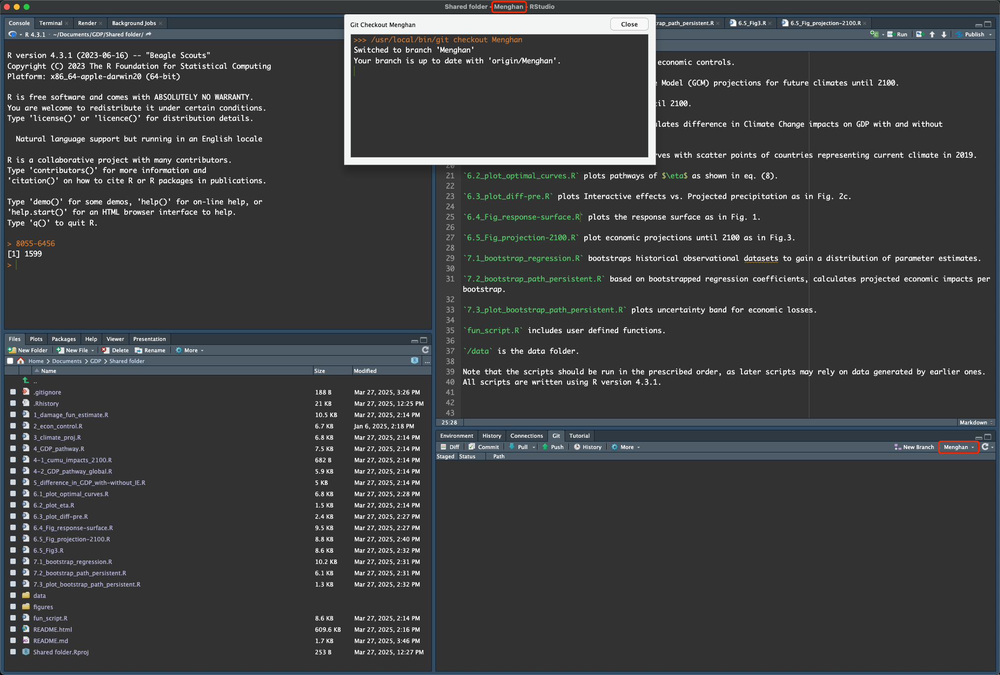

## Dark Theme

<https://community.rstudio.com/t/fvaleature-req-word-background-highlight-color-in-find-and-spellcheck/18578/3>

<https://rstudio.github.io/rstudio-extensions/rstudio-theme-creation.html>

<https://docs.posit.co/ide/user/ide/guide/ui/appearance.html#creating-custom-themes-for-rstudio>

Theme repository: <https://github.com/max-alletsee/rstudio-themes>

`.ace_marker-layer .ace_selection` Changes the color and style of the highlighting for the currently selected line or block of lines.

`.ace_marker-layer .ace_bracket` Changes the color and style of the highlighting on matching brackets.

**Recommended highlight color**: `rgba(255, 0, 0, 0.47)`

`RStudio` editor theme directory on Mac:

right click `RStudio.app`, "Show Package Contents" to navigate to the application folder.

`/Applications/RStudio.app/Contents/Resources/resources/themes/ambiance.rstheme`

Custom theme (user-defined) folder:

-   `~/.config/rstudio/themes/idle_fingers_2.rstheme` on mac
-   [viridis-theme](https://github.com/z3tt/viridis-theme/blob/main/viridis.rstheme)

``` scss
/* yaml tag */
.ace_meta.ace_tag {
  color: #2499DA;
}
/* quoted by $...$ and code chunk options */
.ace_support.ace_function {
  color: #55C667;
}
```

------------------------------------------------------------------------

## Update R {#update-r}

Q: How to tell which version of R you are running?\
A: In the R terminal, type `R.version`.

The key thing to be aware of is that when you update R, [if you just download the latest version from the website, you will lose all your packages!]{style="color:#FF9900"} ❌

The easiest way to update R and not cause yourself a huge headache is to use the `installr` package. When you use the `updateR()` function, a series of dialogue boxes will appear. These should be fairly self-explanatory but there is a [full step-by-step guide](https://www.r-statistics.com/2015/06/a-step-by-step-screenshots-tutorial-for-upgrading-r-on-windows/#google_vignette "Guide to update R with `installr`") available for how to use `installr`, the important bit is to [select "Yes" when it asked if you would like to copy your packages from the older version of R]{style="color:#00CC66"}.

``` r
# Install the installr package
install.packages("installr")

# Load installr
library(installr)

# Run the update function
updateR()
```

------------------------------------------------------------------------

## Packages Management

**Load packages**

Q: What is the difference btw `library(package)` and `require(package)`?\
A:

-   `library(package)` returns an error if the package doesn't exist.

-   `require(package)` returns `FALSE` if the package is not found and `TRUE` if the packages is loaded. `require` is designed for use inside other functions, such as using the value it returns in some error checking loop, as it outputs a warning and continues if the package is not found.

Q: How to reload a package after updating?\
A: Call `detach(package:pkg, unload = TRUE)` or `unloadNamespace` first, then use `library(pkg)` to reload. If you use `library` on a package whose namespace is loaded, it attaches the exports of the already loaded namespace. So detaching and re-attaching a package may not refresh some or all components of the package, and is inadvisable. The most reliable way to completely detach a package is to [restart R]{style="color:#00CC66"}.

For example, if we want to detach `ggplot2` package, we can use

``` r
detach(package:ggplot2, unload=TRUE)
```

`requireNamespace` can be used to *test* if a package is installed and loadable because it comes back with either `TRUE` (if found the pkg) or `FALSE` (if failed to find the pkg).

``` r
> !requireNamespace("ggplot2")
[1] FALSE
> !requireNamespace("ggplot3")
Loading required namespace: ggplot3
Failed with error:  ‘there is no package called ‘ggplot3’’
[1] TRUE
```

To see whether need to install some packages:

```{r eval=F}
if (!requireNamespace("devtools")) install.packages("devtools")
```

Alternatively,

``` r
# short command
"ggplot2" %in% installed.packages()
# full command
"ggplot2" %in% rownames(installed.packages())
```

`installed.packages()` Finds details of all packages installed in the specified library path `lib.loc`. Returns a matrix of package names, library paths and version numbers.

``` r
> installed.packages() %>% class()
[1] "matrix" "array" 

> installed.packages() %>% str()
 chr [1:355, 1:16] "abind" "alphavantager" "anytime" "askpass" "assertthat" "backports" "base" ...
 - attr(*, "dimnames")=List of 2
  ..$ : chr [1:355] "abind" "alphavantager" "anytime" "askpass" ...
  ..$ : chr [1:16] "Package" "LibPath" "Version" "Priority" ...
```

The following code can be used to load packages for your project and set up the working environment.

``` r
# load the pkg, if not found, install then load
require(dplyr) || {install.packages("dplyr"); require(dplyr)}
require(odbc) || {install.packages("odbc"); require(odbc)}
require(DBI) || {install.packages("DBI"); require(DBI)}
```

If using `library()`, will return error if some package is not installed and interrupt the program.

If it is a list of packages you want to check, use `lapply` to loop through all packages.

``` r
## First specify the packages of interest
packages = c("MASS", "nlme")

## Now load or install&load all
package.check <- lapply(
  packages,
  FUN = function(x) {
    if (!require(x, character.only = TRUE)) {
      install.packages(x, dependencies = TRUE)
      library(x, character.only = TRUE)
    }
  }
)
```

You can then use `search()` to determine whether all the packages have loaded.

``` r
search()
 [1] ".GlobalEnv"        "package:nlme"      "package:MASS"     
 [4] "package:stats"     "package:graphics"  "package:grDevices"
 [7] "package:datasets"  "renv:shims"        "package:utils"    
[10] "package:methods"   "Autoloads"         "package:base"     
```

------------------------------------------------------------------------

**Install R packages from source**

``` r
# From local tarball
install.packages(
  # indicate path of the package source file
  "~/Documents/R/UserPackages/shoRtcut2_0.1.0.tar.gz", 
  # indicate it is a local file
  repos = NULL)

# From github
install.packages("Rcpp", repos="https://rcppcore.github.io/drat")
```

**Install from GitHub**

``` r
devtools::install_github(repo, ref="HEAD", subdir = NULL)
```

-   `repo` repository address in the format `username/repo[/subdir][@ref|#pull]`. Alternatively, you can specify `subdir` and/or `ref` using the respective parameters. If both are specified, the values in `repo` take precedence.
-   `ref` Desired git reference. Could be a commit, tag, or branch name, or a call to `github_pull()` or `github_release()`. Defaults to `"HEAD"`, which means the default branch on GitHub and for git remotes.

Ex

``` r
# install version 3.5.1
install_github("tidyverse/ggplot2", ref="ggplot2 3.5.1")
```

------------------------------------------------------------------------

Check installed packages

``` r
# print all installed packages
rownames(installed.packages())
# check if `ggplot2` is installed
"ggplot2" %in% rownames(installed.packages())
```

Check package version

``` r
packageVersion("ggplot2") # check package version
```

Q: How do I know if I have the latest version?\
A: You can go to GitHub repo to check release notes. You will find the latest version of packages there.

------------------------------------------------------------------------

**Update packages**

-   Update an individual package

    -   Using `install.packages`

        ``` r
        install.packages("ggplot2") # update one specific package
        ```

    -   Using `update.packages`

        ``` r
        update.packages(oldPkgs = "ggplot2")
        ```

        Note that you need to [specify `oldPkgs` explicily]{style="color:#00CC66"} as it is a named argument.

-   Update ALL outdated packages

    ``` r
    ## update all installed packages in a stated library location, default to `.libPaths()`
    update.packages(lib.loc = .libPaths(), ask = TRUE) 
    ```

    `update.packages` updates ALL outdated packages in a stated library location. That library location is given by the first argument (if not supplied it works on all known library locations for the current R session).\
    It will ask you for every package if you want to update.\
    To just say `yes` to everything, use `ask = FAlSE`.

    ``` r
    update.packages(ask = FALSE)
    ```

    Unfortunately this [won’t]{style="color:#00CC66"} update packages installed by `devtools::install_github()`

------------------------------------------------------------------------

[Troubleshooting]{style="font-size: 1.13em; font-weight: bold;"}

Q: I ran `update.packages("ggplot2")`, but nothing happened. No output on console, no error, nothing.\
A: The first argument specifies the library location you want to search through (and update packages therein). `update.packages("ggplot2")` means you want to update the packages in library location `ggplot2`, which is most [unlikely]{style="color:#FF9900"} to exist on your R installation.

------------------------------------------------------------------------

Q: I tried to update `ggplot2` with `install.packages("ggplot2")`, but nothing happened.\
A: [If `ggplot2` is already loaded]{style="color:#00CC66"}, then you can't install `ggplot2` in the current session now. If you need to, save any objects you can't easily recreate, and quit out of R. Then start a new R session, immediately run `install.packages("ggplot2")`, then once finished, load the package and reload in any previously saved objects.

------------------------------------------------------------------------

More about `update.packages`:

-   `update.packages(lib.loc = NULL, repos = getOption("repos"), ask = TRUE)`: First a list of all packages found in `lib.loc` is created and compared with those available at the repositories. If `ask = TRUE` (the default) packages with a newer version are reported and for each one the user can specify if it should be updated. If so the packages are downloaded from the repositories and installed in the respective library path (or `instlib` if specified).

-   You can specify one specific package to update using `update.packages(oldPkgs = "ggplot2")`. It will check updates only for that package and ask you if you want to update.

    The easiest way to update an individual package is just to use `install.packages`. It is a one step command, compared to `update.packages`, which first checks and then asks.

-   `update.packages` returns NULL invisibly.

-   Be aware that <u>some package updates may cause your previous code to stop working</u>. For this reason, we recommend updating all your packages once at the beginning of each academic year (or semester) – don't do it before an assessment or deadline just in case!

------------------------------------------------------------------------

**Updating all Packages after [R update]{style="color:#0099FF"}**

R packages are missing after updating. So you have to save the installed packages and re-install them after updating.

-   Alternatively, `installr::updateR()` automatically [updates R](#update-r) and installs your packages. ✅

Here is how to do it manually.

``` r
## get packages installed
packs <- as.data.frame(installed.packages(.libPaths()[1]), stringsAsFactors = F)
# Save to local
f_name <- "~/Documents/R/packages.csv"
rownames(packs)
write.csv(packs, f_name, row.names = FALSE)
packs <- read_csv(f_name)
packs
## Re-install packages using install.packages() after updating R
install.packages(packs$Package)
```

R library path `/Library/Frameworks/R.framework/Versions/4.2-arm64/Resources/library`

-   use `find.package("ggplot2")` to find the location to where the given package is found.
-   alternatively, you can run `.libPaths()`
    -   `.libPaths()` without an argument will return a list of all the places R will currently look for loading a package when requested.
    -   `.libPaths("a/b/c")` with an argument will add that new directory (`"a/b/c"`) to the ones R was already using. If you use that directory often enough, you may wish to add that call to `.libPaths("a/b/c")` in your `.Rprofile` startup file in your home directory.

------------------------------------------------------------------------

### Put your R package on GitHub {.unnumbered}

Reference: <https://jennybc.github.io/2014-05-12-ubc/ubc-r/session2.4_github.html>

-   Change to the package directory

-   Initialize the repository with `git init`

-   Add and commit everything with

    1.  `git add .` stage changes;
    2.  `git status` optional check staged changes, but yet to submit;
    3.  and `git commit` submit staged changes.

-   Create a [new repository on GitHub](https://github.com/new)

-   Connect your local repository to the GitHub one

    ``` bash
    # add repo name "origin" to the remote repo at the URL
    git remote add origin https://github.com/username/reponame
    ```

-   Push everything to github

    ``` bash
    # rename the current local branch to "main"
    git branch -M main
    # creates a remote branch "origin" and sets it upstream of the "main" branch
    git push -u origin main
    ```

------------------------------------------------------------------------

## Using Git with RStudio

Before you start coding, make sure that you are on the correct branch. You may check

-   from the Git tab on the Environment, History, Connections, ... pane
-   you can also see from the status bar on the very top of the window. The words are formatted as "Projection Name – Branch – RStudio".

```{r out.width = "100%", eval=TRUE, echo=FALSE}

```

Choose a License for your repo

Q: Which open source license is appropriate for my project?\
A: See <https://opensource.guide/legal/#which-open-source-license-is-appropriate-for-my-project>.

Q: How to add a license to my repo?\
A: Follow the instructions [here](https://docs.github.com/en/communities/setting-up-your-project-for-healthy-contributions/adding-a-license-to-a-repository "GitHub: add license to your rep").

--------------------------------------------------------------------------------

## Save R Workspace

If you want to saves [all objects]{style="color:#00CC66"} in your work space, use `save.image()`. It will creates an image of your current variables and functions, and saves them to a file called `.RData`. When R next loads, objects stored in this image are by default restored.

This sounds convenient, however, you do NOT want to do this because this corrupt <span style='color:#FF9900'>reproducibility</span> of your project. ❌

You want to <span style='color:#00CC66'>start from a clean slate</span> very time. ✅

It is suggested change RStudio Global Options to

-   *not* "restore `.RData` into workspace at startup", and
-   *never* "save workspace to `.RData` on exit".


In case you do feel the need to save the workspace, use the following cmd.

`save.image(file = ".RData", version = NULL, ascii = FALSE, compress = !ascii, safe = TRUE)`

``` r
## save current workspace ##
f_name <- "RImage/TCR_2023-05-09.RData"
f_name
save.image(f_name)
# load(f_name)
```

Q: Can I save the loaded packages in the current session/workspace?\
A: The workspace is for *objects* like data and functions. Starting R with particular packages loaded is what your `.Rprofile` file is for, and you can have a different one in each directory. But I'd recommend not saving anything between r sessions and instead recreate it all using code. This is much more likely to lead to reproducible results.


**History**

When you quit a project, `.Rhistory` is automatically written to the project directory unless you opt out to. It contains a history of all of the commands that you have sent to the R console in this session.


--------------------------------------------------------------------------------

**Pop out an editor**

Click the `Show in New Window` button in any source editor tab.


To return a document to the main window, click the `Return to Main Window` button on the editor toolbar.


--------------------------------------------------------------------------------

**Environment Pane**

By default, the Environment pane is located in the top-right and includes the Environment, History, Connections, Build, and Version Control System (VCS) tabs.

Version Control System (VCS) 

The VCS tab will change based on the version control system you have enabled for that session. For example, using Git will change the tab name to Git and provide some common commands for viewing diffs, committing changes, pull and push … 
Output pane

The Output pane displays various outputs such as plots, HTML content, or on-disk files. It contains the Files, Plots, R Packages, Help, Viewer, and Presentation tabs.

Ref: [RStudio Pane Layout][pane-layout]

--------------------------------------------------------------------------------

**Global Options that make coding easier**

- Syntax highlight and matched parentheses. 

  Under "Tools -\> Global Options -\> Code -\> Display", under **Syntax section**, check the boxes for **highlight R function calls** and **use rainbow parentheses**. The second is especially useful to mark matching opening and closing brackets.

- Show whitespace characters. 

  In "Tools -> Global Options -> Code -> Display", check "Show whitespace characters". This will let you see spaces and newlines in the editor.


--------------------------------------------------------------------------------


[pane-layout]: https://docs.posit.co/ide/user/ide/guide/ui/ui-panes.html#:~:text=four%20primary%20panes.-,To%20add%20additional%20source%20columns%2C%20from%20the%20RStudio%20menu%3A%20Global,only%20within%20the%20Source%20pane.	"RStudio Pane Layout"


