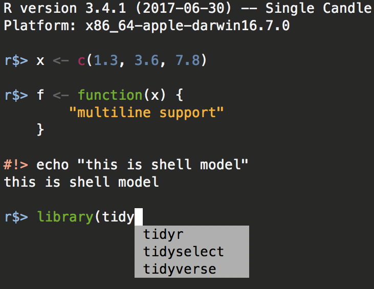

# VS Code

[`vscode-R`](https://github.com/REditorSupport/vscode-R/wiki) is the R Extension for Visual Studio Code. The extension is mainly focused on providing language service based on static code analysis and user interactivity between VS Code and R sessions.

You can run R in VS Code. Simply open the folder containing your R scripts in VS Code, and then open the command palette (`Cmd+Shift+P`) and type "R: Create R terminal". This will start an R session in the terminal.

- By default, this will close the currently open folder. 
- If you want multiple windows each with their own folder, you first open a new window (`Ctrl` + `Shift` + `N`) and then open the folder in that new window.

`rstudioapi::restartSession()` will restart the R session.

Command Palette, type "**R: Interrupt R**" to interrupt the current R session.


## Keyboard shortcuts

|                      Shortcuts                       |               Function                |
| :--------------------------------------------------- | :------------------------------------ |
|                     `cmd` + `/`                      |                comment                |
| `shift` + `cmd`  + `M` or <br>`shift` + `ctrl` + `M` | In script editor: user defined; `%>%` |
|   <span style='color:#00CC66'>`ctrl` + `P`</span>    |    In Radian: user defined; `%>%`     |
|                     `opt` + `-`                      |          user defined; `<-`           |
|                   `ctrl` + `` ` ``                   |    toggle btw editor and terminal     |
| `cmd` + `1`/`2`                                      | toggle between editors                |

- For commonly used general keyboard shortcuts (not limited to R), see [HERE](https://my1396.github.io/Econ-Study/2024/08/12/Productivity-Tools.html#keyboard-shortcuts).

- [Suggested keyboard shortcuts](https://github.com/REditorSupport/vscode-R/wiki/Keyboard-shortcuts) for R in VS Code.

- For user defined shortcuts, you can add them in the `keybindings.json` file.


--------------------------------------------------------------------------------

Q: How to run R code interactively? \
A: Create an R terminal via command **R: Create R Terminal** in the Command Palette. Once an R terminal is ready, you could either select the code or put the cursor at the beginning or ending of the code you want to run, press (<kbd class="env-green">Cmd</kbd> + <kbd class="env-green">Enter</kbd>), and then code will be sent to the active R terminal. 

If you want to run an entire R file, open the file in the editor, and press <kbd>Cmd+Shift+S</kbd> and the file will be sourced in the active R terminal. Alternatively, open Command Palette and type "**R: Run Source**".

You can use `# %%` to create code cells in R scripts, mimicking the behavior of Jupyter notebooks. 
Use <kbd class="env-green">Shift</kbd> + <kbd class="env-green">Cmd</kbd> + <kbd class="env-green">Enter</kbd> to run the current cell. 
Refer to [Run R in Interactive Window](https://my1396.github.io/Econ-Study/2026/02/01/Python-VSCode.html#run-r-in-interactive-window) for more details.


When you run the whole code cell, output will be shown after the whole cell is executed. If you want to see the output immediately after each line of code, you can add the following to `settings.json`:

```yaml
// Run code line-by-line in the terminal
"r.bracketedPaste": false,
```

But the output will look cluttered as the code and output are mixed together. So I prefer to keep `r.bracketedPaste` to `true` and to see the output after each cell is executed.

--------------------------------------------------------------------------------

Q: Why using VS Code for R programming instead of RStudio? \
A: Several reasons:

- Better integration with Copilot, making it easier to write code with AI assistance. 
- More responsive and powerful engineering tools such as symbol highlight, find references, rename symbol, etc. integrated to the IDE.
- VS Code has a lot of extensions that can enhance your R programming experience, such as `Markdown Preview Enhance`, `Live Server`, and `GitLens`.
- Git support is better in VS Code, making it easier for version control and collaboration.

--------------------------------------------------------------------------------

## `languageserver` package

The [R language server](https://github.com/REditorSupport/vscode-R/wiki/R-Language-Service) implements the [Language Server Protocol](https://microsoft.github.io/language-server-protocol/specifications/specification-current/) (LSP) and provides a set of language analysis features such as *completion*, providing function signatures, extended function documentation, locating function implementations, occurrences of a symbol or object, *rename symbol*, and code diagnostics and formatting. The R language server statically analyzes R code, and `vscode-R` interfaces with it to provide the core of this extension's functionality.

The R language server is implemented by the [languageserver](https://github.com/REditorSupport/languageserver) package which performs static code analysis with the latest user documents in `R` and `Rmd` languages. Therefore, it does not rely on an active R session and thus does not require the code to be executed.

[vscode-R settings](https://github.com/REditorSupport/vscode-R/wiki/R-options)

### Highlight Features:

- `styler`

  The language server provides code formatting through the through the [`styler`](https://github.com/r-lib/styler) package in R. See [here](https://github.com/REditorSupport/languageserver#customizing-formatting-style) for configuration.

  Main usage: select the code block you want to format, right-click and select **Format Selection**. Note that this only works in the **Edit Mode** when Vim is enabled.

  Alternatively, right-click at anywhere in the code editor and select **Format Document** to format the entire document. 

- **Rename symbols** 

  Place the cursor on the symbol you want to rename, right-click and select **Rename Symbol**. A dialog will pop up, allowing you to enter the new name for the symbol. A refactoring preview will be shown, allowing you to review the changes before applying them.

- **Find References**
  
  Right-click on an R object, 
  - select **Find All References** to find all references to the object in the current workspace.
    
    The results will be shown in the **References** view in the Activity Bar on the left side of the window.

  - select *Go To References* open a popup showing all of the uses of the object within the current document.

--------------------------------------------------------------------------------

### `lintr`

R code linting (diagnostics) is provided by [lintr](https://github.com/r-lib/lintr) via language server and is enabled by default. It provides syntax error warnings as well as style guidelines.

**Configuration**

To configure the behavior of `lintr`, you should create/edit the global `lintr` config file at `~/.lintr`. Alternatively, you can also create/edit a project-specific lintr config file at `${workspaceFolder}/.lintr`. 

- Do not forget the new **empty line** at the end of the file.

  To be sure that the file is correctly set up you can use:

  ```r
  read.dcf(".lintr") # Should give no error
  ```

  If the file is not available in the workspace you can add it with:

  ```r
  options(lintr.linter_file="Path/to/file/.lintr")
  ```

  You can also add this line in your `.Rprofile` to not have to run it everytime. [ref ↩︎](︎https://stackoverflow.com/a/77286956)

- Visit [Individual linters](https://lintr.r-lib.org/reference/index.html#individual-linters) for a complete list of supported linters.

- Visit the [Configuring linters](https://lintr.r-lib.org/articles/lintr.html#configuring-linters) for a complete guide to customizing lintr config regarding the list of linters and file or line exclusions.


Q: How to disable `lintr`? \
A: Set `"r.lsp.diagnostics": false`. Then in command palette, type "Developer: Reload Window" for the changes to take effect.


--------------------------------------------------------------------------------

## Radian

Q: There is no syntax highlighting in the R terminal. How to fix it? \
A: Install [**Radian**](https://github.com/randy3k/radian), an improved **R console** REPL interface that corrects many limitations of the official R terminal and supports many features such as *syntax highlighting* and *auto-completion*. 


```{r radian, echo=FALSE}

```

Q: How to install Radian? \
A: In the terminal, run

```bash
$pipx install radian
  installed package radian 0.6.15, installed using Python 3.13.5
  These apps are now globally available
    - radian
⚠️  Note: '/Users/menghan/.local/bin' is not on your PATH environment variable. These apps will not be globally
    accessible until your PATH is updated. Run `pipx ensurepath` to automatically add it, or manually modify your PATH in
    your shell's config file (e.g. ~/.bashrc).
done! ✨ 🌟 ✨

$pipx ensurepath

/Users/menghan/.local/bin has been been added to PATH, but you need to open a new terminal or re-login for this PATH
    change to take effect. Alternatively, you can source your shell's config file with e.g. 'source ~/.bashrc'.

You will need to open a new terminal or re-login for the PATH changes to take effect. Alternatively, you can source your
shell's config file with e.g. 'source ~/.bashrc'.
```

N.B. If you have `zsh` as your shell, you need to run `source ~/.zshrc` instead of `source ~/.bashrc`.

To find where `radian` is installed, you can run:

```bash
which radian
/Users/menghan/.local/bin/radian
```

This is the path to the `radian` executable.

After adding Radian to your PATH, you can invoke it in the terminal by simply typing `radian`.

```bash
$radian
R version 4.3.1 (2023-06-16) -- "Beagle Scouts"
Platform: aarch64-apple-darwin20 (64-bit)

r$>
```

Then, in VS Code, you will need to set Radian as the default R terminal. You can also configure other settings for R.

Add the following settings to your `settings.json` file:

```json
{
  /* R settings */ 
  "r.rterm.mac": "/Users/menghan/.local/bin/radian",
  "r.bracketedPaste": true,
  "r.sessionWatcher": true,
  "r.plot.useHttpgd": true,
  "[r]": {
    "editor.defaultFormatter": "REditorSupport.r",
    "editor.formatOnType": true
  },
  "r.formatting.style": "styler",
}
```

**Options:**

- `r.rterm.mac`: Path to the Radian executable.
- `r.bracketedPaste`: Enables bracketed paste mode, which allows pasting code without executing it immediately. This is useful if you want to paste multiple lines of code into the console at once.
- `r.sessionWatcher`: Enables [session watcher](https://github-wiki-see.page/m/REditorSupport/vscode-R/wiki/R-Session-watcher) to monitor the R session. Specifically, 
  
    - Show value of session symbols on hover
    - Show plot output on update and plot history
    - Show htmlwidgets, documentation and shiny apps in WebView

- `r.alwaysUseActiveTerminal`: always send code to active terminal rather than `vscode-R`; helps me to start an R session which is terminated when VSCode exits.

- `r.plot.useHttpgd`: Use the httpgd package for viewing plots in a VS Code window or in the browser.

- Language-specific editor settings for R files: 
  
  Prerequisite: install `styler` package in R.
  
  ```r
  install.packages("styler")
  ```

  Use `styler` for code formatting, and set the default formatter to `REditorSupport.r`.

  `REditorSupport.r` and `styler` are able to identify specific R syntax, e.g., `%>%` and `|>` as pipe operators, and will format the code accordingly. 
  By contrast, the default formater in VS Code does not recognize these operators and fails to auto indent after a pipe operator.

  `"editor.formatOnType": true` will trigger formatting as you type.

See [Extension Settings](https://github.com/REditorSupport/vscode-R/wiki/Extension-settings) for a full list of settings of `vscode-R` that can be set in VSCode's `settings.json` file.


### Configuration


Radian can be customized by specifying the below options in various locations:

- `$HOME/.config/radian/profile`
- `.radian_profile` in the working directory


Example of a radian [profile](https://github.com/randy3k/radian?tab=readme-ov-file#settings)

```r
# either  `"emacs"` (default) or `"vi"`.
options(radian.editing_mode = "vi")

# enable various emacs bindings in vi insert mode
options(radian.emacs_bindings_in_vi_insert_mode = TRUE)

# show vi mode state when radian.editing_mode is `vi`
options(radian.show_vi_mode_prompt = TRUE)
options(radian.vi_mode_prompt = "\033[0;34m[{}]\033[0m ")

# custom key bindings
options(
    radian.escape_key_map = list(
        list(key = "-", value = " <- "),
    ),
    radian.ctrl_key_map = list(
        list(key = "p", value = " %>% ")
    )
)
```

- Insert pipe operator `%>%` by pressing `Ctrl` + `P`
  
- Insert assignment operator `<-` by pressing `Esc` + `-`
  
  But this does not work when Vim is enabled as it interferes with Vim's normal mode.


**VI support by `radian`:**

- `options(radian.editing_mode = "vi")`: set the default editing mode to vi. 
- `options(radian.show_vi_mode_prompt = TRUE)`: This option will show the current vi mode in the prompt when using `radian` in vi mode. The prompt will be colored blue and will display the current mode.

  - `[ins]`: insert mode
  - `[nav]`: normal mode

--------------------------------------------------------------------------------

<a id="restart-radian"></a>
Q: How to **restart Radian**?  
A: Run `rstudioapi::restartSession()` in the R terminal.

You can define a function to restart Radian. 

In `.Rprofile`, add the following function definition:

```r
# restart function, convenient in radian
restart <- function() {
    getOption("rchitect.py_tools")$attach()
    os <- import("os")
    sys <- import("sys")
    os$execv(sys$executable, c("sys$executable", "-m", "radian"))
}
```

This snippet use Python to use `os.execv()` to replace the current process with a new instance of Radian. When you call `restart()`, it will effectively restart Radian without needing to close and reopen the terminal manually.

This is more robust than `rstudioapi::restartSession()`.

Issue: the `restart()` function, cannot use `rstudioapi::` functions.

Workaround: Close R and create a new R terminal manually or use `rstudioapi::restartSession()`.


### Data Viewer

You can view objects in the workspace by clicking the R icon in the Activity bar.
It is a convenient way to view the R workspace, preview existing R objects, find help topics, and read help pages interactively.


You can use <span class="env-green">`view()`</span> to open the data viewer in a new tab. For example, `view(mtcars)` will open the `mtcars` dataset in the data viewer.


--------------------------------------------------------------------------------

## Plot Viewer

VS Code has a built-in plot viewer that looks like this: [↩](https://nx10.dev/httpgd/articles/b01_vscode.html)


What I don't like about the built-in plot viewer

- Weird aspect ratio and zoom, labels look very small
- auto-resize is bad

[`httpgd`](https://nx10.github.io/httpgd/): A graphics device for R that is accessible via HTTP and WebSockets. This package was created to make it easier to embed live R graphics in integrated development environments and other applications. `httpgd` is required by the interactive plot viewer of the R extension for VS Code.

A preview of `httpgd` plot viewer in VS Code:


Benefits of `httpgd` plot viewer:

- Auto-resizing is good
- Interactive
- History plots, save, delete, clear

**Useful resources:**

- [Plot viewer project Wiki](https://github.com/REditorSupport/vscode-R/wiki/Plot-viewer)
- [Using httpgd in VSCode: A web-based SVG graphics device, \@Kun Ren](https://renkun.me/2020/06/16/using-httpgd-in-vscode-a-web-based-svg-graphics-device/)

--------------------------------------------------------------------------------

**Setup `httpgd` in VS Code**

1. Install `httpgd` package in R
   
   ```r
    install.packages("httpgd")
    ```

2. Enable `r.plot.useHttpgd` in VS Code settings.

   ```json
   {
     "r.plot.useHttpgd": true
   }
   ```

   - `r.plot.useHttpgd`: use the httpgd-based plot viewer instead of the base VSCode-R plot viewer

   This will allow you to view plots in a separate window or in the browser, which is useful for interactive visualizations.

--------------------------------------------------------------------------------

### Quick Start with `httpgd`

```r
library(httpgd)
# Start the httpgd graphics device
hgd()

# Open the plot viewer in your browser
hgd_browse()

# Create a figure
x = seq(0, 3 * pi, by = 0.1)
plot(x, sin(x), type = "l")
```

Q: Plot viewer is missing. \
A: Run `hgd()` in R and get the url to the viewer. Use the command palette to run "**R Plot: Open httpgd Url**". It will let you enter the url address, fill it in and hit Enter to open the plot viewer. Alternatively, if you want to view in external browser, you can copy the url and paste it in your browser.

--------------------------------------------------------------------------------

**Functions in `httpgd`:** [↩](https://nx10.dev/httpgd/reference/index.html)

- `hgd()` Initialize device and start server.
- `hgd_browse()` Open the plot viewer in your browser, can be internal or external.

  `hgd_browse()` is equivalent to running "R Plot: Open Httpgd Url" in the command palette.

  ```r
  > hgd()
  httpgd server running at:
    http://127.0.0.1:58118/live?token=Ka9j9ziG
  
  > hgd_browse()
  Browsing http://127.0.0.1:58118/live?token=Ka9j9ziG
  ```
  
  When you call `hgd_browse()`, it will open the graphic device in a new tab in your default web browser. You wil see the path to the viewer in the R console. 
  
  You may copy and paste the url to your external browser.

  
  
  There is an url in the tab header to indicate it is a web browser. When you hover over the image, the menu bar will show up. You can choose to download, copy, <span class="env-green">clear all plots</span>, etc.

  Click <i class="codicon codicon-refresh" aria-hidden="true" style="font-size:1.5em; vertical-align: middle;"></i> in the tool bar to refresh the viewer.

  

  ```r
  # Stop the browser server with:
  dev.off(which = dev.cur())
  
  # If you have multiple devices open, close all devices with:
  graphics.off()
  ```

- <span class="env-green">`hgd_close()`</span> will close the httpgd device.
  
  Equivalent to `dev.off()`.
  
  Note that this will <span class="env-orange">**NOT**</span> close the viewer window automatically for you. You can close the viewer manually by clicking the "x" button on the top right corner of the viewer window.

  By the next time you call `plot`, you will see all historical plots are gone.
  
  > Closing the plot viewer window does not clear the plots, nor clearing the plots closes the plot viewer window.

  If you don't call `hgd_close()`, but click the "x" button on the top right corner of the viewer window, the viewer will be closed but all historical plots are still there. You can call `plot` again to see the previous plots.

  Otherwise, if you click the "x" button directly, the viewer will be closed, but all historical plots are still there. You can call `plot` again to see the previous plots.

- `hgd_url()` will return the url of the viewer. You can copy and paste the url to your external browser.

--------------------------------------------------------------------------------

**Keyboard shortcut** in the WebView

- ←/→/↑/↓: navigate through the plot history
  
  Use ←/→ to navigate to the last/next plot. ✅
  
  ↑/↓ is strange as ↑ goes to next while ↓ goes to last... ❌

- `+`/`-`: zoom in/out
- `0`: reset zoom
- `s`/`p`: save the current plot as SVG/PNG
  
   Not recommended to save as PNG as the resolution is low.

   Use `ggsave("plot.png", dpi = 300)` instead to save high-resolution plots.

--------------------------------------------------------------------------------

### Configuration

Nice settings to make the plot viewer run more smoothly: make `httpgd` the default plot viewer in VS Code and open the viewer in a new tab beside the editor.

Add to `.Rprofile`

```r
if (interactive() && Sys.getenv("TERM_PROGRAM") == "vscode") {
  if ("httpgd" %in% .packages(all.available = TRUE)) {
    options(vsc.plot = FALSE)
    options(device = function(...) {
      httpgd::hgd(silent = TRUE)
      .vsc.browser(httpgd::hgd_url(), viewer = "Beside")
    })
  }
}
```

It disables the original simple plot watcher provided by vscode-R session watcher (which replays user graphics into a png file) and use httpgd as the graphics device and opens a new WebView tab in VSCode to show the graphics.

--------------------------------------------------------------------------------

Useful **shortcuts** for the plot viewer: Open current `httpgd` window if closed (<kbd>ctrl</kbd> + <kbd>opt</kbd> + <kbd>p</kbd>).

```json
{
  "key": "ctrl+alt+p",
  "command": "r.runCommand",
  "when": "editorTextFocus && editorLangId == 'r'",
  "args": ".vsc.browser(httpgd::hgd_url(), viewer = \"Beside\")"
}
```


--------------------------------------------------------------------------------

Universal graphics device (`unigd`) is a package that provides a set of functions to manage the plot viewer, such as:

- <span class="env-green">`unigd::ugd_clear()`</span> Clear all pages in the plot viewer. 
  
  Same effects as `hgd_close()`.

- `unigd::ugd_remove(page = 2)` Remove the second page.


--------------------------------------------------------------------------------

## R Debugger

To be added ...

ref: 

- [Debugging R in VSCode, \@Kun Ren](https://renkun.me/2020/09/13/debugging-r-in-vscode/)


--------------------------------------------------------------------------------

## Emulating `rstudioapi` functions 

The VSCode-R extension is compatible with a subset of RStudio Addins via an `{rstudioapi}` emulation layer. Nearly all of the document inspection and manipulation API is supported, allowing RStudio add-ins and packages that rely on `rstudioapi` to function within VS Code.

-   This emulation is achieved by "duck punching" or "monkey patching" the `rstudioapi` functions within the R session running in VS Code. This means the original `rstudioapi` functions are replaced with custom implementations that communicate with VS Code instead of RStudio.

-   To enable RStudio Addins, you may need to add `options(vsc.rstudioapi = TRUE)` to your `~/.Rprofile` file. This ensures the `rstudioapi` emulation is loaded when your R session starts.

    `getOption("vsc.rstudioapi")` will return `TRUE` if the emulation is enabled.

--------------------------------------------------------------------------------

**Use RStudio Addins from VS Code** 

How to use your RStudio Addins in VS Code after enabling the emulation:

-  Use the command palette (`Ctrl+Shift+P`) and type "**R: Launch RStudio Addin**".
-  You will see a list of available RStudio add-ins that you can run directly from VS Code. 
-  Choose the add-in you want to run, and it will execute in the current R session.

--------------------------------------------------------------------------------

You can also bind a keyboard shortcut to **launch the RStudio Addin picker** (command id: `r.launchAddinPicker`):

```json
{
	"key": "ctrl+shift+A",  // launch RStudio Addin
	"command": "r.launchAddinPicker",
	"when": "editorTextFocus && (editorLangId == 'markdown' || editorLangId == 'r' || editorLangId == 'rmd' || editorLangId == 'quarto')"
},
```

This will allow you to quickly access and run RStudio add-ins without needing to open the command palette each time.

--------------------------------------------------------------------------------

To **launch a specific RStudio addin**, you can map a direct keybinding to the addin R functions. 

- The function can be found in `inst/rstudion/addins.dcf` file of the addin-providing-package's source. 
  - Look for the keyword `Binding` in the file to find the function name.
  - The package name is the repository name of the addin-providing package.

Use example: Here I want to invoke two RStudio addins: `shoRtcut::set_new_chapter()` and `shoRtcut2::set_new_chapter2()`. 

Add the following keybindings to your `keybindings.json` file:

```json
{
  "description": "Pad line with dashes",
  "key": "ctrl+shift+S",
  "command": "r.runCommand",
  "when": "editorTextFocus && (editorLangId == 'markdown' || editorLangId == 'r' || editorLangId == 'rmd' || editorLangId == 'quarto')",
  "args": "shoRtcut:::set_new_chapter()"
},
{
  "description": "Pad line with equals",
  "key": "ctrl+shift+=",
  "command": "r.runCommand",
  "when": "editorTextFocus && (editorLangId == 'markdown' || editorLangId == 'r' || editorLangId == 'rmd' || editorLangId == 'quarto')",
  "args": "shoRtcut2:::set_new_chapter2()"
},
```

Now you can use

- `Ctrl+Shift+S` to pad a line with dashes, and 
- `Ctrl+Shift+=` to pad a line with equals.

ref: [RStudio addin support in VSCode-R](https://github.com/REditorSupport/vscode-R/wiki/RStudio-addin-support)

--------------------------------------------------------------------------------

## Work with Rmd

You can edit Rmd with either of the two Language Modes:

- `R Markdown`: there is a knit button to provide preview but no live preview.
  
    If using RStudio, you can only get a preview after rendering 

    - Render the site using: `rmarkdown::render_site()` function, which can be slow for large sites. 
    - Render the document using: `rmarkdown::render("0103-RStudio-VSCode.Rmd")` function, which is equivalent to clicking the "Knit" button in RStudio.

    Note that 

    - Knit button generate output html in the `docs/` directory; it uses your styles settings in the `_output.yml` file.
    - `rmarkdown::render` generates output html in the same directory as the Rmd file. It does not apply any settings from `_output.yml` file, so you need to specify any headers you want to load, e.g., mathjax macros.
    
    
    How to decide which Language Mode to use? A rule of thumb is:

    - If your Rmd has lots of R code you need to run interactively, use `R Markdown`.
    - If you want to write a static report with minimal R code, use `Markdown`.
    
      At all cases, it is quite easy to switch between the two modes by changing the Language Mode in the bottom right corner of VS Code. So you can choose either one that suits you best.
  
- `Markdown`: there is no knit button but you can have a live preview using the `Markdown Preview Enhance` extension.
  
    Instead, you need to type the command `rmarkdown::render()` in the R console or in an R script to render the Rmd file.


### Render book

Render the site `rmarkdown::render_site(input = ".", output_format = "all")`

- `rmarkdown::render_site()` without arguments will render **all** formats by default.
- specify `output_format` to render a specific format, e.g., `bookdown::gitbook`, `bookdown::pdf_book`, etc.

```r
# Render the site, equivalent to clicking the "Build Book" button in RStudio
# All output formats specified in the `_output.yml` file will be rendered.
rmarkdown::render_site()
# Render a specific output format, e.g., bookdown::gitbook
rmarkdown::render_site(output_format = 'bookdown::gitbook')
```

Render a single document has two options:

- `rmarkdown::render_site(file_name)` looks for the `_output.yml` file in the root directory of the site and applies the settings specified in that file. See [HERE](#render-single-rmd) for more details.
  
  Recommended for its automatic formatting. ✅

- `rmarkdown::render(input, output_format = NULL)` renders any single Rmd file without applying any settings from `_output.yml` file. See [HERE](#render-rmd-site) for more details.
  
  You need to specify any headers you want to load, e.g., mathjax macros. More hassle → less recommended. 

```r
# Render the document, equivalent to clicking the "Knit" button in RStudio
# This will apply any global settings for your website and generate the output html in the `docs/` directory.
rmarkdown::render_site("0103-RStudio-VSCode.Rmd")

# Render a single Rmd file
rmarkdown::render("0103-RStudio-VSCode.Rmd")
```


### View book

To view the static site in the `docs/` directory. I installed the VSCode extension [Live Preview](https://marketplace.visualstudio.com/items?itemName=ms-vscode.live-server). All I need to do is select one of the .html files, right-click the preview button in the code editor, and there it is. I can also just navigate to http://127.0.0.1:3000/docs/ in my browser. It even updates as I add chapters and redo the `render_site()` command.

- If Live Preview is not loading the latest changes, try "**Developer: Reload Window**" in the command palette.
- A most reliable way is just to open the `docs/xxx.html` file in your browser. This way, not only will it open the file you clicked, but it will also open the entire site.
  
  An additional benefit is that your site won't blink when you make changes or build the site. I found the constant blinking of the Live Preview blinding. 
  
  Using static files, you simply refresh the browser every time you rebuild the site.

ref

- [vscode-R Wiki: R Markdown](https://github.com/REditorSupport/vscode-R/wiki/R-Markdown)

--------------------------------------------------------------------------------

## Extensions

[`R Tools`](https://marketplace.visualstudio.com/items?itemName=Mikhail-Arkhipov.r) provides support for the R language, including syntax checking, completions, code formatting, formatting as you type, tooltips, linting.

Open the Command Palette and type '**R:**' to see list of available commands and shortcuts.

--------------------------------------------------------------------------------

## Jupyter Notebooks

[Jupyter](https://jupyter-notebook.readthedocs.io/en/latest/) (formerly IPython Notebook) is an open-source project that lets you easily combine Markdown text and executable Python source code on one canvas called a **notebook**. It provides an interactive environment where you can write and execute code, visualize data, and document your analysis **all in one place**.

It sounds like R Markdown. 

- One distinction is that R Markdown runs code in R console, while Jupyter notebook runs code in its own kernel.

- Jupyter can provide individual environments for each notebook, making it easier to manage dependencies and avoid conflicts between different projects. → But probably, it's easier just to use the **system R kernel** as you don't need to install packages in each environment.
  - You can use `conda install` to manage packages in each independent environment.

- Magic commands
  
  This can be used to run code in **different languages** within the same notebook. For example, you can use the `%%R` magic command to run R code in a Python notebook, or the `%%python` magic command to run Python code in an R notebook.

  There are many other magic commands available, such as `%%bash` to run shell commands, `%%time` to time the execution of a cell, and `%%cd` to change the current working directory.

- Online services
  
  You may have web-based access to Jupyter notebooks via services such as Google Colab, [JupyterHub](https://jupyter.org/try-jupyter/lab/) and Open OnDemand.

- You can convert Jupyter notebooks to Quarto qmd format:

  ```bash
  quarto convert demo-python.ipynb
  ```

  This is nice in part because qmd (like Rmd) is more easily handled by **version control** and with shell commands than the JSON format of `.ipynb` files.

**Tutorial:**

- [IRkernel Install](https://irkernel.github.io/installation/)
- [IRkernel CRAN Documentation](https://cran.r-project.org/web/packages/IRkernel/refman/IRkernel.html)
- [Jupyter And R Markdown: Notebooks With R](https://www.datacamp.com/blog/jupyter-and-r-markdown-notebooks-with-r)
- [A simple example of Jupyter Notebook in R](https://colab.research.google.com/github/alvinntnu/python-notes/blob/master/python-basics/magic-r.ipynb)
- [Jupyter Tutorial](https://jupyter-tutorial.readthedocs.io/en/24.1.0/kernels/r.html)
- [repr options](https://irkernel.github.io/docs/repr/0.6/repr-options.html)
  
  [`repr`](https://irkernel.github.io/docs/repr/0.9/) is a package that provides rich representations for R objects in Jupyter notebooks. It allows you to customize how R objects are displayed in the notebook, including options for controlling the size and format of plots, tables, and other output.

  [repr CRAN Documentation](https://cran.r-project.org/web/packages/repr/index.html)


1. Install [IRkernel](https://github.com/IRkernel/IRkernel)
   ```r
   install.packages("IRkernel")
   IRkernel::installspec() 
   ```
   
   - Note this needs to be run in the R terminal or Radian (running in RStudio does not work).
   - `IRkernel::installspec()` makes the R kernel available to Jupyter. It lets Jupyter to use the default system R kernel instead of the R provided by Anaconda.
2. Reload window. Open command palette and type "**Jupyter: Create New Blank Notebook**" to create a new Jupyter notebook.
3. Click on the button right below ellipsis in upper right corner to choose kernel
   - Select **Jupyter Kernels** > **R** to use the R kernel.
     
     It should look something like this:
     

## Render Jupyter notebook

You can use `quarto` to convert Jupyter notebooks (`.ipynb`) to other formats such as HTML, PDF, or Markdown. It uses the document YAML to decide which format to convert to.

```bash
quarto render notebook.ipynb
```

Note that when rendering an `.ipynb` Quarto will **NOT** execute the cells within the notebook by default (the presumption being that you already executed them while editing the notebook). If you want to execute the cells you can pass the `--execute` flag to render:

```bash
quarto render notebook.ipynb --execute
```

Path error when rendering `.ipynb` file with `quarto --execute`:

```
quarto render 07_Lab-2_dummy-variable.ipynb --execute --log-level=DEBUG
Quarto version: 1.7.31
projectContext: Found Quarto project in /Users/menghan/Library/CloudStorage/OneDrive-Norduniversitet/FIN5005 2025Fall/course_web
Loaded deno-dom-native
[execProcess] python /Applications/quarto/share/capabilities/jupyter.py
[execProcess] Success: true, code: 0

Starting ir kernel...[execProcess] /Users/menghan/anaconda3/bin/python /Applications/quarto/share/jupyter/jupyter.py
[execProcess] Success: true, code: 0
ERROR: 

path
[NotebookContext]: Starting Cleanup
```

Not resolved...

--------------------------------------------------------------------------------

### Code cell modes

Three code modes in Jupyter notebooks:

- **Unselected**: When no bar is visible, the cell is unselected.
  

- **Selected**: When a cell is selected, it can be in command mode or in edit mode.
  
  <a name="command-mode"></a>
  - **Command mode**: solid vertical bar on the left side of the cell.
    
    The cell can be operated on and accepts keyboard commands.

    Hit **Enter** to enter edit mode, or click on the cell to enter edit mode.
  
  - **Edit mode**: a solid vertical bar is joined by a <span class="env-green">blue border</span> around the cell input editor.
    
    Press **Escape** to return to command mode, or **click outside** the cell to return to command mode.


--------------------------------------------------------------------------------

### Keyboard shortcuts

Command Palette, type "**Preferences: Open Keyboard Shortcuts**" to open the keyboard shortcuts editor. You can search for "jupyter" to find all Jupyter-related commands and their shortcuts.


**Run code cells**


| Shortcut        | Function                                                                                                         |
| --------------- | ---------------------------------------------------------------------------------------------------------------- |
| <span class="env-green">`Ctrl+Enter`</span>    | runs the currently selected cell; focus stays on the **current cell**             |
| `Shift+Enter`   | runs the currently selected cell and focus moves to **new cell**.       |
| `Opt+Enter`     | runs the currently selected cell and <span class="env-green">inserts a new cell</span> immediately below <br />(focus moves to **new cell**). |
| Run Cells Above | Command Palette, type "**Notebook: Execute Above Cells**"                                                       |

There is no executing current cell and moving focus to the next cell shortcut, you need to first run the current cell with `Ctrl+Enter`, then hit the down arrow key ↓ to move focus to the next cell.

I added one keyboard shortcut for this: `cmd+Enter` to run the current cell and move focus to the next cell. <span class="env-green">This works for both command mode and edit mode.</span>

```json
{
  "key": "cmd+enter",
  "command": "notebook.cell.executeAndSelectBelow",
  "when": "notebookEditorFocused"
}
```

**Insert code cells**

Under <a href="#command-mode">**command mode**</a> (no thin blue border around the input cell, one thick vertical bar on the left):

| Shortcut   | Function                                                                                  |
| ---------- | ----------------------------------------------------------------------------------------- |
| `ctrl+; A` | Press `Ctrl+;`, release, then `A`.<br />Insert a new code cell **above** the current one. |
| `ctrl+; B` | Add a new code cell **below** the selected one.                                           |

Note: On my Mac, I just need to hit `ESC` to enter command mode, then `A` or `B` to insert a new cell above or below the current cell. No need to hit `Ctrl+;` first.

**Change Cell to Code**

| Shortcut      | Function                |
| ------------- | ----------------------- |
| cmd mode: `Y` | Change cell to <span class="env-green">code</span>     |
| cmd mode: `M` | Change cell to <span class="env-green">Markdown</span> |

**Miscellaneous**

| Shortcut           | Function                          |
| ------------------ | --------------------------------- |
| `ctrl+; X` or `dd` | Delete selected cells             |
| `shift + ↑/↓`      | Select consecutive multiple cells |
| `L`                | command mode; toggle line numbers |
| `R`                | Undo last change                  |


ref:

- [Most useful keyboard shortcuts for Notebook & Lab](https://discourse.jupyter.org/t/most-useful-keyboard-shortcuts-for-notebook-lab/18113)
- [Jupyter Tutorial](https://jupyter-tutorial.readthedocs.io/en/24.1.0/notebook/shortcuts.html)

### Insert Image

The built-in image rendering in Jupyter notebooks is not very flexible. It renders images using the default width and height (about 50% of page width and almost square), which might be too large or too small for your needs, and very often, you want a specific aspect ratio.

Use `IRdisplay` to control plot size in Jupyter notebooks: ✅

1. generate the image and save it to a file, e.g., `temp-plot.png`
   
   ```r
   ggsave(f_name, p, width = 6, height = 4, dpi = 300, units = "in")
   ```
2. insert a code cell and load the image using `IRdisplay::display_html()`

   ```r
   #| echo: false
   # Display the image with controlled width using HTML
   library(IRdisplay)
   display_html(paste0(''))
   # center the image
   display_html(paste0('<div style="text-align: center;"></div>'))
   ```

Alternatively, use markdown syntax

```markdown
{width=70%}
```

- [Plot size with IRKernel](https://groups.google.com/g/jupyter/c/623EFF2_yQg?pli=1)


--------------------------------------------------------------------------------

**`repr` options**

`repr` options are used to control the behavior of repr when not calling it directly. Use [`options`](http://www.rdocumentation.org/packages/base/topics/options)`(repr.* = ...)`and [`getOption`](http://www.rdocumentation.org/packages/base/topics/options)`('repr.*')` to set and get them, respectively.

Once `repr` package is loaded, all options are set to defaults which weren’t set beforehand.

`repr.plot.*`:  representations of recordedplot instances

| Options               | Descriptions                                     |
| --------------------- | ------------------------------------------------ |
| `repr.plot.width`     | Plotting area width in inches (default: `7 in`)  |
| `repr.plot.height`    | Plotting area height in inches (default: `7 in`) |
| `repr.plot.pointsize` | Text height in pt (default: 12)                  |
| `repr.plot.res`       | PPI for rasterization (default: 120)             |

```r
# set plot size to 4 x 3 inches
options(repr.plot.width = 4, repr.plot.height = 3)
```

This works but is not ideal as the plot element is not adjusted proportionally. Text size is too large for the small plot and might be cropped. ❌


Other output representations

| Options                | Descriptions                                                 |
| ---------------------- | ------------------------------------------------------------ |
| `repr.matrix.max.rows` | How many rows to display at max. Will insert a row with vertical ellipses to show elision. (default: **60 rows**, first and last 30 rows) |
| `repr.matrix.max.cols` | How many cols to display at max. Will insert a column with horizontal ellipses to show elision. (default: 20) |

See [repr CRAN](https://cran.r-project.org/web/packages/repr/refman/repr.html) for all available options.


--------------------------------------------------------------------------------

### View data frames

Jupyter Notebook comes with a built-in Data Viewer. Choose 'Jupyter Variables' in the menu bar on the top, if you don't see it, click the '...' button to find it. It will show you all the variables in the terminal panel.


Tou can double-click a variable to open it in the Data Viewer. It provides a spreadsheet-like interface to view the data.

You can filter, sort, and search the data in the Data Viewer.

--------------------------------------------------------------------------------

**Data Wrangler**

Use [Data Wrangler](https://marketplace.visualstudio.com/items?itemName=ms-toolsai.datawrangler) extension to view data frames in a spreadsheet-like interface. 

**Launch Data Wrangler from a Jupyter Notebook**

If you have a Pandas data frame in your notebook, you'll now see an **Open 'df' in Data Wrangler** button (where `df` is the variable name of your data frame) appear in bottom of the cell after running any of `df.head()`, `df.tail()`, `display(df)`, `print(df)`, and `df`.


You can also launch Data Wrangler directly from a local file (such as a .csv). Right-click the file in the File Explorer and select **Open in Data Wrangler**.


ref: [Quick Start Guide for Data Wrangler in VS Code](https://code.visualstudio.com/docs/datascience/data-wrangler-quick-start)

--------------------------------------------------------------------------------

### Export Jupyter notebook

You can export Jupyter notebooks to various formats, including Python scripts (.py), HTML, PDF, and more.

Refer to [this post](https://stackoverflow.com/questions/64297272/best-way-to-convert-ipynb-to-py-in-vscode)

The exported `.py` file will have "Run Cell", "Run Below", etc. This is due to `# %%` cell markers in the exported .py file. But they don't interfere with the execution of the code in the .py file. Besides, I actually like these segmentation as they organize the code into sections and make it easier to run code in chunks. These features are useful when you run the .py file in an interactive window.

The trick part is you need to deal with the magic commands manually. `.py` files don't support magic commands, so you need to remove them or replace them with equivalent python code.


--------------------------------------------------------------------------------


## Issues

**Copilot Bug**

Issue: Copilot suddenly suggests new edit, and cannot close Diff Editor.


**The cell output**

- not distinguishable from the code input
- text has a dark grey background color, which is hard to read.


You can customize your active Visual Studio Code [color theme](https://code.visualstudio.com/docs/getstarted/themes) with the [<span class="codicon codicon-settings-gear dynamic-setting-icon"></span>`workbench.colorCustomizations`](https://code.visualstudio.com/api/extension-guides/color-theme) and [<span class="codicon codicon-settings-gear dynamic-setting-icon"></span> `editor.tokenColorCustomizations`](https://code.visualstudio.com/api/language-extensions/syntax-highlight-guide) user [setting](https://code.visualstudio.com/docs/configure/settings). E.g.,

```json
"workbench.colorCustomizations": {
    "editor.foreground": "#ffffff"
},
```

`workbench.colorCustomizations` allows you to set the colors of **VS Code UI elements** such as list & trees (File Explorer, suggestions widget), diff editor, Activity Bar, notifications, scroll bar, split view, buttons, and more.

- For a list of all customizable colors, see the [Theme Color Reference](https://code.visualstudio.com/api/references/theme-color).

`editor.tokenColorCustomizations` allows you to set the colors of **syntax highlighting** in the source code editor, such as text, comments, keywords, strings, numbers, and more.

- Use the [scope inspector](https://code.visualstudio.com/api/language-extensions/syntax-highlight-guide#scope-inspector) tool to investigate what tokens are present in a source file.
- [Syntax Highlight Guide](https://code.visualstudio.com/api/language-extensions/syntax-highlight-guide) for more information on how to customize syntax highlighting.


**Developer Tools**

Command Palette → type "**Developer: Toggle Developer Tools**", this will open the Developer Tools window. It is useful for 

- styling the VS Code UI, such as changing the colors of the text and background in the editor, or customizing the colors of the Jupyter notebook cells.
- debugging issues with VS Code, such as checking for errors in the console

--------------------------------------------------------------------------------

## FAQ


Q: I cannot see my R Objects in the global environment. \
A: when you click on "**R: (not attached)**" on the bottom bar or type `.vsc.attach()` into the terminal, your objects should start showing up in your global environment.

Q: How to hide variables in **OUTLINE view**? \
A: OUTLINE view by default shows all variables in the current R script, making it difficult to locate your true sections. To hide variables, go to command palette, type "Outline: Show", there is a list of objects that you can choose to show or hide (you can choose to set this for workspace or the user). Here is my current setting:

```json
{
  "outline.showArrays": false,
  "outline.showBooleans": false,
  "outline.showClasses": true,
  "outline.showConstants": false,
  "outline.showFields": false // this hides most variables you actually don't want to see
}
```

> **Note** that some answers mention that you should use `"outline.showVariables": false`, but this does NOT work for me. Instead, I use `"outline.showFields": false` to hide most variables.

To set outline appearance for a specific language, you can use the following settings:

```json
{
  "[r]": {
    "outline.showArrays": false,
    "outline.showBooleans": false,
    "outline.showClasses": true,
    "outline.showConstants": false,
    "outline.showFields": false
  },
  "[rmd]": {
    "outline.showKeys": false,
  }
}
```

- Set `outline.showKeys` to false will prevent code chunks from being shown in the OUTLINE view of Rmd files.


[**Multiple language specific editor settings**](https://code.visualstudio.com/updates/v1_63#_multiple-language-specific-editor-settings)

You can now configure language specific editor settings for multiple languages at once. The following example shows how you can customize settings for javascript and typescript languages together in your settings.json file:

```json
"[javascript][typescript]": {
  "editor.maxTokenizationLineLength": 2500
}
```

See [HERE](https://code.visualstudio.com/docs/editing/intellisense#_types-of-completions) for a complete list of icons and their meanings in the OUTLINE view. 

The following tables shows the icons that you most commonly see in the OUTLINE view.


<table class="table table-striped">
  <thead>
    <tr>
      <th>Icon</th>
      <th>Name</th>
      <th>Symbol type</th>
    </tr>
  </thead>
  <tbody>
    <tr>
      <td><i class="codicon codicon-symbol-method" style="font-size: 1.2em;color:#b180d7"></i></td>
      <td>Methods and Functions</td>
      <td><code>method</code>, <code>function</code>, <code>constructor</code></td>
    </tr>
    <tr>
      <td><i class="codicon codicon-symbol-variable" style="font-size: 1.2em;color:#75beff"></i></td>
      <td>Variables</td>
      <td><code>variable</code></td>
    </tr>
    <tr>
      <td><i class="codicon codicon-symbol-field" style="font-size: 1.2em;color:#75beff"></i></td>
      <td>Fields</td>
      <td><code>field</code></td>
    </tr>
    <tr>
      <td><i class="codicon codicon-symbol-text" style="font-size: 1.2em;"></i></td>
      <td>Words</td>
      <td><code>text</code></td>
    </tr>
    <tr>
      <td><i class="codicon codicon-symbol-constant" style="font-size: 1.2em;"></i></td>
      <td>Constants</td>
      <td><code>constant</code></td>
    </tr>
    <tr>
      <td><i class="codicon codicon-symbol-class" style="font-size: 1.2em;color:#ee9d28"></i></td>
      <td>Classes</td>
      <td><code>class</code></td>
    </tr>
    <tr>
      <td><i class="codicon codicon-symbol-structure" style="font-size: 1.2em;"></i></td>
      <td>Structures</td>
      <td><code>struct</code></td>
    </tr>
    <tr>
      <td><i class="codicon codicon-symbol-namespace" style="font-size: 1.2em;"></i></td>
      <td>Modules</td>
      <td><code>module</code></td>
    </tr>
    <tr>
      <td><i class="codicon codicon-symbol-property" style="font-size: 1.2em;"></i></td>
      <td>Properties and Attributes</td>
      <td><code>property</code></td>
    </tr>
  </tbody>
</table>

- Constant <i class="codicon codicon-symbol-constant" style="font-size: 1.2em;vertical-align: middle;"></i> applies to Quarto sections. Need to set `"outline.showConstants": true,` to show sections properly in the OUTLINE view.


--------------------------------------------------------------------------------

**References**:

- [R in Visual Studio Code](https://code.visualstudio.com/docs/languages/r)
- Set up `vscode-R`: 
  - <https://renkun.me/2019/12/26/writing-r-in-vscode-interacting-with-an-r-session/>
  - <https://francojc.github.io/posts/r-in-vscode/>
  - [VS Code for R on macOS](https://jimgar.github.io/posts/vs-code-macos-r/post.html#extensions)
  - [vscode-R GitHub Wiki](https://github.com/REditorSupport/vscode-R/wiki/Getting-Started)
- Getting started with `httpgd`: <https://nx10.github.io/httpgd/articles/getting-started.html>
- Bookdown in VS code: <https://www.bendirt.com/bookdown/>
- [Jupyter Notebooks in VS Code](https://code.visualstudio.com/docs/datascience/jupyter-notebooks)
