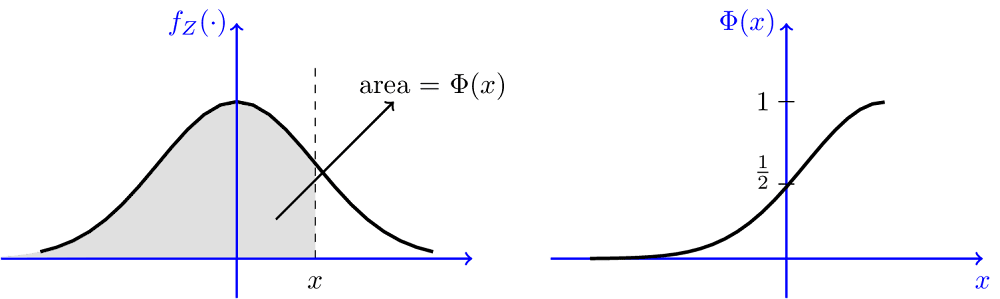

## Figures

The idea is to generate the figure, output to local, then reload using the following code. 

~~~~markdown
```{r car-plot, eval=TRUE, fig.asp = 0.62, echo=FALSE, out.width="80%", fig.cap="Caption here." }`r ''`
knitr::include_graphics(img1_path) 
```
~~~~

Use code chunk label to cross reference, e.g., <span style='color:#00CC66'>`Fig. \@ref(fig:car-plot)`</span>. 

- Note that you must specify `fig.cap` to enable labeling and cross references. Otherwise, the cross reference will show `Fig. ??`.

- `knitr::include_graphics` supports web url for html output, but NOT for latex output.


Alternatively, use `fig.width` to fix the figure width, and `fig.asp` to fix the aspect ratio (height:width).

~~~~markdown
```{r car-plot2, fig.width=6, fig.asp=0.6, fig.cap="Caption here." }`r ''`
library(AER)
data(CASchools)
library(ggplot2)
ggplot(CASchools, aes(x = expenditure)) +
  geom_histogram(binwidth = 500, fill = "lightblue", color = "black") +
  labs(title = "Histogram of Expenditure per Student",
       x = "Expenditure per Student (USD)",
       y = "Frequency") +
  theme_minimal(base_size = 14)
```
~~~~


```{r histogram, fig.width=6, fig.asp=0.6, echo=FALSE, fig.cap="Historgram of Expenditure per Student. Fixed `fig.width` and `fig.asp`."}
packages <- c("AER", "ggplot2")
invisible(lapply(packages, function(pkg) suppressPackageStartupMessages(library(pkg, character.only = TRUE))))
data(CASchools)
ggplot(CASchools, aes(x = expenditure)) +
  geom_histogram(binwidth = 500, fill = "lightblue", color = "black") +
  labs(title = "Histogram of Expenditure per Student",
       x = "Expenditure per Student (USD)",
       y = "Frequency") +
  theme_minimal(base_size = 14)
```

--------------------------------------------------------------------------------

### Output directly to document


- You can let the code output to document directly, i.e., not generating a file and reload. 

    But in this case, scale the figure will change the plot text too. The text might be scaled unexpectedly too small/large. Just be careful with it.

Load data.

```{r message=FALSE}
library(quantmod)
aapl <- getSymbols("AAPL", 
           src = 'yahoo', 
           from = "2014-08-01", 
           to = "2024-09-17",   
           auto.assign = FALSE
           )
```


--------------------------------------------------------------------------------

`out.width="50%"`

~~~~markdown
```{r out.width="50%", fig.asp = 0.62, fig.cap="`out.width=\"50%\"`, fig.asp set to 0.62."}`r ''`
# plot text is scaled too
plot(aapl$AAPL.Close)
```
~~~~


```{r out.width="50%", fig.asp = 0.62, echo=FALSE, fig.cap="`out.width`=50%, fig.asp set to 0.62. Note that text font scales too, hard to read.test"}
plot(aapl$AAPL.Close)
```


--------------------------------------------------------------------------------


`out.width="100%"`

~~~~markdown
```{r out.width="100%", fig.asp = 0.6, fig.cap="`out.width=\"100%\"`."}`r ''`
plot(aapl$AAPL.Close)
```
~~~~

```{r out.width="100%", fig.asp = 0.6, echo=FALSE, fig.cap="`out.width`=100%, fig.asp set to 0.6. Note that the plot text got zoomed too, can be too large."}
plot(aapl$AAPL.Close)
```

--------------------------------------------------------------------------------

### Fixed `fig.width`

- Text does NOT scale with figure size; visibility is good. ✅

~~~~markdown
```{r fig.width=6, fig.asp=0.6}`r ''`
# Text font does NOT scale, but figure title got cropped
plot(aapl$AAPL.Close)
```
~~~~

```{r fig.width=5, fig.asp=0.6, echo=FALSE, fig.cap="Set `fig.width`. Note that text font does NOT scale with figure, BUT the figure title got cropped."}
plot(aapl$AAPL.Close)
```


--------------------------------------------------------------------------------

### Save and reload

This approach preserves your preference better, maintains the relative size of your figure and the text. 

No cropping, no fuss.

```{r message=FALSE}
f_name <- "images/aapl.png"
png(f_name, width=2594, height=1600, res=300)
plot(aapl$AAPL.Close)
invisible(dev.off())
```

~~~~markdown
```{r out.width="50%", fig.cap="include_graphics with `out.width`=50%."}`r ''`
knitr::include_graphics(f_name) 
```
~~~~

```{r out.width="50%", echo=FALSE, fig.cap="include_graphics with `out.width`=50%." }
knitr::include_graphics(f_name) 
```

--------------------------------------------------------------------------------

~~~~markdown
```{r out.width="100%", fig.cap="include_graphics with `out.width`=100%." }`r ''`
knitr::include_graphics(f_name) 
```
~~~~

```{r out.width="100%", echo=FALSE, fig.cap="include_graphics with `out.width`=100%." }
knitr::include_graphics(f_name) 
```


--------------------------------------------------------------------------------

Q: How to suppress the following `dev.off()` messages generated by code chunks in `Rmd`? 

```r
## quartz_off_screen 
##                 2
```

A: Enclose `dev.off()` within `invisible()`, or dump the result of `dev.off()` to a garbage variable. 

```r
invisible(dev.off())     # opt1
whatever <- dev.off()    # opt2
```

--------------------------------------------------------------------------------

Specify code chunk options `fig.width` and `fig.height` for R-generated figures only.

- Default is `fig.width = 7` and `fig.height = 5` (**in inches**, though actual width will depend on screen resolution). Remember that these settings will default to `rmarkdown` values, not `knitr` values.
- If don't know what size is suitable, can right-click the Plots Viewer and choose "Copy Image Address". Scale by `/100` (in inches) and fill the values to chunk options.

--------------------------------------------------------------------------------

`out.width` and `out.height` apply to both existing images and R-generated figures.

- note that the percentage need to be put in quotes.
- `fig.width` do not scale font, it shows the original font size.
- `out.width` scales the whole figure. Better to use this one. If you want to fix aspect ratio, use `fig.asp=0.6` to set height:width = 6:10.
    
    - `out.width` keeps the original aspect ratio of the figure and scale the text in the figure too.
    
        But what most people want is to scale the figure but not the text. For instance, you want to scale your figure to 70\% width of page, but you want to keep the original size of text so it is readable.
        
    - A caveat with `out.width`is that the <span style='color:#00CC66'>axis labels and ticks will be so small</span> and hard to read.

--------------------------------------------------------------------------------

Other chunk options related to figures:

`fig.cap=NULL`  specify figure captions. Must provide `fig.cap` if you need to cross reference the figure.

See <span style='color:#00CC66'>`Fig. \@ref(fig:car-plot)`</span>  use code chunk label to cross reference. The chunk label (`car-plot`) provides the identifier for referencing the figure generated by the chunk.

- `Fig.&nbsp;\@ref(fig:logit-regression)` use `&nbsp;` to insert a <span style='color:#00CC66'>non-breaking space</span>.

<span style='color:#00CC66'>`fig.align="center"`</span> to set figure alignment.

`fig.pos="H"` fix placement.

<span style='color:#00CC66'>`fig.asp=0.6`</span> aspect ratio height:width=6:10.


--------------------------------------------------------------------------------


<span style='color:#00CC66'>**Suggested practice**</span> so that you have correct aspect ratio and automatically scaled text and labels in figures. ✅

1. Generate the figure and save to local

   The benefit is that you have full control to adjust the figure as needed, such as font size, and could reuse it later.

   ````markdown
   ```{r echo=FALSE, include=FALSE}`r ''`
   p <- ggplot(contingency_table %>% 
              as_tibble() %>% 
              mutate(chd69=factor(chd69, levels=c("non-developed", "developed"))), 
          aes(x=smoke, y=n, fill=chd69)) +
       geom_bar(position="stack", stat="identity", color="black", linewidth=0.1) + 
       scale_fill_grey(start=0.88, end=0.7) +
       labs(y="Frequency") +
       theme(axis.title.x = element_blank(), legend.position = "bottom")
   f_name <- "images/stacked_bar.png"
   plot_png(p, f_name, 5.17, 5)
   ```
   ````

   Specify chunk options <span style='color:#00CC66'>`include=FALSE`</span> (Do not include code output) to suppress the graphic window information like the following.

   ```r
   ## quartz_off_screen 
   ##                 2
   ```

2. Add the figure using 

   ````markdown
   ```{r scatter-plot, echo=FALSE, fig.cap="Scatter plot of avearge wage against experience.", out.width = "80%"}`r ''`
   include_graphics(f_name)
   ```
   ````

3. Cross reference 

   - `pdf_document`: using `\autoref{fig:scatter-plot}` from `hyperref` package or `Fig. \ref{fig:scatter-plot}` from base latex.

     `hyperref` uses `Figure`, could be changed to `Fig.` by putting the following cmd at the begin of the Rmd.

     ```latex
     \renewcommand\figureautorefname{Fig.}
     ```

   - `bookdown::html_document2`: using `\@ref(fig:scatter-plot)`.

--------------------------------------------------------------------------------

### Latex symbols in Fig. caption {.unnumbered}

**The R code block approach.**

- `\\Phi` works. You need to escape the `\` in `\Phi` .
- If there are quotation marks (`"`) in the figure caption, need to escape them using `\"...\"` to distinguish from the outer quotes of the caption parameter.
- You can use regular Markdown syntax in Fig captions, such as using `**Bold**` to make text bold.
- <span style='color:#00CC66'>Better to use R code blocks to include figures.</span> 

    Note that `include_graphics("https://link-to-Google-drive")` <span style='color:#FF9900'>does NOT work for pdf output</span>. Works for html output though.

    If using html tag `<figure>`, the numbering will be messed up. There is only automatic numbering with R code figures.

    Use example:
    
    ````markdown
    ```{r fig.cap="The $\\Phi$ and $\\phi$ ($f_Z(.)$) functions (CDF and pdf of standard normal).", out.width="70%", echo=FALSE}`r ''`
    
    ```
    ````
    
    Will generate the following Fig \@ref(fig:fig1).
    
    ```{r fig1, fig.cap="The $\\Phi$ and $\\phi$ ($f_Z(.)$) functions (CDF and pdf of standard normal).", out.width="70%", echo=FALSE}
    
    ```


Alternatively, use **the HTML approach**, and enclose the caption inside `<figcaption>`. 
  
- Benefit: You can type equations as you normally do. Don't need to escape backslashes as using the R code blocks in the example above. 
- <span style='color:#FF9900'>Drawback: You need to manually add figure numbering.</span> 

❗️That means, when you change the order of sections or figures in your webpage, the numbering will be a mess. You need to change all capitals manually.

```html
<figure> 

<figcaption>Fig.1 The $\Phi$ and $\phi$ ($f_Z(.)$) functions (CDF and pdf of standard normal).</figcaption>
</figure>
```

<figure> 

<figcaption>Fig.1 The $\Phi$ and $\phi$ ($f_Z(.)$) functions (CDF and pdf of standard normal).</figcaption>
</figure>

--------------------------------------------------------------------------------

### Refer to another figure in figure caption {.unnumbered}

Just need to use double backslash  `\\@ref(fig:xxx)` in the figure caption.

Use example:

We first generate the figure to be referenced.

````markdown
```{r firstplot, out.width="60%", fig.cap="Source Figure to be referred to."}`r ''`
library(ggplot2)
p <- ggplot(mtcars, aes(wt, mpg))
plot_A <- p + geom_point()
plot_A
```
````
<br>

```{r firstplot, out.width="60%", fig.cap="Source Figure to be referenced. **Note that when specifying `out.width=60%`, the text in the figure is scaled too small.**", echo=FALSE}
library(ggplot2)
p <- ggplot(mtcars, aes(wt, mpg))
plot_A <- p + geom_point()
plot_A
```

Now a second plot with a reference to Fig.: \@ref(fig:firstplot).

````markdown
```{r secondplot, fig.cap = "This is the same as Fig.: \\@ref(fig:firstplot) but now with a red line." }`r ''`
plot_A + geom_line(alpha = .75,col = "red")
```
````

<br>

```{r secondplot, fig.cap = "This is the same as Fig.: \\@ref(fig:firstplot) but now with a red line and `out.width=100%`.", echo=FALSE}
plot_A + geom_line(alpha = .75,col = "red")
```


