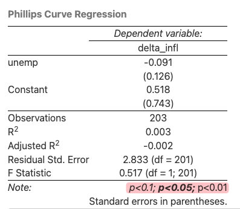
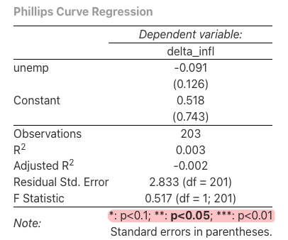

## Tables

```{r setup, include=FALSE}
source("setup.R")
```


If you have some data in R and you want to display them as nice tables, you can use `knitr::kable()`, `knitr::kableExtra`, or `xtable` packages.


But if you a table already, you can just copy-and-paste the table into your Rmd file. It can be either in 

- Markdown table, or
- Latex table
  
  Note that Pandoc will preserve raw LaTeX code in Markdown documents when converting the document to LaTeX, so you can use LaTeX commands or environments in Markdown. [↩︎](https://bookdown.org/yihui/rmarkdown-cookbook/raw-latex.html#raw-latex)

  You may use a fenced code block with the attribute <span class="env-green">`=latex`</span>, e.g.,

  ````markdown
  ```{=latex}`r ''`
  \begin{tabular}{ll}
  A & B \\
  A & B \\
  \end{tabular}
  ```
  ````

  Do not forget the equal sign before `latex`, i.e., it is `=latex` instead of `latex`.

  `=latex` tells Pandoc to treat the content as raw LaTeX code.

--------------------------------------------------------------------------------

<span class="env-green">**Cross reference tables**</span>

Using `bookdown` cmd: `\@ref(tab:chunk-label)`.

Note that you must provide `caption` option in `knitr::kable()`. Otherwise the table won't be numbered.

~~~markdown
And see Table \@ref(tab:mtcars).

```{r mtcars, echo=FALSE}`r ''`
knitr::kable(mtcars[1:5, 1:5], caption = "The mtcars data.")
```
~~~

Refer to the Table \@ref(tab:mtcars).

```{r mtcars, echo=FALSE}
knitr::kable(mtcars[1:5, 1:5], caption = "The mtcars data.")
```

```{r, echo=FALSE}
# print kable() results as text instead of real tables
kat = function(x, ...) {
  if (length(x) > 0) x[1] = gsub('^\n+', '', x[1])
  x = gsub('\n\n+', '\n', x)
  cat(x, sep = '\n')
}
```

--------------------------------------------------------------------------------

`knitr::kable(x, format="pipe")` is useful when you want to copy-and-paste R output from console to other document, e.g., markdown.

```{r mtcars-pipe, echo=TRUE, comment='', render=kat, class.output='md', collapse = TRUE}
knitr::kable(mtcars[1:5, 1:5], format = "pipe")
```


--------------------------------------------------------------------------------

### `knitr::kable`

[`knitr::kable(x, digits, caption=NULL, escape=TRUE)`](https://bookdown.org/yihui/rmarkdown-cookbook/kable.html) Create tables in LaTeX, HTML, Markdown and reStructuredText.

It **adjusts column widths automatically** based on content.

- `caption` 	The table caption. In order to number the table, mut specify the `caption` argument.

- `format`  Possible values are `latex`, `html`, `pipe` (Pandoc's pipe tables), `simple` (Pandoc's simple tables), `rst`, and `jira`. 

  The value of this argument will be <span class="env-green">automatically determined</span> if the function is called within a **knitr** document. 

  If the tables is not rendered properly, you can specify the format manually.

- `digits`  Maximum number of digits for numeric columns, passed to `round()`. 

- `col.names` Rename columns.

- <span class="env-orange">`escape = TRUE`</span>  Whether to escape special characters when producing HTML or LaTeX tables. <a name="escape"></a>
  
  Default is `TRUE`, will treat characters literally; special characters will either be escaped or substituted; no special characters will be interpreted.
  
  For example, `$` is escaped as `\$`, `_` is escaped as `\_`, and `\` is substituted with `\textbackslash{}`

  See [**Math in rmd tables**](#escape-example) for examples of using math symbols in rmd tables.
  
  - <span class="env-green">Set `escape = FALSE` when you have math symbols in the table</span>. 
    
    It makes sure that the math symbols will be rendered.
    
    Note that you need to escape certain special characters in LaTeX math mode though, e.g., use `\\sigma` for printing $\sigma$ in `kable`.

    - Don't need to escape `$`, `^` and `_` in math mode.
  
  - When set to `FALSE`, you have to <span class="env-green">make sure **yourself** that special characters will not trigger syntax errors</span> in LaTeX or HTML.
  
  - Common special LaTeX characters include `#`, `%`, `&`, `{`, and `}`. Common special HTML characters include `&`, `<`, `>`, and `"`. 
    
    They have special meanings and will be treated as format commands instead of literal characters. E.g., `#` will be interpreted as section headers. If you want to print them as literal characters, you need to escape them properly.

    These can easily lead to errors or unexpected effects when you render your file.


- `align` Column alignment: a character **vector** consisting of `'l'` (left), `'c'` (center) and/or `'r'` (right). 

  - By default or if `align = NULL`, <span class="env-green">numeric columns are right-aligned</span>, and <span class="env-green">other columns are left-aligned</span>.
    
    文字列左对齐，数字列右对齐。
  - If only one character is provided, that will apply to all columns.
  - If a vector is provided, will map to each individual column specifically.

- Missing values (`NA`) in the table are displayed as `NA` by default. 
  
  If you want to display them with other characters, you can set the option `knitr.kable.NA`, e.g. <span class="env-green">`options(knitr.kable.NA = '')`</span> in the YAML to hide `NA` values.

- <span class="env-green">`booktabs = TRUE`</span>   use the booktabs package. Default to `FALSE`.
  
  | `booktabs`       | `True`                                                       | `FALSE`                                        |
  | ---------------- | ------------------------------------------------------------ | ---------------------------------------------- |
  | Column separator | No vertical lines in the table, you can add via `vline` option | Table columns are separated by vertical lines. |
  | Horizontal lines | Only has horizontal lines for the table header and the bottom row. <br />- Use `\toprule`, `\midrule`, and `\bottomrule` | Use `\hline`                                   |
  | Row behavior     | A line space is added to every five rows by default.<br />Disable it with `linesep = ""`. |                                                |
  
  
  
- `linesep = ""` remove the extra space after every five rows in kable output (with `booktabs` option)

  `linesep = c("", "", "", "", "\\addlinespace")` default value; empty line space every 5 rows.

```r
# For Markdown tables, use `pipe` format
> knitr::kable(head(mtcars[, 1:4]), format = "pipe")
|                  |  mpg| cyl| disp|  hp|
|:-----------------|----:|---:|----:|---:|
|Mazda RX4         | 21.0|   6|  160| 110|
|Mazda RX4 Wag     | 21.0|   6|  160| 110|
|Datsun 710        | 22.8|   4|  108|  93|
|Hornet 4 Drive    | 21.4|   6|  258| 110|
|Hornet Sportabout | 18.7|   8|  360| 175|
|Valiant           | 18.1|   6|  225| 105|

# For Plain tables in txt, `simple` is useful
> knitr::kable(head(mtcars[, 1:4]), format = "simple") 
                      mpg   cyl   disp    hp
------------------  -----  ----  -----  ----
Mazda RX4            21.0     6    160   110
Mazda RX4 Wag        21.0     6    160   110
Datsun 710           22.8     4    108    93
Hornet 4 Drive       21.4     6    258   110
Hornet Sportabout    18.7     8    360   175
Valiant              18.1     6    225   105
```

--------------------------------------------------------------------------------

#### Math in rmd tables

`knitr::kable(x, escape=TRUE)` 

- `escape=TRUE` 	whether to escape special characters when producing HTML or LaTeX tables. Refer to [`kable` arguments](#escape) for more details.
  - Defaults to `TRUE`.
  - When `escape = FALSE`, you have to make sure that special characters will not trigger syntax errors in LaTeX or HTML. E.g., if you don't escape `\`, it will cause an error.


You need to escape backslashes (`\`) passed into the table data.

--------------------------------------------------------------------------------

<a name="escape-example"></a>
**Example 1 of escaping special characters:** 


````markdown
```{r, echo=FALSE}`r ''`
library(knitr)

mathy.df <- data.frame(site = c("A", "B"), 
                       b0 = c(3, 4), 
                       BA = c(1, 2))

colnames(mathy.df) <- c("Site", "$\\beta_0$", "$\\beta_A$")

kable(mathy.df, escape=FALSE)
```
````


If your target output is pdf, it is possible to edit Latex table directly in `Rmd`.

- Don't enclose in `$$`.
- Use `\begin{table}` and start your table data.

--------------------------------------------------------------------------------


**Example 2 of escaping special characters:**

```{r}
library(knitr)

df <- data.frame(
  Variable = c("Return", "Variance", "Literal symbols"),
  Formula = c("$r_t = \\frac{P_t}{P_{t-1}} - 1$", 
              "$\\sigma^2 = Var(r_t)$",
              "\\$, \\%, \\_, \\#")
)

kable(df, escape = FALSE, booktabs = TRUE)
```


**Expected behaviors:**

- `Return` row → LaTeX math `$r_t ...$` renders properly.
- `Variance` row → works with superscripts and variance notation.
- `Literal symbols` row → shows `$ % _ #` as text in the PDF.


--------------------------------------------------------------------------------

### Data frame printing

To show the `tibble` information (number of row/columns, and group information) along with paged output, we can write a custom function by modifying the [`print.paged_df`](https://github.com/rstudio/rmarkdown/blob/main/R/html_paged.R#L241-L248) function (which is used internally by rmarkdown for the `df_print` feature) and use CSS to nicely format the output.

<https://stackoverflow.com/a/76014674/10108921>

<span class="env-green">**Paged df**</span>

- <https://bookdown.org/yihui/rmarkdown/html-document.html#tab:paged>
- <https://github.com/rstudio/rmarkdown/issues/1403>

```yaml
---
title: "Use caption with df_print set to page"
date: "`r Sys.Date()`"
output:
  bookdown::html_document2:
    df_print: paged
---
```

When the `df_print` option is set to `paged`, tables are printed as HTML tables with support for pagination over rows and columns.

The possible values of the `df_print` option for the `html_document` format.

| Option                                 | Description                                                  |
| -------------------------------------- | ------------------------------------------------------------ |
| `default`                              | Call the `print.data.frame` generic method; console output prefixed by `##`; |
| <span class="env-green">`kable`</span> | Use the `knitr::kable` function; looks nice but with no navigation for rows and columns, neither column types.<br /><span class="env-green">Suggested for pdf output.</span> |
| `tibble`                               | Use the `tibble::print.tbl_df` function, this provides groups and counts of rows and columns info as if printing a `tibble`. |
| <span class="env-green">`paged`</span> | Use `rmarkdown::paged_table` to create a pageable table; `paged` looks best but slows down compilation significantly; |
| A custom function                      | Use the function to create the table                         |

The possible values of the `df_print` option for the `pdf_document` format: `default`, `kable`, `tibble`, `paged`, or a custom function.

~~~~markdown
paged print

```{r echo=TRUE, paged.print=TRUE}`r ''`
ggplot2::diamonds
```

default output

```{r echo=TRUE, paged.print=FALSE}`r ''`
ggplot2::diamonds
```

kable output

```{r echo=TRUE}`r ''`
knitr::kable(ggplot2::diamonds[1:10, ])
```
~~~~


Note that `kable` output doesn't provide tibble information.


Available options for `paged` tables:

| Option         | Description                                           |
| -------------- | ----------------------------------------------------- |
| max.print      | The number of rows to print.                          |
| rows.print     | The number of rows to display.                        |
| cols.print     | The number of columns to display.                     |
| cols.min.print | The minimum number of columns to display.             |
| pages.print    | The number of pages to display under page navigation. |
| paged.print    | When set to `FALSE` turns off paged tables.           |
| rownames.print | When set to `FALSE` turns off row names.              |

These options are specified in each chunk like below:

~~~markdown
```{r cols.print=3, rows.print=3}`r ''`
mtcars
```
~~~


For **pdf_document**, it is possible to write LaTex code directly.

````markdown
```{=latex}
\begin{tabular}{ll}
A & B \\
A & B \\
\end{tabular}
```
````


Do not forget the equal sign before `latex`, i.e., it is `=latex` instead of `latex`. 

--------------------------------------------------------------------------------


### Stargazer

[`stargazer`](https://www.rdocumentation.org/packages/stargazer/versions/5.2.3/topics/stargazer) print nice tables in `Rmd` documents and `R` scripts:

- Passing a data frame to stargazer package creates a <span class="env-green">**summary statistic table**</span>. 

- Passing a regression object creates a nice <span class="env-green">**regression table**</span>.  

- Support tables output in multiple formats: `text`, `latex`, and `html`.
    - In `R` scripts, use `type = "text"` for a quick view of results. 

- `stargaer` does NOT work with `anova` table, use `pander::pander` instead.

--------------------------------------------------------------------------------

#### Text table

Specify `stargazer(model, type = "text")`

````markdown
```{r descrptive-analysis-text, comment = ''}`r ''`
apply(data[,-1], 2, get_stat) %>% 
    stargazer(type = "text", digits = 2)
```
````
The text output looks like the following.
```
===============================================
                        Dependent variable:    
                    ---------------------------
                            delta_infl         
-----------------------------------------------
unemp                         -0.091           
                              (0.126)          
                                               
Constant                       0.518           
                              (0.743)          
                                               
-----------------------------------------------
Observations                    203            
R2                             0.003           
Adjusted R2                   -0.002           
Residual Std. Error      2.833 (df = 201)      
F Statistic             0.517 (df = 1; 201)    
===============================================
Note:               *p<0.1; **p<0.05; ***p<0.01
```

Significance codes are shown in the footnote.

- By default, `stargazer` uses `***`, `**`, and `*` to denote statistical significance at the one, five, and ten percent levels (`* p<0.1; ** p<0.05; *** p<0.01`). 

- In contrast, `summary.lm` uses `* p<0.05, ** p<0.01, *** p< 0.001`.

- You can change the cutoffs for significance using `star.cutoffs = c(0.05, 0.01, 0.001)`.

There is **one empty line** after each coefficient, to remove the empty lines, specify `no.space = TRUE`. 

The regression table with all empty lines removed:

```
===============================================
                        Dependent variable:    
                    ---------------------------
                            delta_infl         
-----------------------------------------------
unemp                         -0.091           
                              (0.126)          
Constant                       0.518           
                              (0.743)          
-----------------------------------------------
Observations                    203            
R2                             0.003           
Adjusted R2                   -0.002           
Residual Std. Error      2.833 (df = 201)      
F Statistic             0.517 (df = 1; 201)    
===============================================
Note:               *p<0.1; **p<0.05; ***p<0.01
```

--------------------------------------------------------------------------------

#### HTML table


HTML table can be obtained by specifying `stargazer(model, type = "html")`.

Note that you need to specify <span class="env-green">`results="asis"`</span> in the code chunk options. This option tells `knitr` to treat verbatim code blocks "as is." Otherwise, instead of your table, you will see the raw html or latex code.

- Note that <span class="env-orange">`*`'s do **NOT** show properly in html output</span>, see Fig. \@ref(fig:stargazer1), need to specify in the footnote (`notes`) manually.

```{r stargazer1, echo=FALSE, fig.cap="Failed to show significance codes in HTML output.", out.width='60%'}

```

Use the following code to display the correct significance symbols.

````markdown
```{r descrptive-analysis-html, results="asis"}`r ''`
# the following code fixes the significance codes in html output
apply(data[,-1], 2, get_stat) %>% 
    stargazer(
      type = "html", digits = 2, 
      notes = "<span>&#42;</span>: p<0.1; <span>&#42;&#42;</span>: <strong>p<0.05</strong>; <span>&#42;&#42;&#42;</span>: p<0.01 <br> Standard errors in parentheses.",
      notes.append = F
      )
```
````

- `&#42;` is the HTML entity code for `*`.
- Stargazer by default using `*` for 10% significance, `**` for 5% significance, and `***` for 1% significance.

After correcting the significance codes, the output looks like Fig. \@ref(fig:stargazer2).

```{r stargazer2, echo=FALSE, fig.cap="Correct significance codes.", out.width='60%'}

```


--------------------------------------------------------------------------------

#### Common arguments

<span class="env-green">**Table general formatting options:**</span>

- `type = "latex" | "html" | "text"` specify output table format.

- `digits = 3` an integer that indicates how many decimal places should be used. Defaults to 3 digits.
  
  A value of `NULL` indicates that no rounding should be done at all, and that all available decimal places should be reported. 

- `notes` a character vector containing notes to be included below the table.

- `notes.append = FALSE` a logical value that indicates whether `notes` should be appended to the existing standard note(s) associated with the table's `style` (typically an explanation of significance cutoffs). 
  - Defaults to `TRUE`.
  - If the argument's value is set to `FALSE`, the character strings provided in `notes` will replace any existing/default notes.

- `notes.align`: `"l"` for left alignment, `"r"` for right alignment, and `"c"` for centering. This argument is not case-sensitive.

___

<span class="env-green">**Control structure of regression tables**</span>

- `intercept.bottom = TRUE` place the intercept at the bottom of the table. Defaults to `TRUE`.

- `keep.stat = NULL`: control which model statistics should be kept in the table. Possible values include `"n"`, `"rsq"`, `"adj.rsq"`, `"f"`, `"ser"`, `"ll"`, `"aic"`, `"bic"`, and `"logLik"`. 

  - The default is `NULL`, which means that all available statistics will be included in the table.
  - To exclude all statistics, set `keep.stat = c()`.
  - To include only the number of observations and the adjusted R-squared, set `keep.stat = c("n", "adj.rsq")`.

- <span class="env-green">`order = NULL`</span>: a vector of **regular expressions** (or of **numerical indexes**) that indicates the order in which variables will appear in the output.
  
  This options is useful when you want to rearrange the order of variables in the regression table. 
  
  The order of variables when you include <span class="env-green">interaction terms</span> might not be what you expect. In my case, the interaction term appears in between the main effects, while I want it to appear after all main effects.

  You can use `stargazer(model)` to examine the default order and names of variables. Then you can specify the order you want. By default, intercept is at the bottom.

  **Two ways to specify the order:**

  - Regular expression to match variable names.
    
    In order to exactly match the variable names, you can use

    ```r
    vars.order <- c("x1", "x2", "x3", "x3:x1")
    stargazer(fit1, fit2, fit3, align = TRUE,
      table.placement = "H", omit.stat = c("f", "ser"), 
      order = paste0("^", vars.order , "$") # format as regular expressions
      )
    ```
    
    Note that `^` and `$` are used to exact match the whole variable name. A character vector of all variable names won't work, as `order` expects regular expressions.

    A <span class="env-orange">caveat</span> is that you might have some issues if the variable names include special characters, e.g.: "." or "*".
  
  - Numerical indexes of the variables in the model summary.
    
    ```r
    stargazer(fit1, fit2, fit3, align = TRUE,
      table.placement = "H", omit.stat = c("f", "ser"), 
      order = c(2, 3, 1, 4, 5)
      )
    ```
    
    This approach is simple, but less readable.

___

<span class="env-green">**Make your model names more informative:**</span>

- `column.separate` a numeric vector that specifies how `column.labels` should be laid out (grouped) across regression table columns. 
  
  A value of `c(2, 1, 3)`, for instance, will apply the first label to the two first columns, the second label to the third column, and the third label will apply to the following three columns (i.e., columns number four, five and six).

- `dep.var.labels` labels for dependent variables.

- <span class="env-green">`column.labels`</span> a character vector of labels for columns in regression tables.
  
    This is useful to denote different regressions, informing the name/nature of the model, instead of using numbers to identify them.

    When you add custom column labels, you may want to use: <span class="env-green">`model.numbers = FALSE`</span> to suppress the default model numbers (1) (2)...

- <span class="env-green">`covariate.labels`</span>  labels for covariates in the regression tables.

    Can provide latex symbols in the labels, need to escape special symbols though.

    ```r
    stargazer(mod_sel_lm_mtcars, 
              covariate.labels = 
                c("(Intercept)", "drat", "hp", "$w_{i}$",
                  "\\textit{k}", "logLik", "AICc", "\\Delta AICc"))
    ```

- `add.lines` add a row(s) for additional info, such as reporting fixed effects.

    ```r
    stargazer(output, output2, type = "html",
              add.lines = list(
                c("Fixed effects?", "No", "No"),
                c("Results believable?", "Maybe", "Try again later")
                )
              )
    ```

___

<span class="env-green">**Make your table more compact:**</span>

- `single.row = TRUE` to put coefficients and standard errors on same line

- <span class="env-green">`no.space = TRUE`</span> to remove the spaces after each line of coefficients

- `font.size = "small"`  to make font size smaller


**Tip:** Add a blank line under the `stargazer` table: `&nbsp;` with a blank line above and below.


--------------------------------------------------------------------------------

#### Cross reference `stargazer` tables

- **In pdf output**, use `Table \@ref(tab:reg-table)` or `Table \ref{tab:reg-table}`.

  ````markdown
  Table \@ref(tab:reg-table) summarize the regression results in a table.
  
  ```{r, include=TRUE, results='asis'}`r ''`
  stargazer(capm_ml, FF_ml, type='latex', header=FALSE,
            digits=4, no.space = TRUE,
            title="Regression Results for META",
            label = "tab:reg-table")
  ```
  ````

  ❗️ Note that you need to specify <span class="env-green">`results="asis"`</span> in the code chunk options. Omitting this options will result in failing to compile tex.
  
  - <span class="env-green">`header=FALSE`</span> is to suppress the `% Table created by stargazer` header. This applies to only `latex` tables.
  
    ```markdown
    % Table created by stargazer v.5.2.3 by Marek Hlavac, Social Policy Institute. E-mail: marek.hlavac at gmail.com
    % Date and time: Fri, Sep 19, 2025 - 15:16:36
    ```

  - `label="tab:reg-table"` is to specify the cross reference label for the table.

  - <span class="env-green">`table.placement = "H"`</span>  set float to `H` to fix positions.  Places the float at *precisely* the location in the code. This requires the <span class="env-green">`float`</span> LaTeX package. Remember to load it in the YAML.

    - Defaults to `"!htbp"`. 

      The `htbp` controls where the table or figure is placed. Tables and figures do not need to go where you put them in the text. LATEX moves them around to prevent large areas of white space from appearing in your paper.
      `h` (Here): Place the float here, i.e., *approximately* at the same point it occurs in the source text (however, *not exactly* at the spot)
      `t` (Top): Place the table at the top of the *current* page
      `b` (Bottom):  Place the table at the *bottom* of the current page.
      `p` (Page): Place the table at the top of the *next* page.
      `!`: Override internal parameters LaTeX uses for determining "good" float positions. 

  - `align = FALSE` 	a logical value indicating whether numeric values in the same column should be aligned at the decimal mark in LaTeX output.
  
- **In html output**, cross references to stargazer tables are <span class="env-orange">NOT</span> so straightforward.

  `label` option in `stargazer` does not work. Cannot use chunk labels either.

  ````markdown
  ```{r fit-age, echo=FALSE, results='asis', fig.cap="Logistic regression of CHD on age."}`r ''`
  # Use title caption from fig.cap
  tit <- knitr::opts_current$get("fig.cap")
  # Adding caption for html output
  tit_html <- paste0(
    '<span id="tab:', knitr::opts_current$get("label"),'">(#tab:',
          knitr::opts_current$get("label"), ')</span>', tit)
  stargazer::stargazer(fit.age,
            label = paste0("tab:", knitr::opts_current$get("label")),
            title = ifelse(knitr::is_latex_output(), tit, tit_html),
            type = ifelse(knitr::is_latex_output(),"latex","html"),
            notes = "<span>&#42;</span>: p<0.1; <span>&#42;&#42;</span>: <strong>p<0.05</strong>; <span>&#42;&#42;&#42;</span>: p<0.01 <br> Standard errors in parentheses.",
            notes.append = F,
            header = F
            )
  ```
  
  Here is another reference to stargazer Table \@ref(tab:fit-age).
  ````

  Don't change things unless it is absolutely necessary. Run the code chunk before compiling the whole website. It gets slowly as the website gets larger. 

  `stargazer::stargazer()` the `::` is necessary, and `header=F` is necessary and should be place at the end, otherwise will have errors as follows.

  ```r
  Error in `.stargazer.wrap()`:
  ! argument is missing, with no default
  Backtrace:
   1. stargazer::stargazer(...)
   2. stargazer:::.stargazer.wrap(...)
  Execution halted
  
  Exited with status 1.
  ```

  Another example if you don't need to add footnotes.

  ````markdown
  ```{r mytable, results='asis', fig.cap="This is my table."}`r ''`
  
  # Use title caption from fig.cap
  tit <- knitr::opts_current$get("fig.cap")
  
  # Adding caption for html output
  tit_html <- paste0('<span id="tab:',
                     knitr::opts_current$get("label"),
                     '">(#tab:',
                     knitr::opts_current$get("label"),
                     ')</span>',
                     tit)
  
  stargazer::stargazer(
    fit.age,
    label = paste0("tab:", knitr::opts_current$get("label")),
    title = ifelse(knitr::is_latex_output(), tit, tit_html),
    type = ifelse(knitr::is_latex_output(),"latex","html"),
    header = F
    )
  ```
  
  Here is a reference to stargazer Table \@ref(tab:mytable).
  ````

  

**Alignment of Stargazer Tables**

- In PDF, the tables will be in the center by default. 

- However, when working with HTML output, you need to add CSS styling to adjust the table. 


References:

- <https://libguides.princeton.edu/c.php?g=1326286&p=9763596#s-lg-box-wrapper-36305037>

--------------------------------------------------------------------------------

### `xtable`

Two steps:

1. convert to `xtable` object
2. print to LaTeX or html code

```r
xtab <- xtable(tableResults, caption = NULL, digits = NULL)
print(xtab, include.rownames=FALSE)
```

`xtable` converts an **R** object to an `xtable` object, which can then be printed as a LaTeX or HTML table.

**`xtable()` arguments**

-  `align` 	Character vector of length <span class="env-green">equal to the number of columns</span> of the resulting table, indicating the alignment of the corresponding columns. Also, `"|"` may be used to produce vertical lines between columns in LaTeX tables, but these are effectively ignored when considering the required length of the supplied vector. 
    -   If a character vector of length one is supplied, it is split as `strsplit(align, "")[[1]]` before processing. Since the row names are printed in the first column, the length of `align` is one greater than `ncol(x)` if `x` is a `data.frame`. 
    -   Use `"l"`, `"r"`, and `"c"` to denote left, right, and center alignment, respectively. 
    -   Use `"p{3cm}"` etc. for a LaTeX column of the specified width. For HTML output the `"p"` alignment is interpreted as `"l"`, ignoring the width request. Default depends on the class of `x`.

-   `caption`   Character vector of length 1 or 2 containing the table's caption or title. If length is 2, the second item is the "short caption" used when LaTeX generates a "List of Tables". 
-   `digits`     Numeric vector of length equal to one (in which case it will be replicated as necessary) or to the number of columns of the resulting table **or** matrix of the same size as the resulting table, indicating the number of digits to display in the corresponding columns. 


`print.xtable()` arguments

- `include.rownames`   A logical value indicating whether the row names of `x` should be printed. Default is `TRUE`.
- `type`  Possible values are `"latex"` and `"html"`. Default is `"latex"`.

**Print a data frame**

```{r results='asis'}
library(xtable)

df <- data.frame(
  Asset = c("A", "B"),
  Mu = c(0.175, 0.055),
  Sigma = c(0.258, 0.115)
)

# Convert to xtable
xtab <- xtable(df, caption = "Asset Parameters", digits = 3)

# Print html code
print(xtab, type = "html", include.rownames = TRUE)
```

**Print a regression table**

```{r results='asis'}
model <- lm(mpg ~ hp + wt, data = mtcars)
xtab_model <- xtable(model, caption = "Regression of mpg on hp and wt")

# Print as html
print(xtab_model, type = "html", digits = 3)
```


--------------------------------------------------------------------------------

### `kableExtra`

The [**kableExtra**](https://bookdown.org/yihui/rmarkdown-cookbook/kableextra.html) package is designed to extend the basic functionality of tables produced using `knitr::kable()`.

`kableExtra::kbl()` extends `knitr::kable()`, with some additional features.

```r
# pipe kabe output to the styling function of kableExtra
kable(iris) %>%
  kable_styling(latex_options = "striped")
```


`kableExtra::kable_styling(bootstrap_options = c("striped", "hover"), full_width = FALSE)`

- `bootstrap_options` 	A character vector for bootstrap table options. Please see package vignette or visit the w3schools' [Bootstrap Page](https://www.w3schools.com/bootstrap/bootstrap_tables.asp) for more information. Possible options include `basic`, `striped`, `bordered`, `hover`, `condensed`, `responsive` and `none`.

  - `striped`   alternating row colors
  - `hover` Use the `:hover` selector on `tr` (table row) to <span class="env-green">highlight table rows</span> on mouse over.

- `full_width`  A `TRUE` or `FALSE` variable controlling whether the HTML table should have 100% the preferable format for `full_width`. If not specified, 

  - `TRUE` for a HTML table , will have full width by default but 
  - this option will be set to `FALSE` for a LaTeX table.

- `latex_options` 	A character vector for **LaTeX** table options, i.e., won't have effect on html tables. 

  Possible options:

  | Arguments       | Meanings                                                     |
  | --------------- | ------------------------------------------------------------ |
  | `striped`       | Add alternative row colors to the table. It will imports `LaTeX` package `xcolor` if enabled. |
  | `scale_down`    | useful for super **wide** table. It will automatically adjust the table to <span class="env-green">fit the page width</span>. |
  | `repeat_header` | only meaningful in a **long** table environment. It will let the header row repeat on every page in that long table. |
  | `hold_position` | "hold" the floating table to the exact position. It is useful when the `LaTeX` table is contained in a `table` environment after you specified captions in `kable()`. It will force the table to stay in the position where it was created in the document. |
  | `HOLD_position` | A stronger version of `hold_position`. Requires the float package and specifies ⁠[H]⁠. |


Rows and columns can be grouped via the functions `pack_rows()` and `add_header_above()`, respectively. 

`scroll_box(width = "100%", height = "500px")`  let you create a fixed height table while **making it scrollable**. This function only works for html long tables.

```r
# commonly used settings 
table %>% 
    knitr::kable(digits = 5) %>%
    kable_styling(bootstrap_options = c("striped", "hover"), full_width = FALSE, latex_options="scale_down") %>% 
    scroll_box(width = "100%", height = "500px")
```


```r
# escape=TRUE, this makes your life easier, will output the table exactly as it is
result <- read_csv("~/Documents/GDP/data/reg_result/IFE_result.csv")
result %>%
  knitr::kable(digits = 5, escape=T) %>%
  kable_styling(bootstrap_options = c("striped", "hover"), full_width = FALSE, latex_options="scale_down")
```


```r
# escape=FALSE, have to specify escape by replace `*` to `\\\\*`
result <- read_csv("~/Documents/GDP/data/reg_result/IFE_result.csv")
result <- result %>% 
  mutate(pval.symbol = gsub("[*]", "\\\\*", pval.symbol) )
result %>%
  knitr::kable(digits = 5, escape=FALSE) %>%
  kable_styling(bootstrap_options = c("striped", "hover"), full_width = FALSE, latex_options="scale_down")
```


#### tables in pdf output

```r
reg_data %>% 
    select(Date, adjusted, eRi, rmrf) %>%
    head(10) %>% 
    knitr::kable(digits = c(0,2,4,4), escape=T, format = "latex", booktabs = TRUE, linesep = "" ) %>%
    kable_styling(latex_options = c("striped"), full_width = FALSE, stripe_color = "gray!15")
```

`knitr::kable()` arguments

- `format = "latex"` specifies the output format.

- `align = "l"` specifies column alignment.

- `booktabs = TRUE` is generally recommended for formatting LaTeX tables.

- `linesep = ""` prevents default behavior of extra space every five rows.

--------------------------------------------------------------------------------

`kableExtra::kable_styling()` arguments

- `position = "left"` places table on left hand side of page.
- `latex_options = c("striped", "repeat_header")` implements table striping with repeated headers for tables that span multiple pages.
- `stripe_color = "gray!15"` species the stripe color using LaTeX color specification from the [xcolor package](https://mirror.mwt.me/ctan/macros/latex/contrib/xcolor/xcolor.pdf) - this specifies a mix of 15% gray and 85% white.

--------------------------------------------------------------------------------

`linebreak(x, align = "l", double_escape = F, linebreaker = "\n")`  Make linebreak in LaTeX Table cells.

- `align="l"`  Choose from "l", "c" or "r". Defaults to "l".

--------------------------------------------------------------------------------


#### Customize the looks for columns/rows

`kableExtra::column_spec(kable_input, column)` this function allows users to select a column and then specify its look.

```r
# specify the width of the first two columns to be 5cm
table %>%
  knitr::kable() %>%
  column_spec(1:2, width = "5cm") 
```

- `kable_input`: Output of `knitr::kable()`

- `column`: A numeric value or vector indicating which column(s) to be selected.

  E.g., to format the 1st and 3rd columns: `column_spec(c(1, 3), width = "5cm") `.


`row_spec()` works similar with `column_spec()` but defines specifications for rows. 

- For the position of the target row, you don’t need to count in header rows or the group labeling rows.
- `row_spec(row = 0, align='c')` specify format of the header row. Here I want to center align headers.

--------------------------------------------------------------------------------

#### Add header rows to group columns

`add_header_above()`: The header variable is supposed to be a named character with the names as new column names and values as column span. 

For your convenience, if column span equals to 1, you can ignore the `=1` part so the function below can be written as `add_header_above(c("", "Group 1" = 2, "Group 2" = 2, "Group 3" = 2))`.

```r
kbl(dt) %>%
  kable_classic() %>%
  add_header_above(c(" " = 1, "Group 1" = 2, "Group 2" = 2, "Group 3" = 2))
```


You can add another row of header on top.

--------------------------------------------------------------------------------

#### Group rows

`collapse_rows` will put <u>repeating cells in columns</u> into multi-row cells. The vertical alignment of the cell is controlled by `valign` with default as “top”.

- Not working for html output.

```r
collapse_rows_dt <- data.frame(C1 = c(rep("a", 10), rep("b", 5)),
                 C2 = c(rep("c", 7), rep("d", 3), rep("c", 2), rep("d", 3)),
                 C3 = 1:15,
                 C4 = sample(c(0,1), 15, replace = TRUE))

kableExtra::kbl(collapse_rows_dt, align = "c") %>%
  kable_paper(full_width = F) %>%
  column_spec(1, bold = T) %>%
  collapse_rows(columns = 1:2, valign = "top")
```


Empty string as column name in `tibble`: use `setNames` or `attr`

```r
df <- tibble(" "=1)
setNames(df, "")
# # A tibble: 1 x 1
#      ``
#   <dbl>
# 1     1

attr(df, "names") <- c("")
```

`footnote()` add footnotes to tables. 

- There are four notation systems in `footnote`, namely `general` (no prefix for footnotes), `number`, `alphabet` and `symbol`. 

--------------------------------------------------------------------------------

### huxtable

`huxtable` supports export to LaTeX, HTML, Microsoft Word, Microsoft Excel, Microsoft Powerpoint, RTF and Markdown.

- [Changing layout](https://hughjonesd.github.io/huxtable/articles/huxtable.html#changing-the-layout)

```{r results='asis'}
library(tidyverse)
library(huxtable)
df <- data.frame(
  Parameter = c("\\( \\mu \\)", "\\( \\sigma^2 \\)"),
  Boeing = c(0.149, 0.069),
  Microsoft = c(0.331, 0.136)
)
ht <- as_hux(df)
ht <- ht %>% 
  insert_row("\\( \\rho \\)(Boeing, Microsoft)", -0.008, "", after=3) %>% 
  merge_cells(4, 2:3) %>% 
  set_align(4, 2:3, "center") %>%
  set_bold(1, everywhere, TRUE) %>%
  set_width(0.6)

# print_latex(ht) # uncomment this line if printing as LaTeX table
print_html(ht) # print as HTML table
```

- `as_hux()` convert a data frame to a `huxtable` object.

- `insert_row(..., after)` insert a new row after the specified row number.
  
  Need to <span class="env-green">provide values for all columns</span>. Empty values can be filled with `""`.

- <span class="env-green">Table header as row 1</span> 
  - insert a new row 3 would be `after = 3`.
  - insert as the first row would be `after = 0`.

- <span class="env-green">`merge_cells(row, col)`</span> merge cells in the specified rows and columns.

- `set_align(row, col, value)` set alignment for the specified rows and columns.
  - `set_align("center")` set all cells to be center aligned.

- `set_width(value)` set the width of the table. Default html tables are 100% width.
  
  A numeric width is treated as a proportion of f the surrounding block width (HTML) or text width (LaTeX). 

- `col_width(ht, value)` set relative widths for each column.
  
  ```r
  col_width(jams) <- c(.2, .8)
  ```

- **Math symbols** works fine for bookdown, but not for xaringan presentations.
  
  - By default, huxtable will escape special characters in your cells. 
    - To display special characters such as LaTeX maths, set the `escape_contents` property to `FALSE`.
    - Alternatively, manually escape special characters. 
      
      <span class="env-green">Use `\\( \\mu \\)`</span>, <span class="env-orange">`\\$` does not work.</span>
  - For xaringan, use unicode symbols instead, e.g., `μ` for `\mu`, `σ` for `\sigma`, and `ρ` for `\rho`.


--------------------------------------------------------------------------------

**Example with math symbols in `huxtable`:**

- `set_escape_contents(FALSE)` to turn off escaping special characters.
- Set code chunk option  `results='asis'` to print the table as is.
- Escape backslash `\` with another backslash `\\`.


```{r results='asis'}
# set escape_contents to FALSE
df <- data.frame(
  Parameter = c("$\\mu$", "$\\sigma^2$"),
  Boeing = c(0.149, 0.069),
  Microsoft = c(0.331, 0.136)
)
ht <- as_hux(df) %>% 
  set_escape_contents(FALSE) %>%    # turn off escaping special characters
  set_align("center") %>%           # center align all cells
  set_bold(1, everywhere, TRUE) %>% # bold header row
  set_width(0.6)                    # set table width
print_html(ht)
```

--------------------------------------------------------------------------------

**In <span class="env-green">xaringan presentations</span>, use <u>unicode symbols</u> instead of LaTeX math symbols.**

- In xaringan presentations, table width is automatically adjusted to fit contents.
- In html output, table width is 100% by default.

````markdown
```{r results='asis'} `r ''`
# Create huxtable and use special characters that will be converted to math
df <- data.frame(
  Parameter = c("μ", "σ²"),
  Boeing = c(0.149, 0.069),
  Microsoft = c(0.331, 0.136)
)
ht <- as_hux(df)
ht <- ht %>% 
  insert_row("ρ(Boeing, Microsoft)", -0.008, "", after=3) %>% 
  merge_cells(4, 2:3) %>% 
  set_width(0.6) %>%
  set_bold(1, everywhere, TRUE) %>%
  set_align(everywhere, everywhere, "center")

print_html(ht)
```
````

will be render as:

```{r echo=FALSE, results='asis'}
df <- data.frame(
  Parameter = c("μ", "σ²"),
  Boeing = c(0.149, 0.069),
  Microsoft = c(0.331, 0.136)
)
ht <- as_hux(df)
ht <- ht %>% 
  insert_row("ρ(Boeing, Microsoft)", -0.008, "", after=3) %>% 
  merge_cells(4, 2:3) %>% 
  set_width(0.6) %>% 
  set_bold(1, everywhere, TRUE) %>%
  set_align(everywhere, everywhere, "center")

print_html(ht)
```