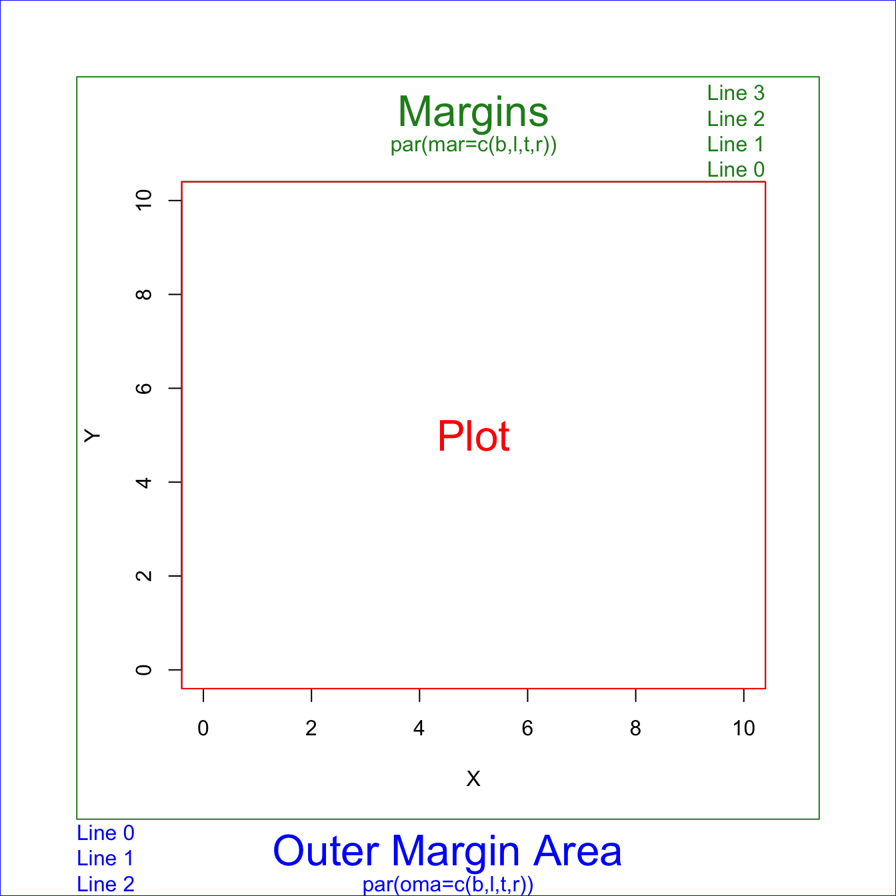

# Graphics


### Graphic Parameters  {.unnumbered .unlisted}

`par()` permanently set global graphic parameters in the current session. Doesn't apply to external graphic devices, e.g., x11.

<span style='color:#008B45'>**One nice looking setting**</span>: 

```{r eval=F}
par(oma=c(0.5,0.5,0,2), mar=c(3.5, 3.5, 2, 1), mgp=c(2.4,0.8,0))
```

- `mar` inner margins inside the plot area. Use this to set spacing between <span style='color:#008B45'>subplots</span>. 内边距

- `oma` outer margins outside the plot area. If it is a multi-panel figure, use this to set spaing for the <span style='color:#008B45'>whole figure</span>. 外边距

  It takes a little trial-and-error to hit on margins that produce the desired spacing. 

  If you want all of your panels to have plots that fill the same area, then the `bottom+top` and `left+right` margins <span style='color:#008B45'>need to be the same</span> in all panels. In the following example, the sum is 0.4 for both, but bottom+top does not need to equal left+right.

  `oma` 和 `mar` 是叠加的关系。如果有任何图的元素被chop off, 增加内边距。

- these parameters can also be set inside `plot`. When use `plot.xts`, parameters set using `par` are not honored, have to specify inside the `plot.xts` function.

  - `plot.xts` set `mar = c(3, 2, 0, 2)`. So any settings before are overwritten.

- Note that `par` does not work for `ggplot` figures, must set margins using `theme(plot.margin=margin(t = 0, r = 0, b = 0, l = 0, unit = "pt"))`.


Q: Axis title got chopped off. \
A: increase `mar` to enlarge inner margins. Or, reduce `mgp[1]` to reduce the margin between title and axis.


Q: 需要每个subplot 设置各自边距 \
A: 每个图开始之前设置`par`. 


Q: add title to each subplot. \
A: use `text` to add text in the graph area.


Q: add text to the whole figure, such as shared y-axis title and figure title. \
A: use `mtext(text, side)`. 1-bottom, 2-left, 3-right, 4-top.


```r
# multipanel example
par(mfrow=c(2,2), tcl=-0.5, family="serif")

# Top left panel
par(mai=c(0.2,0.4,0.2,0))
plot(Sepal.Length~Sepal.Width, data=iris, subset=(Species=="virginica"), 
     xlab=" ", ylab=" ", xlim=c(min.width,max.width), ylim=c(min.length,max.length), xaxt="n")
axis(1, labels=FALSE) # drop the numbers in the x-axis
# add title to subplot
text((max.width-min.width)/2 + min.width, max.length+0.15, expression(italic("Iris virginica")))

# Top right panel
plot.new()

# Bottom left panel
par(mai=c(0.4,0.4,0,0))
plot(Sepal.Length~Sepal.Width, data=iris, subset=(Species=="versicolor"), xlab=" ", ylab=" ",
     xlim=c(min.width,max.width), ylim=c(min.length,max.length))
text((max.width-min.width)/2 + min.width, max.length+0.15, expression(italic("Iris versicolor")))

# Bottom right panel
par(mai=c(0.4,0.2,0,0.2))
plot(Sepal.Length~Sepal.Width, data=iris, subset=(Species=="setosa"), xlab=" ", ylab=" ",
     xlim=c(min.width,max.width), ylim=c(min.length,max.length), yaxt="n")
axis(2, labels=FALSE) # drop the number in the y-axis
text((max.width-min.width)/2 + min.width, max.length+0.15, expression(italic("Iris setosa")))

# Shared titles for the whole figure
mtext("Sepal Width", side=1, outer=T, at=0.5)
mtext("Sepal Length", side=2, outer=T, at=0.5)
```


A 3x3 multiplot figure

Sometimes `for` loop works strangely, so use `repeat ... break` loop.

```r
par(mfrow=c(3,3))
i <- 1
repeat {
    plot_data <- confusion_ftable[,,i]
    mosaicplot(t(plot_data),
               xlab="Observation", ylab="Prediction",
               main=sprintf("Group %s", i), cex.axis = 1.2 )
    i <- i+1
    if (i==10) break
}
```


**Graphical Parameters `par()`**

https://www.rdocumentation.org/packages/graphics/versions/3.6.2/topics/par

`?par`  to get help page in R.

| `par` Parameter                                           | Description                                                  |
| --------------------------------------------------- | ------------------------------------------------------------ |
| oma                                                 | **outer margin** in text lines for the whole plotting area, `c(bottom, left, top, right)`, clockwise from bottom.  Mesured in margin lines.<br />By default, `par(oma = c(b=0, l=0, t=0, r=0))`. <br />`oma` is set for each panel. Cannot be used for each subfigure. |
| omi                                                 | Same as `oma`, but set outer margins in **inches**.          |
| mar                                                 | - **Inner margin**. A numerical vector of the form `c(bottom, left, top, right)` which gives the number of lines of margin to be specified on the four sides of the plot. The default is `c(b=5, l=4, t=4, r=2) + 0.1`. Measured in margin lines. <br />- Margin from axis to figure boundaries, cannot be too small, otherwise axis label could be clipped out and invisible for you.<br />- Change this when you have <span style='color:#008B45'>**subplots**</span> in one panel; |
| mai                                                 | Same as `mar`, but set inner margins in **inches**. By default, `par(mai = c(1, 0.8, 0.8, 0.4) + 0.02)`. |
| pch                                                 | plot character, 1~25                                         |
| cex                                                 | controls the size of text and symbols in the plotting area with respect to the default value of 1.<br />Plot symbol size, if one number, then all symbols scale to the same level; if a vector of the same length with data, then each point scales accordingly. |
| cex.lab                                             | x- and y-<span style='color:#008B45'>**axis title**</span> magnification relative to current setting. |
| cex.axis                                            | The magnification to be used for <span style='color:#008B45'>axis text</span> relative to the current setting of `cex`. |
| cex.main                                            | main title magnification relative to current setting         |
| col                                                 | controls the color.                                          |
| col.lab                                             | The color to be used for x and y labels.                     |
| col.axis                                            | The color to be used for axis annotation.                    |
| **mgp**                                             | The margin line (in mex units) for the <span style='color:#008B45'>axis</span> title, axis labels (ticks) and axis line. The default is c(3, 1, 0). Negative distances are allowed, resulting in titles and / or labels inside the plotting region. <br />-  `mgp[1]` defines distance between the axis **titles** and the axes, <br />-  `mgp[2]` defines distance between the axis labels and the axes. <br />-  `mgp[3]` just leave it at 0;<br />Default values are too large. `mgp=c(2,0.8,0)` looks good. |
| <span style='color:#008B45'>**mfrow**=c(1,1)</span> | layout of subplots, *Multiple Figures* drawn by *row*. `c(nr, nc)` creates an nr-by-nc layout. |
| xpd=T, default as F                                 | it is OK to plot outside the region, <br />- `FALSE`: only inside the plot; <br />- `TRUE`: in the outer plotting area' <br />- `NA`: everywhere on your plotting device |
| horiz=T                                             | you want a horizontal legend                                 |
| inset=c(x,y)                                        | move the legend relative to the 'bottom' location            |
| bty = 'n'                                           | Specify the box surrounding the graph area.<br />`o`: complete box (default parameter), <br />`n`: no box <br />`7`: top + right `L`: bottom + left `C`: top + left + bottom `U`: left + bottom + right |
| las=0                                               | numeric in {0,1,2,3}. 0 always parallel to the axis [*default*], 1 always horizontal, 2 always perpendicular to the axis, 3 always vertical. |
| yaxt / xaxt                                         | A character which specifies the y/x axis type. Specifying `"n"` to suppress plotting the axis text. <br />This is useful when you have multiple panels with shared axis labels and titles. |


```{r out.width = "50%", fig.align = "center", echo=F}

```


Every time you change `par`, first save the orginal one so that could be easily reset, if needed. 

```{r eval=F}
op <- par() # save unchanged original defualt one
par(newsettings) # change to the way you need, newsettings can be tag=value or a list of tagged values
par(op) # reset to the default
```

`par()` gets *reset* every time a new device is opened. So use `dev.new()` and `dev.off()`  to create a new device and close. 

`par()` with no arguments is used to get *all* the graphical parameters as a named list.

Several parameters can only be set by a call to `par()`, others can be set as arguments to `plot` functions.  See `?par` for  which par can only be changed through `par()`.

Tip: When you cannot change parameters through `plot` functions, change through `par(newsettings)`. Just put it before the `plot` command, and leave everthing else the same. After the plot, you can restore the settings to default.

For instance, `cex.lab` doesn't work in `mosaicplot`, you just change the font size through `par(cex.lab=1.5)` and put it before `mosaicplot`.

Q: How to *query* values of graphical parameters?  
A: Two options: `par("cex")` or `par()$cex`.

```r
# query one parameter
> par("cex")
[1] 0.66

# query multiple parameters
> par(c("cex", "omi"))
$cex
[1] 0.66

$omi
[1] 0 0 0 0
```

`par(cex.lab=1.2)` set `cex.lab` to 1.2. This will enlarge font size for the plot. Defaults to 1. 


--------------------------------------------------------------------------------

### Plot example {.unnumbered .unlisted}

<https://r-charts.com/base-r/axes/?utm_content=cmp-true>

```R
x<-1:10; y<-x*x
# Suppress the axis
plot(x, y, xaxt="n", yaxt="n")
# Changing x axis
xtick<-seq(0, 10, by=5)
axis(side=1, at=xtick, labels = FALSE) # Add tick marks
text(x=xtick,  par("usr")[3], 
     labels = xtick, srt = 45, pos = 1, xpd = TRUE) # Add tick mark labels
# Changing y axis
ytick<-seq(0, 100, by=50)
axis(side=2, at=ytick, labels = FALSE)
text(par("usr")[1], ytick,  
     labels = ytick, srt = 45, pos = 2, xpd = TRUE)
```

`plot()` function accepts [graphical parameters](https://www.rdocumentation.org/packages/graphics/versions/3.6.2/topics/par) in `par` to set aesthetics, such as font size, margins.  The difference is that settings in `plot()` apply to current figure, while settings in `par` apply globally.

| `plot` Parameter                                     | Description                                                  |
| --------------------------------------------- | ------------------------------------------------------------ |
| <span style='color:#008B45'>`type='l'`</span> | what type of plot should be drawn. Default `p` for **p**oints. Other types:<br/>`l` for <span style='color:#008B45'>**l**ines</span>; `b` for **b**oth; `o` for Both points and lines “overplotted”; |
| main                                          | main title                                                   |
| xlab                                          | x axis title                                                 |
| xaxp and yaxp                                 | customizing where the ticks of each axis start and end and the number of regions to divide the axis specifying vectors of the form `c(start, end, number_regions)`. |
| xlim and ylim                                 | set axis limits                                              |
| lty                                           | Line types can either be specified as an integer (0=blank, 1=solid (default), 2=dashed, 3=dotted, 4=dotdash, 5=longdash, 6=twodash) or as one of the character strings `"blank"`, `"solid"`, `"dashed"`, `"dotted"`, `"dotdash"`, `"longdash"`, or `"twodash"`, where `"blank"` uses ‘invisible lines’ (i.e., does not draw them). |
| lwd                                           | line width relative to the default (default=1). 2 is twice as wide. |
| col                                           | default plotting color. <br />- The simplest way is with a character string giving the <u>color name</u> (e.g., `"red"`). A list of the possible colors can be obtained with the function `colors`. <br />- Alternatively, colors can be specified directly in terms of their <u>RGB components</u> with a string of the form `"#RRGGBB"` where each of the pairs `RR`, `GG`, `BB` consist of two <u>hexadecimal digits</u> giving a value in the range `00` to `FF`. <br />- Colors can also be specified by giving an index into a small table of colors, the `palette`: indices wrap round so with the default palette of size 8, `10` is the same as `2`. Index `0` corresponds to the background color. Note that the palette (apart from `0` which is per-device) is a per-session setting.<br />- You can use <u>an integer without calling a palette</u>. This refers to the default color palette in R. There are only 8 different colors. 1 is black, 2 is red, 3 is green, 4 is blue. Recycle to index the palette.<br />- Add transparency. The `rgb()` function has an optional 4th argument: `rgb(r,g,b,alpha)`. The value of `alpha` is between 0 and 1, with 0 being totally transparent and 1 being totally opaque. |


**line type**


The **lattice** graphics is useful for conditioning types of plots.  Make separate plots for each group.

```r
lattice::xyplot(drinks ~ partyHr | gender, data=survey, ylab="Drinks/week", 
       xlab="Party hours/week")
```

- `xyplot()` function in the lattice graphics is analogous to as the `plot()` function in the base graphics. 
- The `histogram()` function is a lattice graphics function that is analogous to the `hist()` function in the base graphics. 


The `labels` argument of the `axis` function allows customizing the tick mark labels.

```r
# Change X-axis tick labels
plot(x, y, pch = 19, xaxt = "n")
axis(1, at = seq(round(min(x)),
                 round(max(x)), by = 1),
     labels = 1:11)
```

You can join together two plots with different Y-axis scale increasing the margins of the plot, using `par(new = TRUE)`, creating a new plot without axis or labels and setting a new axis with the `axis` function.

```r
# Increase the plot margins
par(mar = c(5, 4, 4, 4) + 0.25)

# Data
plot(x, y, pch = 19, ylab = "Var 1")

# Needed to merge the plots
par(new = TRUE)

# More data
plot(x ^ 2, y ^ 2,
     col = 4, pch = 19,
     axes = FALSE, # No axes
     bty = "n",    # No box
     xlab = "", ylab = "") # No axis labels

# New axis
axis(4)
# Axis label
mtext("Var 2", side = 4, line = 3, col = 4)
```


`mtext(text, side, line, adj, at)` write text into the margins of a plot.

- `side` 	on which side of the plot (1=bottom, 2=left, 3=top, 4=right).
- `line`         set the margin line where to set the text, starting at 0 counting outwards. Defaults to 0.
- `adj`           **alignment** for each string in the reading direction from 0 to 1, defaults to 0.5. For strings parallel to the axes, `adj = 0` means left or bottom alignment, and `adj = 1` means right or top alignment.
- `at`             to **indicate the absolute position where to draw the text** based on the corresponding axis. Allows you to specify locations more precisely than `adj`. `adj` uses relative positions.


--------------------------------------------------------------------------------


### Plot Symbols {.unnumbered .unlisted}

**`pch` plot symbol**

**`20`** small solid circle.

`21` circle with border and filling. You can colour the inside and outside separately.

```R
geom_point(shape=21, fill="#008BFF", color="#008BFF", alpha=0.8, size=NULL)
```

<https://blog.albertkuo.me/post/point-shape-options-in-ggplot/>

1 2 空心圆, 三角形

16 17 实心圆, 三角形

The `size` aesthetic control the size of points and text, and can be specified with a numerical value (in millimetres) or via a mapping to a continuous variable.


`pch` 16 midium, 19 large, 20 small


Linetype

The `linetype` aesthetic can be specified with either an integer (0-6), a name (0 = blank, 1 = solid, 2 = dashed, 3 = dotted, 4 = dotdash, 5 = longdash, 6 = twodash),


___

### Save figures {.unnumbered .unlisted}

`png(filename, width = 480, height = 480, units = "px", res = 72, ...)`

- `unit`: one of `px`, `in`, `cm`, or `mm`. Defaults to `px`.

- `res`:  The nominal resolution in dpi (number of dot per inch) for bitmap devices (`dpi * inches = pixels`). The higher the dpi, the sharper the image.

  Default res of 72 dpi is too fuzzy. To remove the graininess, use `res=300` for a fine-resolution figure.


For the same figure size, the higher the resolution, the larger the zoom of the figure

```r
png(file="example1.png", res=100)
plot(1:10)
dev.off()
```

<figure style="text-align: center;">

<figcaption> Resolution 100 ppi.</figcaption>
</figure>


```r
png(file="example1.png", res=200)
plot(1:10)
dev.off()
```

<figure style="text-align: center;">

<figcaption> Resolution 100 ppi.</figcaption>
</figure>


**Suggested routine** to find the correct size of your figure using base R:

1. Zoom the plot pane, adjust to the size you are happy with, right click and choose `Copy Image Address`, you will have a url like 

   `http://127.0.0.1:39903/graphics/plot_zoom_png?width=913&height=563`

2. The url provides the aspect ratio of your choice and is a good start point for figure size.

   Use 3 times the given size, i.e., width = 913x3, height = 563x3, set `res=300`, for a high-resolution figure.

___

