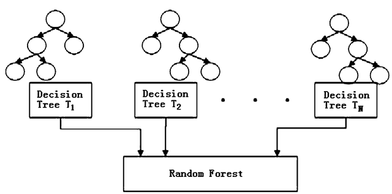

# Machine Learning

Parametric models such as generalized linear regression and logistic regression has advantages and disadvantages.

**Strength**:

- The effects of individual predictors on the outcome are easily understood
- Statistical inference, such as hypothesis testing or interval estimation, is straightforward
- Methods and procedures for selecting, comparing, and summarizing these models are well-established and extensively studied


**Disadvantages** in the following scenarios:

- Complex, non-linear relationships between predictors and the outcome
- High degrees of interaction between predictors
- Nominal outcome variables with several categories


In these situations, non-parametric or algorithmic modeling approaches have the potential to better capture the underlying trends in the data.


Here we introduce three models: classification and regression trees (CART), random forests, k-nearest neighbors.

- Classification and regression trees (CART) are “trained” by recursively partitioning the 𝑝-dimensional space (defined by the explanatory variables) until an acceptable level of homogeneity or “purity” is achieved within each partition.

- A major issue with tree-based models is that they tend to be high variance (leading to a high propensity towards over-fitting). Random forests are a non-parametric, tree-based modeling algorithm that is built upon the idea that averaging a set of independent elements yields an outcome with lower variability than any of the individual elements in the set.

    This general concept should seem familiar. Thinking back to your introductory statistics course, you should remember that the sample mean, $\overline{x}$, of a dataset has substantially less variability ($\frac{\sigma}{\sqrt{n}}$) than the individual data-points themselves ($\sigma$).


Q: What is Bias-Variance Trade-Off in Machine Learning? \
A: 

- Bias refers to error caused by a model for solving complex problems that is over simplified, makes significant assumptions, and misses important relationships in your data. 
- Variance error is variability of a target function's form with respect to different training sets. Models with small variance error will not change much if you replace couple of samples in training set. Models with high variance might be affected even with small changes in training set. High variance models fit the data too well, and learns the noise in addition to the inherent patterns in the data.


## Random Forest

**Averaging of independent trees**

The goal of bagging is to produce $\boldsymbol{B}$ separate training datasets that are independent of each other (typically 𝐵 is in the hundreds). The model of interest (in this case classification and regression trees) is trained separately on each of these datasets, resulting in $\boldsymbol{B}$ different estimated “models”. These are then averaged to produce a single, low-variance estimate.


Bagging is a general approach, but its most well-known application is in the random forest algorithm:

1. Construct $\boldsymbol{B}$ bootstrap samples by sampling cases from the original dataset with replacement (this results in $\boldsymbol{B}$ unique datasets that are similar to the original)
2. Fit a classification and regression tree to each sample, but randomly choose a subset of $m$ variables that can be used in the construction of that tree (this results in $\boldsymbol{B}$ unique trees that are fit to similar datasets using different sets of predictors)
3. For a given data-point, each of the $\boldsymbol{B}$ trees in the forest contributes a prediction or “vote”, with the majority (or average) of these votes forming the random forest’s final prediction, $\hat{y}_i$

```{r out.width = "80%", eval=TRUE}

```


A downside of both the CART and random forest algorithms (as well as many other algorithmic modeling approaches) is an <u>inability to clearly quantify the roles played by individual variables</u> in making predictions. However, the importance of individual variables in a random forest can still be expressed using a measure known as variable importance.


The random forest algorithm requires the following tuning parameters be specified in order to run:

- `ntree` - the number of bagged samples, $\boldsymbol{B}$, onto which trees will be grown
- `mtry` - the number of variables that are randomly chosen to be candidates at each split
- Some sort of stopping criteria for individual trees, this can be: 
    - `nodesize`, which sets the minimum <u>size of terminal nodes</u>
        - larger `nodesize` leads to shallower trees
        - smaller node size allows for deeper, more complex trees
    - `maxnodes`, which sets the maximum <u>number of terminal nodes</u> an individual tree can have.


**Applications of Random Forest**

Some of the applications of Random Forest Algorithm are listed below:

- Banking: It predicts a loan applicant’s solvency. This helps lending institutions make a good decision on whether to give the customer loan or not. They are also being used to detect fraudsters.
- Health Care: Health professionals use random forest systems to diagnose patients. Patients are diagnosed by assessing their previous medical history. Past medical records are reviewed to establish the proper dosage for the patients.
- Stock Market: Financial analysts use it to identify potential markets for stocks. It also enables them to remember the behaviour of stocks.
- E-Commerce: Through this system, e-commerce vendors can predict the preference of customers based on past consumption behaviour.


**When to Avoid Using Random Forests?**

Random Forests Algorithms are not ideal in the following situations:

- Extrapolation: Random Forest regression is not ideal in the extrapolation of data. Unlike linear regression, which uses existing observations to estimate values beyond the observation range. 
- Sparse Data: Random Forest does not produce good results when the data is sparse. In this case, the subject of features and bootstrapped sample will have an invariant space. This will lead to unproductive spills, which will affect the outcome.


**FAQ**

Q: Is RF a linear or non-linear model? \
A: RF can capture complex, non-linear relationships.

Q: Is RF sensitive to Imbalanced Data? \
A: Yes. It may perform poorly if the dataset is highly imbalanced like one class is significantly more frequent than another.


Q: What is the loss function? \
A: Entropy/gini or any other loss function you want.

Q: Difference btw RF and a linear model? \
A: A major difference is that a decision tree does not have "parameters", whereas the linear models need to create a functional form and find the optimal parameters. 

--------------------------------------------------------------------------------

### Implementation in R {-}

`ranger` package offers a computation efficient function for RF.

```r
RF_ranger <- ranger(formula = formula, 
                    data = data_before[idx,], 
                    probability = TRUE,
                    importance = "permutation", 
                    scale.permutation.importance = TRUE,
                    )
    # print(RF_ranger)
    
rf.pred.test <- predict(RF_ranger, data=data_before[-idx,])$predictions
```

Parameters controlling the general process of RF:

- `probability=FALSE`: Whether to forecast a probability forest.

The hyperparameters `mtry`, `min.node.size` and `sample.fraction` determine the degree of randomness, and should be tuned.

- `mtry=500`: Number of variables to possibly split at in each node in one tree. In plain language, it indicates how many predictor variables should be used in each tree. 
    - Default is the (rounded down) square root of the number variables. Alternatively, a single argument function returning an integer, given the number of independent variables.
    - Range btw 1 to the number of predictors.
    - If all predictors are used, then this corresponds in fact to bagging.
- `min.node.size`: The number of observations a terminal node should at least have. 
    - Default 1 for classification, 5 for regression, 3 for survival, and 10 for probability. For classification, this can be a vector of class-specific values. 
    - Range between 1 and 10 
- `sample.fraction`: Fraction of observations to be used in each tree. Default is 1 for sampling with replacement and 0.632 for sampling without replacement. For <u>classification</u>, this can be a vector of class-specific values.
    - Smaller fractions lead to greater diversity, and thus less correlated trees which often is desirable. 
    - Range between 0.2 and 0.9

Parameters controlling what and how intermediate results are saved:

- `keep.inbag = FALSE`: Whether to save how often observations are in-bag in each tree. 

    Set to `TRUE` if you want to check sample composition in each tree.
    
- `importance = 'none'|'impurity'|'impurity_corrected'|'permutation'`: Variable importance mode.
- `scale.permutation.importance = FALSE`: Whether to scale permutation importance by standard error as in (Breiman 2001). Only applicable if `'permutation'` variable importance mode selected.

- `write.forest = TRUE`: Whether to save `ranger.forest` object, required for prediction. Set to `FALSE` to reduce memory usage if no prediction intended. 
    - Set to `FALSE` when you do parameter tuning.

Q: How to tune hyperparameters? \
A: Check out [`mlr3` package](https://mlr3.mlr-org.com). [Here](https://r.geocompx.org/eco.html) is an example.

___


### Imbalance Classification {-}

You can balance your random forests using case weights. Here's a simple example:

```r
library(ranger)

# Make a dataste
set.seed(43)
nrow <- 1000
ncol <- 10
X <- matrix(rnorm(nrow * ncol), ncol=ncol)
CF <- rnorm(ncol)
Y <- (X %*% CF + rnorm(nrow))[,1]
Y <- as.integer(Y > quantile(Y, 0.90))
table(Y)

# Compute weights to balance the RF
w <- 1/table(Y)
w <- w/sum(w)
weights <- rep(0, nrow)
weights[Y == 0] <- w['0']
weights[Y == 1] <- w['1']
table(weights, Y)

# Fit the RF
data <- data.frame(Y=factor(ifelse(Y==0, 'no', 'yes')), X)
model <- ranger(Y~., data, case.weights=weights)
print(model)
```
Code Source: <https://stats.stackexchange.com/a/287849>

Fixed proportion sampling: <https://github.com/imbs-hl/ranger/issues/167>

___

**References**:

https://remiller1450.github.io/m257s21/Lab10_Other_Models.html


