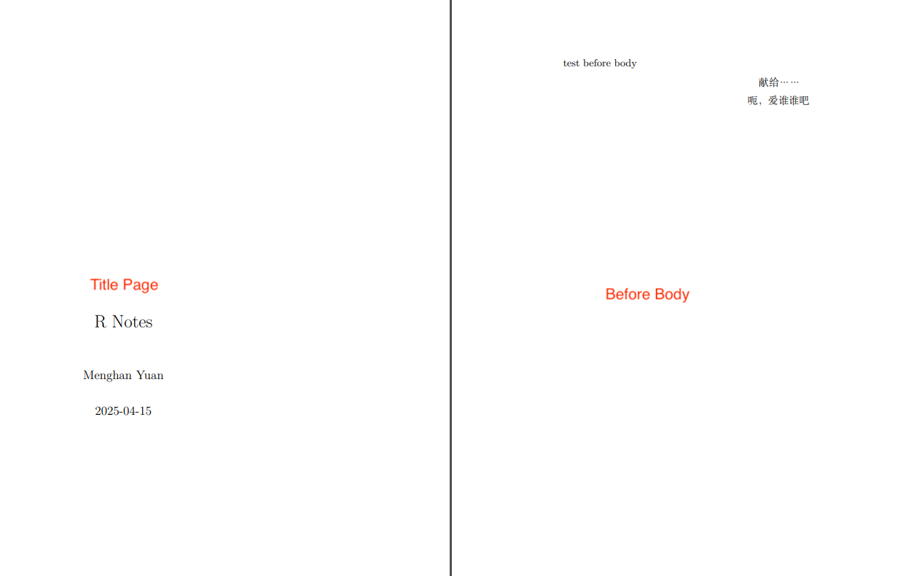

# Rmd

**R Markdown** is a powerful tool for combining analysis and reporting into the same document. R Markdown has grown substantially from a package that supports a few output formats, to an extensive and diverse ecosystem that supports the creation of books, blogs, scientific articles, websites, and even resumes.

Nice documentations 

- **`rmarkdown`** package CRAN
    - [Package CRAN page](https://cran.r-project.org/web/packages/rmarkdown/index.html)
    - [Reference manual](https://cran.r-project.org/web/packages/rmarkdown/rmarkdown.pdf)
- **`bookdown`** package CRAN
    - [Package CRAN page](https://cran.r-project.org/web/packages/bookdown/index.html)
    - [Reference manual](https://cran.r-project.org/web/packages/bookdown/bookdown.pdf)
- [R markdown: The definitive guide.](https://bookdown.org/yihui/rmarkdown)  provides detailed references; GitHub repo [HERE](https://github.com/rstudio/rmarkdown-book).
- [R markdown cookbook](https://bookdown.org/yihui/rmarkdown-cookbook/): concise and covers essential functions, with examples.
- [Authoring Books with R Markdown](https://bookdown.org/yihui/bookdown/): with a focus on `bookdown`.


Q: What is the difference between Rmd and R script?  
A: 

- An R script (`.R`) is used for developing and troubleshooting code; a place where you can store reusable code fragments. 
- An R Markdown file (`.Rmd`) is used to integrate R commands with explanatory text and output, making it useful for creating reports.

--------------------------------------------------------------------------------

**Quick takeaways**:

- Can still use horizontal separator `ctrl + shift + S` for dashed lines and `ctrl + shift + =` for equals
- Headers must have one empty line above and below to separate it from other text

--------------------------------------------------------------------------------

## YAML metadata

Q: What is YAML?  \
A: YAML is a human-friendly data serialization language for all programming languages. YAML stands for “Yet Another Markup Language.” 

Q: What does YAML do? \
A: It is placed at the very beginning of the document and is read by each of Pandoc, **rmarkdown**, and **knitr**. 

- Provide metadata of the document. 
- Located at the top of the file.
- Adheres to the YAML format and is delimited by lines containing three three dashes (`---`).


YAML are also called *header* or *front matter*.

See *R Markdown YAML metadata (header) tutorial with examples* by `hao203` [HERE](https://github.com/hao203/rmarkdown-YAML.git) for commonly used YAML metadata (header) in different R Markdown output formats.


There is NO official documentation for R Markdown YAML frontmatter because the YAML frontmatter is a collection of metadata and each individual piece of data might or not be used by a piece of software from your tool chain. That is, the behavior of YAML depends on your user platform.

For instance, the following metadata

```
editor_options:
  chunk_output_type: console
```

is used *exclusively* by RStudio to have the code block output "be shown in the R console instead of inside the source editor". This option might be ignored by VSCode or Emacs.

--------------------------------------------------------------------------------

YAML can set values of the template variables, such as `title`, `author`, and `date` of the document. 

- The `output` field is used by rmarkdown to apply the <span style='color:#00CC66'>**output format function**</span> `rmarkdown::html_document()` in the rendering process.

  There are two types of output formats in the **rmarkdown** package: documents (e.g., `pdf_document`), and presentations (e.g., `beamer_presentation`).

  Supported output format examples: `html_document`, `pdf_document`.

  R Markdown documents (`html_documents`) and R Notebook documents (`html_notebook`) are very similar; in fact, an R Notebook document is a special type of R Markdown document. The main difference is using R Markdown document (`html_documents`) you have to knit (render) the entire document each time you want to preview the document, even if you have made a minor change. However, using an R Notebook document (`html_notebook`) you can view a preview of the final document without rendering the entire document.
  
  **Troubleshooting**
  
  Issue: `bookdown` always output html, even if specified to pdf. \
  Cause: If it produces HTML, the output format must have been provided somewhere. \
  Fix: Check if you have a `_output.yml` under the root directory of your book project. If you do, you may delete it. Then bookdown will use the output field that you specified in the YAML frontmatter of your Rmd document.
  
  If there are two output formats, `rmarkdown::render()` defaults to use the first output type. If you want another, specify the type, e.g.,  `rmarkdown::render("0100-RStudio.Rmd", 'pdf_document')`. 

--------------------------------------------------------------------------------

**`bookdown` wrappers** of base markdown format

<span style='color:#00CC66'>`bookdown` output formats</span> allow numbering and cross-referencing figures/tables/equations. It takes the format `html_document2`, in general, `markdown_document2` is a wrapper for the base format `markdown_document`. With the `bookdown` output format, you can cross-reference sections by their ID's using the same syntax when sections are numbered. 

Other bookdown output format examples for single documents: `pdf_document2`, `beamer_presentation2`, `tufte_html2`, `word_document2`. See Page 12 of the [reference manual](https://cran.r-project.org/web/packages/bookdown/bookdown.pdf) for a complete list of supported formats by `bookdown`.

What bookdown is very powerful for is that it compiles books. Book formats: 

- HTML:
  - `gitbook`
  - `html_book`
  - `tufte_html_book`
- PDF:
  - `pdf_book`
- e-book:
  - `epub_book`

--------------------------------------------------------------------------------

- Many aspects of the LaTeX template used to create PDF documents can be customized using <span style='color:#00CC66'>**top-level**</span> [YAML metadata](https://bookdown.org/yihui/rmarkdown/pdf-document.html#tab:latex-vars) (note that these options do <span style='color:#FF9900'>**NOT**</span> appear underneath the `output` section, but rather appear at the top level along with `title`, `author`, and so on). For example:

  ```markdown
  ---
  title: "Crop Analysis Q3 2013"
  output: pdf_document
  fontsize: 11pt
  geometry: margin=1in
  ---
  ```

  A few available metadata variables are displayed in the following (consult the Pandoc manual for [the full list](https://pandoc.org/MANUAL.html#variables-for-latex)):

  | Top-level YAML Variable                        | Description                                                  |
  | ---------------------------------------------- | ------------------------------------------------------------ |
  | `lang`                                         | Document language code                                       |
  | `fontsize`                                     | Font size (e.g., `10pt`, `11pt`, or `12pt`)                  |
  | `papersize`                                    | Defines the paper size (e.g., `a4paper`, `letterpaper`)      |
  | `documentclass`                                | LaTeX document class (e.g., `article`, `book`, and `report`) |
  | `classoption`                                  | A list of options to be passed to the document class, e.g., you can create a two-column document with the `twocolumn` option. |
  | `geometry`                                     | Options for [`geometry`](https://ctan.org/pkg/geometry) package (e.g., `margin=1in` set all margins to be 1 inch) |
  | `mainfont`, `sansfont`, `monofont`, `mathfont` | Document fonts (works only with `xelatex` and `lualatex`)    |
  | `linkcolor`, `urlcolor`, `citecolor`           | Color for internal links (cross references), external links (link to websites), and citation links (bibliography) |
  | `linestretch`                                  | Options for line spacing (e.g. 1, 1.5, 3).                   |

  Pandoc User's Guide: <https://www.uv.es/wiki/pandoc_manual_2.7.3.wiki?21>

  `classoption`

  - **`onecolumn`, `twocolumn`** - Instructs LaTeX to typeset the document in one column or two columns.

  - **`twoside`, `oneside`**:  Specifies whether double or single sided output should be generated. The classes’ article and report are single sided and the book class is double sided by default. 

    Note that this option concerns the style of the document only. The option two side does *NOT* tell the printer you use that it should actually make a two-sided printout.

    The difference between single-sided and double-sided documents in LaTeX lies in the layout of the <u>page margins</u> and the orientation of the text on the page.

    - Single-sided documents are printed on only one side of the page, with the text and images aligned to the right-hand side of the page. This type of layout is often used for brochures, flyers, and other types of promotional materials.

    - Double-sided documents are printed on both sides of the page, with the text and images alternating between right-hand and left-hand margins. This type of layout is often used for **books**, reports, and other types of <u>long-form documents</u>.

      A `twoside` document has different margins and headers/footers for odd and even pages.

    The layout of a `twoside` book

    

    Q: Why Inner margin is narrow?  
    A: The reason for this is that with two pages side by side, you actually have only THREE margins - the left, right and middle. The middle margin is made up from the inside margins of both pages, and so these are smaller because they add together to make the middle margin. If they were bigger, then you would end up with too much whitespace in the middle.

    ```r
    o - outside margin
    i - inside margin
    b - binding offset
    
    Before binding:
    ------------------    -----------------
    |oooo|~~~~~~|ii|b|    | |  |~~~~~~|   |
    |    |~~~~~~|  | |    | |  |~~~~~~|   |
    |    |~~~~~~|  | |    | |  |~~~~~~|   |
    |    |~~~~~~|  | |    | |  |~~~~~~|   |
    |    |~~~~~~|  | |    | |  |~~~~~~|   |
    |    |~~~~~~|  | |    | |  |~~~~~~|   |
    ------------------    -----------------
    
    After binding:
    -------------------------------
    |oooo|~~~~~~|ii|ii|~~~~~~|oooo|
    |oooo|~~~~~~|ii|ii|~~~~~~|oooo|
    |oooo|~~~~~~|ii|ii|~~~~~~|oooo|
    |oooo|~~~~~~|ii|ii|~~~~~~|oooo|
    |oooo|~~~~~~|ii|ii|~~~~~~|oooo|
    |oooo|~~~~~~|ii|ii|~~~~~~|oooo|
    -------------------------------
    ```

    

  - **`landscape`** - Changes the layout of the document to print in landscape mode.
  - **`openright`, `openany`** - Makes chapters begin either only on right hand pages or on the next page available. This does not work with the article class, as it does not know about chapters. The report class by default starts chapters on the next page available and the book class starts them on right hand pages.

- In PDFs, you can use code, typesetting commands (e.g., `\vspace{12pt}`), and specific packages from LaTeX. 

    1. The `header-includes` option loads LaTeX packages.

       Note that `header-includes` is a top-level option that align with `output`.

       

    ```markdown
    ---
    output: pdf_document
    header-includes:
      - \usepackage{fancyhdr}
    ---
    
    \pagestyle{fancy}
    \fancyhead[LE,RO]{Holly Zaharchuk}
    \fancyhead[LO,RE]{PSY 508}
    
    # Problem Set 12
    ```

    

    [**Common `header-includes`:**](https://github.com/hao203/rmarkdown-YAML?tab=readme-ov-file#header-includes)

    - Chinese/Japanese support

    ````markdown
    ---
    output: pdf_document
    header-includes:
      - \usepackage{ctex}
    ---
    ````


    2. Alternatively, use `extra_dependencies` to  list a character vector of LaTeX packages. This is useful if you need to load multiple packages:
    
    ```markdown
    ---
    title: "Untitled"
    output: 
      pdf_document:
        extra_dependencies: ["bbm", "threeparttable"]
    ---
    ```
    
    If you need to specify options when loading the package, you can add a second-level to the list and provide the options as a list:
    
    ```markdown
    ---
    title: "Untitled"
    output: 
      pdf_document:
        extra_dependencies:
          caption: ["labelfont={bf}"]
          hyperref: ["unicode=true", "breaklinks=true"]
          lmodern: null
    ---
    ```
    
    Here are some examples of LaTeX packages you could consider using within your report:
    
    - [pdfpages](https://ctan.org/pkg/pdfpages): Include full PDF pages from an external PDF document within your document.
    - [caption](https://ctan.org/pkg/caption): Change the appearance of caption subtitles. For example, you can make the figure title italic or bold.
    - [fancyhdr](https://ctan.org/pkg/fancyhdr): Change the style of running headers of all pages.

- Some output options are passed to Pandoc, such as `toc`, `toc_depth`, and `number_sections`. You should consult the [Pandoc documentation](https://pandoc.org/MANUAL.html#variables) when in doubt.

    `````markdown
    ---
    output:
      pdf_document:
        toc: true
        keep_tex: true
    ---
    `````

    - `keep_tex: true`  if you want to keep intermediate TeX. Easy to debug. Defaults to `false`.

    To learn which arguments a format takes, read the format's help page in R, e.g. <span style='color:#00CC66'>**`?html_document`**</span>.


--------------------------------------------------------------------------------

**Parameters**

We can include variables and R expressions in this header that can be referenced throughout our R Markdown document. For example, the following header defines `start_date` and `end_date` parameters, which will be reflected in a list called `params` later in the R Markdown document. 

````markdown
---
title: My RMarkdown
author: Yihui Xie
output: html_document
params:
  start_date: '2020-01-01'
  end_date: '2020-06-01'
---
````

To access a parameter in our R code, call `params$<parameter name>`, e.g., `params$start_date` and `params$end_date`.

Should I use quotes to surround the values?

- Whenever applicable use the unquoted style since it is the most readable.
- Use quotes when the value can be misinterpreted as a data type or the value contains a `:`.

```r
# values need quotes
foo: '{{ bar }}' # need quotes to avoid interpreting as `dict` object
foo: '123'       # need quote to avoid interpreting as `int` object
foo: 'yes'			 # avoid interpreting as `boolean` object
foo: "bar:baz:bam" # has colon, can be misinterpreted as key

# values need not quotes
foo: bar1baz234
bar: 123baz
```

ref: 

- [R Markdown anatomy, R Markdown Cookbook](https://bookdown.org/yihui/rmarkdown-cookbook/rmarkdown-anatomy.html#:~:text=In%20short%2C%20we%20can%20include%20variables%20and%20R%20expressions%20in%20this%20header%20that%20can%20be%20referenced%20throughout%20our%20R%20Markdown%20document.)
- <https://rmarkdown.rstudio.com/lesson-6.html>


--------------------------------------------------------------------------------

[**File options**](https://rstudio.github.io/visual-markdown-editing/options.html#file-options)


Some aspects of markdown output can be customized via global, project, or file-level options, including:

- How to wrap / break lines (fixed column, sentence-per-line, etc.).
- Where to write footnotes (below the current paragraph or section, or at the end of the document).
- Whether to use the visual mode markdown writer when saving markdown from source mode (to ensure consistency between documents saved from either mode).


Global and project options that affect the way markdown is written can also be customized on a per-file basis. These *file specific options* can be set using YAML. For instance, you want to set lines wrapping after 72 characters:

```markdown
---
editor_options:
  markdown:
    wrap: 72
---
```

--------------------------------------------------------------------------------

### Render Rmd

When you click the `Knit` button (⇧⌘K) in RStudio, generally two processes happen: 

1. The `.Rmd` file is fed to `knitr`, which executes all of the R code chunks and creates a new markdown (`.md`) document which includes the R code and its output.
2. The `.md` file is then processed by [pandoc](http://pandoc.org/) which is responsible for creating the finished format, e.g., HTML, PDF, MS_Word.
   - `.md` files can be directly converted to html, but
   - `.md` to pdf is time-consuming. It first generates `.tex`, then call the LaTeX engine to convert to pdf.


There is one function that can do the processes mentioned above: [`rmarkdown::render`](https://pkgs.rstudio.com/rmarkdown/reference/render.html).

`rmarkdown::render(input, output_format = NULL, output_file = NULL, output_dir = NULL, output_options = NULL, output_yaml = NULL)`

| Arguments        | Definition                                                   |
| ---------------- | ------------------------------------------------------------ |
| `output_format`  | - `"all"` will render all formats define within the file<br />- Name of a format, e.g., `html_document`, will render to that single format<br />- An output format object, e.g., `html_document(toc = TRUE, toc_depth = 2, includes = includes(before_body = "header.htm"))`, where you can pass on the argument |
| `output_options` | - **List** of output options that can override the options specified in metadata (e.g could be used to force `self_contained` or `mathjax = "local"`). <br />- Note that this is <span style='color:#00CC66'>only valid when the output format is read from **metadata**</span> (i.e. not a custom format object passed to output_format).<br />- `output_options` cannot work together with `xxx_document()`. |
| `output_yaml`    | Paths to YAML files specifying output formats and their configurations. The first existing one is used. If none are found, then the function searches YAML files specified to the `output_yaml` top-level parameter in the YAML front matter, `_output.yml` or `_output.yaml`, and then uses the first existing one. |

Use examples of `render`, using **output format objects**

```r
rmarkdown::render("0208-Rmd-GHpage.Rmd", 
	bookdown::pdf_document2(
		latex_engine = "xelatex",
		template = "latex/template.tex",
		includes = includes(
			in_header = "latex/preamble.tex",
  		    before_body = "latex/before_body.tex")
		))

# This does NOT work as `output_options` is only valid when the format is not an output format object "xxx_document()"
rmarkdown::render("0208-Rmd-GHpage.Rmd", 
	bookdown::pdf_document2(
		latex_engine = "xelatex",
		template = "latex/template.tex"), 
	output_options = list(
		includes = includes(
			in_header = "latex/preamble.tex",
  		    before_body = "latex/before_body.tex")
		))

# render to html
rmarkdown::render("AR_application.Rmd",  bookdown::html_document2())
```

Note that sometimes the bookdown cross references in Rmd are not rendered when using the `Knit` button. The rendered html shows `Fig. \@ref(fig:ar-res) ` (without the backslash). In this case, using `rmarkdown::render()` **with `output_format = bookdown::html_document2()`** might help.


--------------------------------------------------------------------------------

You can have more than one output formats for your Rmd. For example, you want both the html and pdf output.

When you render the Rmd with `rmarkdown::render()`, it will use the **first output format you specify in the YAML metadata** (if it is missing, the default is `html_document`).

If you do not want to use the first one, you can specify the one you want in the second argument, e.g., for an Rmd document `input.Rmd` with the metadata:

```yml
output:
  html_document:
    toc: true
  pdf_document:
    keep_tex: true
```

You can render it to PDF via:

```r
# Render to pdf
rmarkdown::render('input.Rmd', 'pdf_document')

# Render multiple formats
render("input.Rmd", c("html_document", "pdf_document"))

# Render all formats defined
rmarkdown::render('input.Rmd', 'all')
```

- RStudio calls the function `rmarkdown::render()` to render the document in **a new R session**.
  
    RStudio does this to ensure **reproducibility**.


--------------------------------------------------------------------------------

[`rmarkdown::render_site(input = ".", output_format = "all",)`](https://pkgs.rstudio.com/rmarkdown/reference/render_site.html) Render all of the R Markdown documents within a directory as a website. There are two requirements for a directory to be rendered as a website:

- It must contain either an `index.Rmd` or `index.md` file.
- It must contain a site configuration file (`_site.yml`).

Note that the "Knit" button in RStudio uses `rmarkdown::render_site` to knit the file in presence of an `index.Rmd` file in the working directory.

--------------------------------------------------------------------------------

### Document dependency

By default, R Markdown produces standalone HTML files with no external dependencies, using `data:`URIs to incorporate the contents of linked scripts, stylesheets, images, and videos. This means you can share or publish the file just like you share Office documents or PDFs. If you would rather keep dependencies in external files, you can specify `self_contained: false`.

Note that even for self-contained documents, MathJax is still loaded externally (this is necessary because of its big size). If you want to serve MathJax locally, you should specify `mathjax: local` and `self_contained: false`.

One common reason to keep dependencies external is for serving R Markdown documents from a website (external dependencies can be cached separately by browsers, leading to faster page load times). In the case of serving multiple R Markdown documents you may also want to consolidate dependent library files (e.g. Bootstrap, and MathJax, etc.) into a single directory shared by multiple documents. You can use the `lib_dir` option to do this. For example:

```markdown
---
title: "Habits"
output:
  html_document:
    self_contained: false
    lib_dir: libs
---
```

--------------------------------------------------------------------------------

### Loading LaTeX packages {.unlisted .unnumbered}

We can load additional LaTeX packages using the [`extra_dependencies`](https://bookdown.org/yihui/rmarkdown-cookbook/latex-extra.html) option <span style='color:#00CC66'>**within** the `pdf_document`</span> YAML settings. 

This allows us to provide a list of LaTeX packages to be loaded in the intermediate LaTeX output document, e.g.,

```markdown
---
title: "Using more LaTeX packages"
output: 
  pdf_document:
    extra_dependencies: ["bbm", "threeparttable"]
---
```

If you need to **specify options** when loading the package, you can add a sub-level to the list and provide the options as a list, e.g.,

```yml
output: 
  pdf_document:
    extra_dependencies:
      caption: ["labelfont={bf}"]
      hyperref: ["unicode=true", "breaklinks=true"]
      lmodern: null
```

For those familiar with LaTeX, this is equivalent to the following LaTeX code:

```latex
\usepackage[labelfont={bf}]{caption} 
\usepackage[unicode=true, breaklinks=true]{hyperref}
\usepackage{lmodern}
```

The advantage of using the `extra_dependencies` argument over the `includes` argument introduced in Section [6.1](https://bookdown.org/yihui/rmarkdown-cookbook/latex-preamble.html#latex-preamble) is that you do not need to include an external file, so your Rmd document can be **self-contained**.


--------------------------------------------------------------------------------

### Includes {.unlisted .unnumbered}

#### HTML Output {.unnumbered}

You can do more advanced customization of output by including additional HTML content or by replacing the core Pandoc template entirely. To include content in the document header or before/after the document body, you use the `includes` option as follows:

```markdown
---
title: "Habits"
output:
  html_document:
    includes:
      in_header: header.html   # inject CSS and JavaScript code into the <head> tag
      before_body: doc_prefix.html  # include a header that shows a banner or logo.
      after_body: doc_suffix.html  # include a footer
  template: template.html  # custom templates
---
```


An example `header.html` to load a MathJax extension `textmacros`.

```html
<script type="text/x-mathjax-config">
  MathJax.Hub.Config({ 
    loader: {load: ['[tex]/textmacros']},
    tex: {packages: {'[+]': ['textmacros']}}
  });
</script>
```

--------------------------------------------------------------------------------

#### PDF Output {.unnumbered}


For example, to support Chinese characters.

You can use `includes` and `preamble.tex` (can be any name, contains any pre-loaded latex code you want to run before your main text code, for setting up environment, loading pkgs, define new commands ... Very flexible.)

In the main Rmd:

````markdown
---
output:
  pdf_document:
    includes:
      in_header: latex/preamble.tex
      before_body: latex/before_body.tex
      after_body: latex/after_body.tex
---
````

If you want to add anything to the preamble, you have to use the `includes` option of `pdf_document`. This option has three sub-options: 

- `in_header`: loading necessary packages

- `before_body`:

  - Styling that has the highest priority (as it will be loaded latest; if you put in `in_header`, it might be overridden by default settings)
  - Dedication page like "The books is dedicated to ..." (此书献给…)

  An example of `before_body.tex`:

  ```latex
  % Styling that has the highest priority
  \let\tightlist\relax % disable `\tightlist`
  \setlength{\abovedisplayskip}{-5pt}
  \setlength{\abovedisplayshortskip}{-5pt}
  
  % book dedication page
  \thispagestyle{empty}
  
  \begin{center}
  献给……
  
  呃，爱谁谁吧
  \end{center}
  ```
  
  The default bookdown uses <span style='color:#FF9900'>**`\tightlist`**</span> for all bullet lists, setting `itemsep=0pt` and `parskip=0pt`, aim for "compact lists." See the following definition:
  
  ```r
  \providecommand{\tightlist}{%
  \setlength{\itemsep}{0pt}\setlength{\parskip}{0pt}}
  ```
  
  I personally don't like the compact list setting, so I disable it with `\let\tightlist\relax`. To prevent it from being overridden, I put it in `before_body.tex` instead of `preamble.tex`.
  
- `after_body`. 

Each of them takes one or multiple file paths. The file(s) specified in `in_header` will be added to the preamble. The files specified in `before_body` and `after_body` are added before and after the document body, respectively.

```latex
\documentclass{article}
% preamble
\begin{document}
% before_body
% body
% after_body
\end{document}
```



In `preamble.tex`:

```latex
\usepackage{xeCJK}  
\setCJKmainfont{Noto Sans CJK SC}
```

**Alternatively**, you can use `header-includes` but with less flexibility to change options:

````markdown
---
output: pdf_document
header-includes:
  - \usepackage{ctex}
---
````

Q: `includes` vs. `header-includes`, which one is better to use for loading LaTeX packages?

A: Another way to add code to the preamble is to pass it directly to the `header-includes` field in the YAML frontmatter. The advantage of using `header-includes`is that you can keep everything in one R Markdown document. 

However, if your report is to be generated in *multiple output formats*, we still recommend that you **use the `includes` method**, because the `header-includes` field is unconditional, and will be included in non-LaTeX output documents, too. By comparison, the `includes` option is only applied to the `pdf_document` format.


Ref: 

<https://github.com/hao203/rmarkdown-YAML?tab=readme-ov-file#chinesejapanese-support>

<https://bookdown.org/yihui/rmarkdown-cookbook/latex-preamble.html>

--------------------------------------------------------------------------------

#### `header-includes` {.unnumbered}

Tex style and package loading can also put in `header-includes`.

Ex.1

```markdown
---
output: pdf_document
header-includes:
 - \usepackage{fancyhdr}
 - \pagestyle{fancy}
 - \usepackage{ctex} #TeX package for  Chinese
 - \fancyhead[L]{MANUSCRIPT AUTHORS}
 - \fancyhead[R]{MANUSCRIPT SHORT TITLE}
 - \usepackage{lineno} # TeX package for line numbers
 - \linenumbers
---
```

Ex.2

```markdown
---
title: Adding a Logo to LaTeX Title
author: Michael Harper
date: December 7th, 2018
output: pdf_document
header-includes:
  - \usepackage{titling}
  - \pretitle{\begin{center}
    \includegraphics[width=2in,height=2in]{logo.jpg}\LARGE\\}
  - \posttitle{\end{center}}
---
```

Ex.3

To override or extend some CSS for just one document, include for example:

```markdown
---
output: html_document
header-includes: |
  <style>
  blockquote {
    font-style: italic;
  }
  tr.even {
    background-color: #f0f0f0;
  }
  td, th {
    padding: 0.5em 2em 0.5em 0.5em;
  }
  tbody {
    border-bottom: none;
  }
  </style>
---
```

--------------------------------------------------------------------------------

### Change Font {.unlisted .unnumbered}


The default font is `\usepackage{lmodern}` in bookdown.

Can specify alternative fonts in `preamble.tex` as follows:

```latex
\usepackage{fontspec}
\setmainfont{Charter}
```

Fonts known to LuaTeX or XeTEX may be loaded by their standard names as you'd speak them out loud, such as Times New Roman or Adobe Garamond. 'Known to' in this case generally means 'exists in a standard fonts location' such as `~/Library/Fonts` on macOS, or `C:\Windows\Fonts` on Windows. In LuaTEX, fonts found in the TEXMF tree can also be loaded by name. In XeTEX, fonts found in the TEXMF tree can be loaded in Windows and Linux, but not on macOS.

--------------------------------------------------------------------------------

## Chunk Options

If you want to **set chunk options globally**, call `knitr::opts_chunk$set()` in a code chunk (usually the first one in the document), e.g.,

````md
```{r, label="setup", include=FALSE}
knitr::opts_chunk$set(
  comment = "#>", 
  echo = FALSE, 
  fig.width = 6
)
```
````

The settings will apply to every chunk in your file as a default. You can overwrite them in individual chunk headers.

Full list of chunk options: <https://yihui.org/knitr/options/>

Chunk options can customize nearly all components of code chunks, such as the source code, text output, plots, and the language of the chunk.


**Other languages are supported in `Rmd`** 

You can list the names of all available engines via:

```r
names(knitr::knit_engines$get())
##  [1] "awk"          "bash"         "coffee"      
##  [4] "gawk"         "groovy"       "haskell"     
##  [7] "lein"         "mysql"        "node"        
## [10] "octave"       "perl"         "php"         
## [13] "psql"         "Rscript"      "ruby"        
## [16] "sas"          "scala"        "sed"         
## [19] "sh"           "stata"        "zsh"         
## [22] "asis"         "asy"          "block"       
## [25] "block2"       "bslib"        "c"           
## [28] "cat"          "cc"           "comment"     
## [31] "css"          "ditaa"        "dot"         
## [34] "embed"        "eviews"       "exec"        
## [37] "fortran"      "fortran95"    "go"          
## [40] "highlight"    "js"           "julia"       
## [43] "python"       "R"            "Rcpp"        
## [46] "sass"         "scss"         "sql"         
## [49] "stan"         "targets"      "tikz"        
## [52] "verbatim"     "theorem"      "lemma"       
## [55] "corollary"    "proposition"  "conjecture"  
## [58] "definition"   "example"      "exercise"    
## [61] "hypothesis"   "proof"        "remark"      
## [64] "solution"     "marginfigure"
```

The engines from `theorem` to `solution` are only available when you use the **bookdown** package, and the rest are shipped with the **knitr** package. 


To use a different language engine, you can change the language name in the chunk header from `r` to the engine name, e.g.,

~~~r
```python
x = 'hello, python world!'
print(x.split(' '))
```
~~~

For engines that rely on external interpreters such as `python`, `perl`, and `ruby`, the default interpreters are obtained from `Sys.which()`, i.e., using the interpreter found via the environment variable `PATH` of the system. If you want to use an alternative interpreter, you may specify its path in the chunk option `engine.path`.

For example, you may want to use Python 3 instead of the default Python 2, and we assume Python 3 is at `/usr/bin/python3` 

````md
```{python, engine.path = '/usr/bin/python3'}
import sys
print(sys.version)
```
````


- All outputs support markdown syntax.
- If the output is html, you can write in html syntax. 


The **chunk label** for each chunk is assumed to be unique within the document. This is especially important for cache and plot filenames, because these filenames are based on chunk labels. Chunks without labels will be assigned labels like `unnamed-chunk-i`, where `i` is an incremental number.

- Chunk label doesn't need a `tag`, i.e., you only provide the `value`. 

- If you prefer the form `tag=value`, you could also use the chunk option `label` explicitly, e.g., 

  ````md
  ```{r, label='my-chunk'}
  # one code chunk example
  ```
  ````


You may use `knitr::opts_chunk$set()` to change the default values of chunk options in a document. 

**Commonly used chunk options**

- Complete list [here](https://yihui.org/knitr/options/). Or `?opts_chunk` to get the help page.

| Options              | Definitions                                                  |
| -------------------- | ------------------------------------------------------------ |
| `echo=TRUE`          | Whether to display the **source code** in the output document.<br />Use this when you want to show the output but NOT the source code itself. |
| `eval=TRUE`          | Whether to evaluate the code chunk.                          |
| `include=TRUE`       | Whether to include the <span style='color:#32CD32'>chunk **code and output**</span> in the output document—including source code, text output, messages, warnings, and plots. <br />If `FALSE`, nothing will be written into the output document, but the code is <u>still evaluated</u> and plot files are generated if there are any plots in the chunk, so you can manually insert figures later. |
| `message=TRUE`       | Whether to preserve messages emitted by `message()`          |
| `warning=TRUE`       | Whether to show warnings in the output produced by `warning()`. |
| `results='markup'`   | Controls how to display the text results. <br />When `results='markup'` that is to write text output as-is, i.e., write the raw text results directly into the output document without any markups.<br />Useful when priting `stargazer` tables. |
| `comment='##'`       | The prefix to be added before each line of the text output. <br />Set `comment = ''` remove the default `##`. |
| `collapse=FALSE`     | Whether to, if possible, collapse all the source and output blocks from one code chunk into a single block (by default, they are written to separate blocks). <br />This option only applies to Markdown documents. |
| `fig.keep='high'`    | How plots in chunks should be kept. <br />`high`: Only keep high-level plots (merge low-level changes into high-level plots). <br />`none`: Discard all plots. <br />`all`: Keep all plots (low-level plot changes may produce new plots). <br />`first`: Only keep the first plot. <br />`last`: Only keep the last plot. <br />If set to a numeric vector, the values are indices of (low-level) plots to keep.<br />If you want to choose the second to the fourth plots, you could use `fig.keep = 2:4` (or remove the first plot via `fig.keep = -1`). |
| `fig.align="center"` | Figure alignment.                                            |
| `fig.pos="H"`        | A character string for the figure position arrangement to be used in `\begin{figure}[]`. |
| `fig.cap`            | Figure caption.                                              |


<span style='color:#32CD32'>`results='markup'`</span>  note plural form for result**s**.

- `results='markup'`: Default. Mark up text output with the appropriate environments depending on the output format. For example, for R Markdown, if the text output is a character string `"[1] 1 2 3"`, the actual output that **knitr** produces will be:

  ~~~r
  ```
  [1] 1 2 3
  ```
  ~~~

  In this case, `results='markup'` means to put the text output in fenced code blocks (```).

- `results='asus'`: Write text output as-is, i.e., write the raw text results directly into the output document without any markups.

  ````md
  ```{r, results='asis'}
  cat("I'm raw **Markdown** content.\n")
  ```
  ````
  

  Sometime, you encounter the following error messages when you have R codes within `enumerate` environment.

  > You can't use `macro parameter character #` in horizontal mode.

  By default, knitr prefixes R output with `##`, which can't be present in your TeX file. 

  Solution:

  - specify `results="asis"` in code chunks.

- `results='hold'`: Hold all pieces of text output in a chunk and flush them to the end of the chunk.

- `results='hide'` (or `results='FALSE'`): Hide text output.

-----------------------------------------------------------------------------

`collapse = FALSE`  Whether to merge text output and source code into a single code block in the output.  The default `FALSE` means R expressions and their text output are separated into different blocks.

`collapse = TRUE` makes the output more compact, since the R source code and its text output are displayed in a single output block. The default `collapse = FALSE` means R expressions and their text output are separated into different blocks.


--------------------------------------------------------------------------------

### Hooks {.unnumbered}

The object `knit_hooks` in the **knitr** package is used to set hooks; the basic usage is `knitr::knit_hooks$set(name = FUN)` (see [objects](https://yihui.org/knitr/objects/) for details) where `name` is the name of a chunk option (can be arbitrary), and `FUN` is a function. 

There are two types of hooks: 

- chunk hooks and 

  A chunk hook is a function that is <u>triggered by a chunk option</u> when the value of this chunk option is not `NULL`. 

- output hooks 

  Output hooks control over output from your code chunks, such as source code, text output, messages, and plots. 

Hook functions may have different forms, depending what they are designed to do.

**Chunk hooks**

For example, we define a **custom chunk hook** function for the `small_mar` option

```r
knitr::knit_hooks$set(small_mar = function(before, ...) {
  if (before)
    par(mar = c(4, 4, .1, .1))  # smaller top/right margin
})
```

Then this function will be called for a chunk option like the following (`small_mar` doesn’t have to be `TRUE`; it can be any non-`NULL` value):

~~~r
```{r, myplot, small_mar=TRUE}
hist(rnorm(100), main = '')
```
~~~

--------------------------------------------------------------------------------

**Output hooks**

With the **knitr** package, you have control over every piece of output from your code chunks, such as source code, text output, messages, and plots. The control is achieved through “output hooks.” 

Available output hook names:


```r
names(knitr:::.default.hooks)
```

```
##  [1] "source"          "output"          "warning"         "message"        
##  [5] "error"           "plot"            "inline"          "chunk"          
##  [9] "text"            "evaluate.inline" "evaluate"        "document"
```

Note that these names of output hooks are reserved by **knitr**, so you must NOT use these names for your custom chunk hooks.

- `source`: processing the source code.
- `output`: processing text output.

You may obtain the actual hooks from the object `knit_hooks` via the `get()` method, e.g.,

```r
# for meaningful output, the code below should be
# executed *inside* a code chunk of a knitr document
knitr::knit_hooks$get("source")
knitr::knit_hooks$get("output")
# or knitr::knit_hooks$get(c('source', 'output'))
```

A custom output hook is registered through the `set()` method of `knit_hooks`. Because this method will override the existing default hook, we recommend that you save a copy of an existing hook, process the output elements in your own way, and pass the results to the default hook. 

When the text output from a code chunk is lengthy, you may want to only show the first few lines. For example, when printing a data frame of a few thousand rows, it may not be helpful to show the full data, and the first few lines may be enough. Below we redefine the `output` hook so that we can control the maximum number of lines via a custom chunk option `out.lines`:


```r
# save the built-in output hook
hook_output <- knitr::knit_hooks$get("output")

# set a new output hook to truncate text output
knitr::knit_hooks$set(output = function(x, options) {
  if (!is.null(n <- options$out.lines)) {
    x <- xfun::split_lines(x)
    if (length(x) > n) {
      # truncate the output
      x <- c(head(x, n), "....\n")
    }
    x <- paste(x, collapse = "\n")
  }
  hook_output(x, options)
})
```

The basic idea of the above hook function is that if the number of lines of the text output is greater than the threshold set in the chunk option `out.lines` (stored in the variable `n` in the function body), we only keep the first `n` lines and add an ellipsis (`....`) to indicate the output is truncated.

Now we can test the new `output` hook by setting the chunk option `out.lines = 4` on the chunk below:

~~~markdown
```{r out.lines = 4}
print(cars)
```
~~~


```
##    speed dist
## 1      4    2
## 2      4   10
## 3      7    4
....
```


And you see four lines of output as expected. 


```r
print(head(cars, 10))
```

```
##    speed dist
## 1      4    2
## 2      4   10
## 3      7    4
## 4      7   22
## 5      8   16
## 6      9   10
## 7     10   18
## 8     10   26
## 9     10   34
## 10    11   17
```


Since we have stored the original `output` hook in `hook_output`, we can restore it by calling the `set()` method again:


```r
knitr::knit_hooks$set(output = hook_output)
```

Now we print the data frame again. The default behavior is to print the whole data frame.


```r
print(head(cars, 10))
```

```
##    speed dist
## 1      4    2
## 2      4   10
## 3      7    4
## 4      7   22
## 5      8   16
## 6      9   10
## 7     10   18
## 8     10   26
## 9     10   34
## 10    11   17
```


References:

- Output hooks: <https://bookdown.org/yihui/rmarkdown-cookbook/output-hooks.html>
- Chunk hooks: <https://bookdown.org/yihui/rmarkdown-cookbook/chunk-hooks.html>


--------------------------------------------------------------------------------

## Print Verbatim R code chunks

**verbatim in line code**

- use `knitr::inline_expr`.

``````markdown
---
title: "Test inline expr"
output: html_document
---

To use `chunk_reveal("walrus", title = "## Walrus operator")` inline, you can wrap it in R inline chunk like this `` `r chunk_reveal("walrus", title = "## Walrus operator")` ``
``````


**Including verbatim R code chunks inside R Markdown**

One solution for including verbatim R code chunks (see below for more) is to insert hidden inline R code (`` `r
  ''` ``) immediately <u>before or after</u> your R code chunk. 

- The hidden inline R code will be evaluated as an inline expression to an empty string by knitr.

Then wrap the whole block within a markdown code block. The rendered output will display the verbatim R code chunk — including backticks.

R code generating the four backticks block:

```r 
output_code <-
"````markdown
```{r}
plot(cars)
``` \n````"
cat(output_code)
```


Write this code in your R Markdown document:


````r
output_code <-
"````markdown
`r ''````{r}
plot(cars)
``` \n````"
cat(output_code)
````

`````
````markdown
`r ''````{r}
plot(cars)
``` 
````
`````


or


````r
output_code <-
"````markdown
```{r}`r ''`
plot(cars)
``` \n````"
cat(output_code)
````

`````
````markdown
```{r}`r ''`
plot(cars)
``` 
````
`````


Knit the document and the code will render like this in your output:

````markdown
```{r}
plot(cars)
```
````

This method makes use of **Markdown Syntax** for code. 

Q: What is the Markdown Syntax for code?  
A: 

- Inline code use a pair of backticks, e.g., `` `code` ``.  To use $n$ literal backticks, use at least $n+1$ backticks outside. Note that use a space to separate your outside backticks from your literal backtick(s). For example, to generate `` `code` ``, you use ``` ``␣`code`␣`` ``` (i.e., two backticks + space + one backtick + `code` + one backtick + space + two backticks). Note that you need to write sequentially.

- Plain code blocks can be written either

  - After <u>three or more</u> backticks (fenced code blocks), or 

    Can also use tildes (`~`)

  - Indent the blocks by four spaces (indented code blocks)

    Special characters do not trigger special formatting, and all spaces and line breaks are preserved. Blank lines in the verbatim text need not begin with four spaces.

- Note that code blocks must be <u>separated from surrounding text by blank lines</u>.


If the code itself contains a row of tildes or backticks, just use a longer row of tildes or backticks at the start and end:

~~~~~~~~~~~~~~~~~~~~~md
~~~~~~~~~~~~~~~~
~~~~~~~~~~
code including tildes
~~~~~~~~~~
~~~~~~~~~~~~~~~~
~~~~~~~~~~~~~~~~~~~~~

These begin with a row of three or more tildes (`~`) and end with a row of tildes that must be at least as long as the starting row.

A trick if you don't want to type more than three tildes or backticks is that you just use different inner and outer symbols.

~~~~~~~~~~~~~~~~~~~~~md
~~~markdown
```r
print ("hello world")
```
~~~
~~~~~~~~~~~~~~~~~~~~~

Will be rendered as:

~~~markdown
```r
print ("hello world")
```
~~~

--------------------------------------------------------------------------------

A shortcut form (without braces) can also be used for specifying the language of the code block:

	```haskell
	qsort [] = []
	```
This is equivalent to:

	``` {.haskell}
	qsort [] = []
	```

`haskell` is the language class.

You can add more classes, such as `numberLines` for adding line numbers.

This shortcut form may be combined with attributes:

	```haskell {.numberLines}
	qsort [] = []
	```
Which is equivalent to:

	``` {.haskell .numberLines}
	qsort [] = []
	```

and 

```html
<pre id="mycode" class="haskell numberLines" startFrom="100">
  <code>
  primes = filterPrime [2..] where
  filterPrime (p:xs) =
    p : filterPrime [x | x <- xs, x `mod` p /= 0]
  </code>
</pre>  
```

If highlighting is supported for your output format and language, then the code block above will appear highlighted, with [numbered lines](https://bookdown.org/yihui/rmarkdown-cookbook/number-lines.html) starting with 100, 101, and go on. 

<pre id="mycode" class="haskell numberLines" startFrom="100">
  <code>
  primes = filterPrime [2..] where
  filterPrime (p:xs) =
    p : filterPrime [x | x <- xs, x `mod` p /= 0]
  </code>
</pre>  

--------------------------------------------------------------------------------

**Code chunks within `enumerate`**

- Mind the indentation. Rstudio does not automatically adjust indentation for codes.

- specify `results="asis"` if encounter

  > You can't use `macro parameter character #' in horizontal mode.

- cross references using bookdown (`\@ref{fig:scatter-plot}`) might not work. 

  Use latex references `\ref{fig:scatter-plot}` (base latex) or `\autoref{fig:scatter-plot}` (from `hyperref` package)

- markdown language does not work well inside latex environments. A possible workaround is use `1` and indent four spaces for contents that follow.

If it is still a pain in the ass, use [this solution](https://tex.stackexchange.com/a/594904).

Basically, just copy the output from R condole and paste in Rmd.


--------------------------------------------------------------------------------

**References**:

https://yihui.org/en/2017/11/knitr-verbatim-code-chunk/

https://support.posit.co/hc/en-us/articles/360018181633-Including-verbatim-R-code-chunks-inside-R-Markdown

https://themockup.blog/posts/2021-08-27-displaying-verbatim-code-chunks-in-xaringan-presentations/

Pandoc’s Markdown: <https://pandoc.org/MANUAL.html#fenced-code-blocks>


