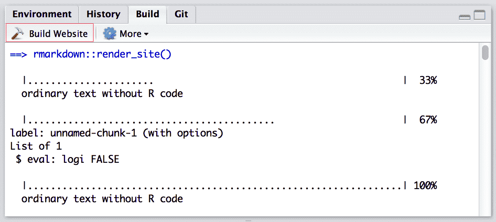

## Rmd GitHub Pages

The **rmarkdown** package had provided a simple site generator that did not rely on a third-party site generator like Hugo. If you feel Hugo is too complex for you, and you only want to build a few Rmd documents into a website, this built-in site generator may be a good choice. 


___

**Stage-commit-push many files**

1.  Use the Terminal `git add .` to "stage" all the files that I want to commit as that's quicker than clicking on all the files often that I want to commit.

2.  Go to RStudio `Commit Pending changes` icon (the white docs icon with a tick in a Git pane) to write the commit as I find `git commit -m "Write your message here"` a bit too long!

3.  Use the Push and Pull buttons in RStudio as that's easier than typing `git push` or `git pull` in the terminal.

--------------------------------------------------------------------------------

### Project structure {.unnumbered}

Note that the **minimum requirement for any [R Markdown website](https://bookdown.org/yihui/rmarkdown/rmarkdown-site.html)** is that it have an `index.Rmd` file and a `_site.yml` file. 

- `_site.yml` provides the global YAML header for the site
- `index.Rmd` provides the content for the home page of your website.

<div class="figure">

<p class="caption">(\#fig:unnamed-chunk-1)Minimal example of a R Markdown website.</p>
</div>


If you execute the `rmarkdown::render_site()` ("Knit" button behavior) function from within the directory containing the website, the following will occur:

1. All of the `*.Rmd` and `*.md` files in the root website directory will be rendered into HTML. Note, however, that Markdown files beginning with `_` are not rendered (this is a convention to designate files that are to be included by top level Rmd documents as child documents).

   - `index.Rmd` controls the content on your main page.

2. The generated HTML files and any supporting files (e.g., CSS and JavaScript) are copied into an output directory (`_site` by default, on Github Pages the output folder is `docs`).

    The HTML files within the output directory are now ready to deploy as a standalone static website.

--------------------------------------------------------------------------------

### `_site.yml` config {.unnumbered}

[`_site.yml`](https://bookdown.org/yihui/rmarkdown/rmarkdown-site.html#site-configuration) is a site configuration file. It provides the <span style='color:#00CC66'>global YAML header for the site</span>. 

It contains various common elements you want to apply to all pages (e.g., output options, CSS styles, header and footer elements, etc.). 

`_site.yml` is equivalent to the combination of `_output.yml` and `_bookdown.yml` in `bookdown`.

A `_site.yml` example:

```yml
name: "my-website"
output_dir: "docs"
include: ["import.R"]
exclude: ["docs.txt", "*.csv"]
output:
  html_document:
    theme: cosmo
    highlight: textmate
    include:
      after_body: footer.html
    css: styles.css
```

- `name` provides a suggested URL path for your website when it is published (by default this is just the name of the directory containing the site).

- `output_dir` field indicates which directory to copy site content into. 

    - `"_site"` is the default if none is specified.

    - It can be `"."` to keep all content within the root website directory alongside the source code.

- The `include` and `exclude` fields enable you to override the default behavior vis-à-vis what files are copied into the output directory. 

  By default, all files within the website directory are copied into the output directory (e.g. `_site`) except for the following:

  1. Files beginning with `"."` (hidden files).
  2. Files beginning with `"_"`
  3. Files known to contain R source code (e.g. `".R"`, `".s"`, `".Rmd"`), R data (e.g. `".RData"`, `".rds"`), or configuration data (e.g. `"rsconnect"` ,`"packrat"`, `"renv"`)).

  The `include` and `exclude` fields of `_site.yml` can be used to override this default behavior (wildcards can be used to specify groups of files to be included or excluded). Note that the `include` and `exclude` fields target only top-level files and directories (i.e. a directory is either included or not, you can't exclude a subset of files within a directory).

  Note also that `include` and `exclude` are *not* used to determine which Rmd files are rendered (all of them in the root directory save for those named with the `_` prefix will be rendered).

- `output` defines shared output options for all R Markdown documents within a site.

    Note that individual documents can also include their own output options, which will be merged with the common options at render time.

    - <code>include: \
      &nbsp;&nbsp;&nbsp;after-body: footer.html
      </code>
      
      An example of `footer.thml`:
      
        ```html
        <p>Copyright &copy; 2016 Skynet, Inc. All rights reserved.</p>
        ```

    - `style.css` is a CSS stylesheet.

        ```css
        blockquote {
          font-style: italic
        }
        ```

--------------------------------------------------------------------------------

### R scripts {.unnumbered}

If you have R code that you would like to share across multiple R Markdown documents within your site, you can create an R script (e.g., `utils.R`) and source it within your Rmd files. For example:

~~~markdown
```{r}
source("utils.R")
```
~~~

**Shared Rmd snippets**

You may have common fragments of R Markdown that you want to share across pages within your site. To share Rmd fragments, you should name them with a leading underscore (`_`), and then include them within their parent Rmd document using the `child` chunk option. For example:

- `about.Rmd`:

  ~~~markdown
  ---
  title: "About This Website"
  ---
  
  More about this website.
  
  ```{r, child="_session-info.Rmd"}
  ```
  ~~~

- `_session-info.Rmd`:

  ~~~markdown
  Session information:
  
  ```{r}
  sessionInfo()
  ```
  ~~~

  The leading underscore (`_`) is an indicator to the site generation engine that the Rmd is a partial document to be included in other documents, so it is not compiled as a standalone document during site rendering.

--------------------------------------------------------------------------------

### `index.Rmd` {.unnumbered}

[`index.Rmd`](https://bookdown.org/yihui/rmarkdown/rmarkdown-site.html#site-generator-function) provides the content for the home page of your website.

A parsimonious example of `index.Rmd` which only includes the website title. This is useful if your home page only includes simple text.

```markdown
---
title: "Lab Scripts for Course Example Demonstration"
---
```

A full example of `index.Rmd`. You may use this when you want to write complex content in your home page.

```markdown
---
title: "R Notes"
author: "Menghan Yuan"
date: "2025-05-14"
site: rmarkdown::default_site
documentclass: book
bibliography: [book.bib, packages.bib]
biblio-style: apalike
link-citations: yes
description: "This is a minimal example of using
  the rmarkdown to write a book."
---
```

`rmarkdown::default_site()` is the default site generation function. It is also possible to define a custom site generator that has alternate behaviors, e.g., `bookdown::bookdown_site`.


Note that `index.Rmd` in the `rmarkdown` build-in site generator is different than [that of `bookdown`](https://bookdown.org/yihui/rmarkdown/bookdown-project.html#index-file). 

In `bookdown` sites, you can specify global YAML that will apply to all pages in the website, but in the `rmarkdown` built-in site generator, each page has its own YAML.

|                         | `rmakrdown`                                         | `bookdown`                                                   |
| ----------------------- | --------------------------------------------------- | ------------------------------------------------------------ |
| Site generator function | `rmarkdown::default_site()`                         | `bookdown::bookdown_site`                                    |
| `index.Rmd`             | home page                                           | First Chapter and YAML that will apply to all pages          |
| Rmd files               | More independent; <br />contains YAML of their own; | Start with first-level heading (e.g., `# Introduction`); <br />do NOT have any YAML; |


References:

- <https://bookdown.org/yihui/rmarkdown/rmarkdown-site.html#site-generator-function>


--------------------------------------------------------------------------------

### Workflow {.unnumbered}

<span style='color:#00CC66'>**Workflow**</span>: Edit your site, **build** it, then push and commit to GitHub to publish your changes online.

To render <span style='color:#00CC66'>**all of the pages**</span> in the website, you use the `Build` pane, which calls `rmarkdown::render_site()` to build and then preview the entire site.

<div class="figure">

<p class="caption">(\#fig:unnamed-chunk-2)Build an entire website in RStudio.</p>
</div>


As you work on the <span style='color:#00CC66'>**individual pages**</span> of your website, you can render them just as you do with conventional standalone R Markdown documents. This is useful when you want to preview a specific page without rendering the whole site, which can be time-consuming.


Two options to render individual pages:

- Using the `Knit` button just as you do with conventional standalone R Markdown documents.

    <div class="figure">
    
    <p class="caption">(\#fig:unnamed-chunk-3)Knit a single page of a website.</p>
    </div>

    - Note that the `Knit` button will call `rmarkdown::render_site(input = "0100-RStudio.Rmd", output_format = "all")`. 
    - It will generate the html output in the `docs/` directory as specified in `_site.yml`.
    - Knitting an individual page will only render and preview that page, not the other pages in the website.

- Or using the command line `rmarkdown::render("0100-RStudio.Rmd")`. 

    - It will generate the **html output** `RStudio.html` in the current working directory. You can see it in the Output pane > `Files` tab. Click the file and choose `View in Web Browser`.


```r
# render the entire site
rmarkdown::render_site()

# render a single file only
rmarkdown::render_site("about.Rmd")
```

To clean up all of the files generated via `render_site()`, you can call the `clean_site()` function, which will remove all files generated by rendering your site's Markdown documents, including knitr's `*_cache` directories. You can specify the `preview = TRUE` option to just list the files to be removed rather than actually removing them:

```r
# list which files will be removed
rmarkdown::clean_site(preview = TRUE)

# actually remove the files
rmarkdown::clean_site()
```

References:

- <https://bookdown.org/yihui/rmarkdown/rmarkdown-site.html#rstudio>


--------------------------------------------------------------------------------

[**Customize the `Knit` button**](https://bookdown.org/yihui/rmarkdown-cookbook/custom-knit.html) 

It is possible to control the behavior of the `Knit` button by providing the `knit` field within the YAML frontmatter of your document.

The field takes a function with the main argument `input` (the path to the input Rmd document) and other arguments that are currently ignored. You can either write the source code of the function directly in the `knit` field, or put the function elsewhere (e.g., in an R package) and call the function in the `knit` field. 

``` markdown
---
knit: |
  (function(input, ...) {
    rmarkdown::render(
      input,
      output_file = paste0(
        xfun::sans_ext(input), '-', Sys.Date(), '.html'
      ),
      envir = globalenv()
    )
  })
---
```


Further readings:

- <https://forum.posit.co/t/changing-default-behavior-of-knit-button/133874>


--------------------------------------------------------------------------------

If you want to have the pdf output, you add `pdf_document` to your document's YAML after `html_document`. This way, your Rmd will supports multiple output format.

- When you click the `Knit` button of run `rmarkdown::render("0100-RStudio.Rmd")`, it will use the first output format. You need to specify the output format you want in the second argument, call `rmarkdown::render("0100-RStudio.Rmd", 'pdf_document')`
- More options can be passed by:

```r
render("0207-Rmd-Table.Rmd", 
bookdown::pdf_document2(
    latex_engine = "xelatex",
    keep_tex = TRUE,
    includes = includes(
       in_header = "latex/preamble.tex",
       before_body= "latex/before_body.tex"))
    )
# `output_options` is not compatible with output format function object
```

Note:

- Each time you run `rmarkdown::render_site()`, the `docs/` folder will be overwritten with updated HTML versions of your `.Rmd`s. This means DON'T EVER EDIT FILES IN THE `docs/` FOLDER! Nothing catastrophic will happen if you do, but you will overwrite and lose all your changes the next time you knit or `render_site()`.
- Don't forget to update 
  - `index.Rmd` (home page) and 
  - `_site.yml` (cross references files `include: ["w1.rmd", "w2.rmd"]`)
    - This will copy files into `docs` so that you can put a downloadable link to them.


--------------------------------------------------------------------------------

### CSS Style {.unnumbered}

```markdown
---
output: 
  html_document:
    theme: cosmo
   # css: style.css # link to external CSS
---

<style type = "text/css"> 
h2 {
  color: red; /* internal CSS */
}
</style>

## R Markdown
```

When you want to change the style of certain element but don't know where to start, open the html in Chrome, and go to `View` > `Developer` > `Inspect Element` to identify the corresponding elements.

--------------------------------------------------------------------------------

**Refer to your posts using relative links**

If you have a Markdown file in your repository at `docs/project1.html`, and you want to link from that file to `docs/another-page.md`, you can do so with the following markup:

```scss
[a relative link](project1.html)
```

When you view the source file on GitHub.com, the relative link will continue to work, but now, when you publish that file using GitHub Pages, the link will be silently translated to `docs/another-page.html` to match the target page’s published URL.

Link to another file

```css
[download](w1.rmd)
<a href="w1.rmd">Download File</a>
```


--------------------------------------------------------------------------------


**TOC** on home page: 

- source code: <https://github.com/lmullen/rmd-notebook/blob/master/index.Rmd>
- webpage: <https://lmullen.github.io/rmd-notebook/>

```r
# replacing with the following options
# {r TOC, echo=FALSE, results='asis'}
rmd <- Sys.glob("*.[Rr]md")
rmd <- rmd[!rmd %in% c("index.Rmd", "about.Rmd")]
html <- sub(".Rmd", ".html", rmd)
lines <- lapply(rmd, readLines)
yaml <- lapply(lines, rmarkdown:::parse_yaml_front_matter)
cat("<ul>")
for (i in seq_along(rmd)) {
  cat(paste0("<li><a href='", html[i], "'>", yaml[[i]]$title, "</a><br/>",
             "<code>", rmd[i], "</code>", "</li>"))
}
cat("</ul>")
```

--------------------------------------------------------------------------------

**Project website**:

- rmarkdown's site generator, *R Markdown: The Definitive Guide*, <https://bookdown.org/yihui/rmarkdown/rmarkdown-site.html>

- Structure: <https://www.storybench.org/convert-google-doc-rmarkdown-publish-github-pages/>

- Multi-page website: <https://phuston.github.io/patrickandfrantonarethebestninjas/howto>

- Blogdown: <https://github.com/liuyanguu/Blogdown?tab=readme-ov-file>

- Distill: <https://rstudio.github.io/distill/website.html>

- Bookdown Notes for One Course: 

    <https://github.com/bcallaway11/econ_4750_notes>

    <https://bcallaway11.github.io/econ_4750_notes/law-of-iterated-expectations.html#>


