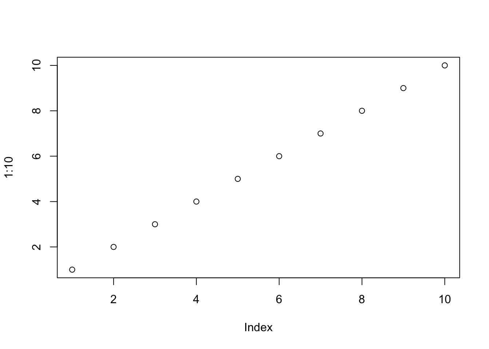

# Quarto


**Useful resources:**

- Quarto Tutorial: 

  - [Quarto Guide: Official Documentation](https://quarto.org/docs/guide/)
  - [Advanced Literate Programming with Quarto](https://jmjung.quarto.pub/m02-advanced-literate-programming/#learning-outcomes)
  - [Quarto: The Practical Guide](https://quarto-tdg.org)

- [YAML Options Reference](https://quarto.org/docs/reference/)
- [Render Quarto in VS Code](https://quarto.org/docs/tools/vscode/index.html)

--------------------------------------------------------------------------------

Quarto is based on **Pandoc** and uses its variation of markdown as its underlying document syntax. See the full documentation of [Pandoc's Markdown](https://pandoc.org/MANUAL.html#pandocs-markdown) for more in-depth documentation.

[**Cell Execution**](https://quarto.org/docs/get-started/computations/vscode.html#cell-execution)

| Quarto Command                         | Keyboard Shortcut |
| -------------------------------------- | ----------------- |
| <span class="env-green">Run Current Cell</span>    | ⇧ + ⌘ + Enter     |
| Run Current Cell and Jump to Next Cell | ⇧ + Enter         |
| Run Selected Line(s)                   | ⌘ + Enter         |
| <span class="env-green">Run All Cells</span>       | ⌥ + ⌘ + R         |

--------------------------------------------------------------------------------

### Projects {.unnumbered .unlisted}

If you have multiple .qmd files in one directory, it's a good practice to create a project for them.

🔥 **Benefits of creating a project:** [↩](https://quarto.org/docs/projects/quarto-projects.html)

- <span class="env-green">Share YAML configuration across multiple `.qmd` files.</span> 
  
  Sometimes YAML gets very long and cluttered. To makes your `.qmd` files cleaner and neater, put shared YAML options in [`_quarto.yml`](#project-metadata) file and it will apply to all `.qmd` files in the same (sub-)directory.

  In each `.qmd` file, you provide file-specific YAML options, e.g, `title`, `author`, `date`, etc.

  <div class="rmdnote">
  <i class="codicon codicon-lightbulb-sparkle env-green" aria-hidden="true" style="font-size:1.5em; vertical-align: middle;"></i> Always create a `_quarto.yml` file in the root of your project directory and put your shared YAML options there. 
  </div>

- Redirect output to a specific folder.
- Freeze rendered output, so that only changed files will be re-rendered

**Types of projects:**

- <span class="env-green">`default`</span>: default type; plain project, no linking between files. 
  
   This is useful if you just want to render multiple `.qmd` files in the same directory.
  
   If the file `_quarto.yml` is empty, or if `type` is unspecified, the `type` is assumed to be `default`. 

- <span class="env-green">`book`</span>: enforce chapters, build everything together.
  
  `book` type supports multiple output formats, e.g., PDF, HTML, EPUB, DOCX, etc. 
  HTML books are a special type of Quarto Website. So they support all Quarto Website features.

  One distinction between `book` and `website` is that when you have pdf output, `book` will compile all chapters into a single pdf file, while `website` will compile each chapter into a separate pdf file.

  <div class="rmdnote">
  <i class="codicon codicon-lightbulb-sparkle env-green" aria-hidden="true" style="font-size:1.5em; vertical-align: middle;"></i> Use `book` type for course materials so that you have a single pdf file for the whole course. 
  </div>

- `website`: create navigation bar, expect `index.qmd` as the homepage.
- `blog`
- `manuscript` and `confluence`

--------------------------------------------------------------------------------

#### Create a project

In terminal, run `quarto create project` and follow the prompts to create a new project. 

You can also define the type and name as arguments in the command, e.g., `quarto create project <type> <name>`.

```bash
quarto create project default project-name project-title
```

Quarto will then create the folder, e.g. project-name and populate it with `_quarto.yml` and a Quarto document with the same name as the project title, `project-title.qmd`:

```
temp-dirs/project-name
├── _quarto.yml
└── project-title.qmd
```

The file `_quarto.yml` is also populated with the project title:

```yaml
project:
  title: "project-title"
```

--------------------------------------------------------------------------------

<i class="codicon codicon-lightbulb-sparkle env-green" aria-hidden="true" style="font-size:1.5em; vertical-align: middle;"></i> You can <span class="env-green">manually create a project by creating a `_quarto.yml` file</span> in the directory. The presence of `_quarto.yml`, even if empty, signals to Quarto this is a project, and allows you to render without specifying a file. 

When you run `quarto render`, Quarto will render all Quarto documents in the project.


--------------------------------------------------------------------------------

<a id="project-metadata"></a>

### YAML Metadata {-}

Put <span class="env-green">**project metadata**</span> in `_quarto.yml` file. Any document rendered within the project directory will automatically inherit the metadata defined at the project level. 

Here is an example of what the `_quarto.yml` file might look like:


```yaml
project:
  type: default

from: markdown+tex_math_single_backslash+markdown_in_html_blocks
bibliography: bibli.bib

format:
  html:
    theme:
      light: [flatly, themes/light.scss]
      dark: [darkly, themes/dark.scss]
    respect-user-color-scheme: true
    toc: true
    css: 
      - ~/Library/CloudStorage/OneDrive-Norduniversitet/_shared-resources/custom-style.css
    self-contained: true
    html-math-method: mathjax
    include-in-header: 
      - ~/Library/CloudStorage/OneDrive-Norduniversitet/_shared-resources/mathjax.html
    fontsize: 14pt
    grid:
      body-width: 1000px
```

Use <span class="env-green">`format`</span> to specify output formats. This is different from Rmd, which uses `output` to specify output formats.
See [HERE](https://quarto.org/docs/faq/rmarkdown.html#i-use-x-bookdown-blogdown-etc..-what-is-the-quarto-equivalent) for Quarto equivalents of document formats in Rmd.


Some YAML options accepts multiple values, you can specify using the block style with dashes `-` or the inline style with square brackets `[]`.

For example, the [`include-in-header`](https://quarto.org/docs/output-formats/html-basics.html#includes) option accepts multiple values. Include contents of *file*, verbatim, at the end of the header. This can be used, for example, to include special CSS or JavaScript in HTML documents or to inject commands into the LaTeX preamble.

- You can specify it in **block style** as follows:

  ```yaml
  include-in-header:
    - mathjax.html
    - custom-style.css
  ```

  `css` official option can also be used to include CSS files in HTML documents.

- Or you can specify it in **inline style** as follows:

  ```yaml
  include-in-header: [mathjax.html, custom-style.css]
  ```


--------------------------------------------------------------------------------

<span class="env-green">**Markdown Extensions**</span> can be enabled using [`from` option](https://quarto.org/docs/reference/formats/html.html#rendering) in YAML. 
For example, `from: markdown+tex_math_single_backslash+markdown_in_html_blocks` enables the following extensions: 

- <span class="env-green">`tex_math_single_backslash`</span> allows you to use `\(` and `\)` to delimit inline math, and `\[` and `\]` to delimit display math.

- <span class="env-green">`markdown_in_html_blocks`</span> allows you to use markdown syntax within HTML tags. 
  
  `markdown_in_html_blocks` (markdown inside html) seems to be enabled by default in Rmd, but <span class="env-orange">**NOT**</span> in Quarto or Jekyll websites.
  
  A workaround if you don't want to enable this extension is to use **html innner and markdown outer**, e.g., 

  ```markdown
  **<span class="env-green">text</span>**
  ```

  This way, both the html class and markdown bold syntax will apply.


For more on available markdown extensions see the [Pandoc Markdown specification](http://pandoc.org/MANUAL.html#pandocs-markdown).


Note that Rmd enables Markdown extensions differently than Quarto. 

- **Rmd** uses the `md_extensions` option.
- **Quarto** uses the <span class="env-green">`from`</span> option. 

Both options can be specified under specific output formats, e.g., `html` or `pdf`, **or** as top-level options that apply to all output formats.

- Under specific output formats:

  ```yaml
  ---
  title: "Habits"
  output:
    html_document:
      md_extensions: -autolink_bare_uris+hard_line_breaks
  ---
  ```

- Top-level options:

  ```yaml
  title: "Habits"
  md_extensions: -autolink_bare_uris+hard_line_breaks
  ```

--------------------------------------------------------------------------------


Host Quarto on [GitHub Pages](https://quarto.org/docs/publishing/github-pages.html).

To get started, change your project configuration `_quarto.yml` to use `docs` as the `output-dir`.

```yaml
project:
  type: book
  output-dir: docs
```

Then, add a `.nojekyll` file to the **root of your repository** that tells GitHub Pages not to do additional processing of your published site using Jekyll (the GitHub default site generation tool):

```bash
touch .nojekyll
```

- Note that `.nojekyll`'s location is different than that of `bookdown`, which is at `/docs` folder.

--------------------------------------------------------------------------------


### Only re-render changed files {.unnumbered .unlisted #incremental-rendering}

You can add the following to your `_quarto.yml` file to only re-render changed files:

```yaml
execute: 
  freeze: auto
```

When `freeze: auto` is enabled, Quarto checks for modifications in the source files of your computational documents. If no changes are detected, Quarto will utilize the cached results from previous computations, skipping the re-execution of code chunks. 

This <span class="env-green">significantly speeds up rendering times</span>, especially for large projects with many computational documents. ✅

There are drawbacks: some files may not be updated in time. 

- Use `freeze: false` to force re-rendering of all files when you are able to submit your changes.
- Use `freeze: auto` when you are editing actively and want to see your changes in time.

--------------------------------------------------------------------------------


**Strengths of Quarto:**

- hoverable citations and cross-references, easy to read
- [easy subplots](https://quarto.org/docs/authoring/cross-references.html#subfigures)


**Weaknesses of Quarto:**

- slow compared to `Bookdown`
  
  <span class="env-green">**Workaround:**</span>
  
  - Use `quarto preview` in terminal to enable live preview
  - Set `freeze: auto` in `_quarto.yml` to only re-render changed files.

- Quarto's way of cross references equations is NOT compatible with latex labels. Quarto's way does not handle multilined equations labeling well. See [HERE](#rmd-multiline-eqns) for details.

- Not support `rstudioapi` functions. E.g., the following is often used to set working directory to the folder where the current script is located. 

  <span class="env-orange">But it does **NOT** work in Quarto.</span>
  
  ```r
  # set working dir, return error in Quarto
  dir_folder <- dirname(rstudioapi::getSourceEditorContext()$path)
  setwd(dir_folder)
  ```

--------------------------------------------------------------------------------


## Book Structure

`book` type projects are designed for authoring books. 
It combines multiple documents (chapters) into a single manuscript.
It supports a variety of formats: PDF, HTML, EPUB, DOCX, etc.

Best to use `book` if you want both PDF and HTML outputs.

The `_quarto.yml` file contains the book project structure.

```yaml
project:
  type: book

book:
  chapters:
    - index.qmd
    - preface.qmd
    - part: dice.qmd
      chapters: 
        - basics.qmd
        - packages.qmd
    - part: cards.qmd
      chapters:
        - objects.qmd
        - notation.qmd
        - modifying.qmd
        - environments.qmd
    - references.qmd
  appendices:
    - tools.qmd
    - resources.qmd

bibliography: references.bib

format:
  html:
    theme: cosmo
  pdf:
    documentclass: scrreprt
  epub:
    cover-image: cover.png
```

- <span class="env-green">The `index.qmd` file is **required**</span> (because Quarto books also produce a website in HTML format). This page should include the preface, acknowledgements, etc.

- `book` specifies title, author, chatperters, and other book-level metadata.

  - `chapters` property includes one or more book chapters.

  You can divide your book into parts using `part` within the book `chapters`. 

  - The `references.qmd` file will include the generated bibliography (see [References](https://quarto.org/docs/books/book-structure.html#references) below for details).
  
  Note that the markdown files `dice.qmd` and `cards.qmd` contain the part title (as a level one heading) as well as some introductory content for the part. 

  If you just need a part title then you can alternatively use this syntax:

  ```yaml
  book:
    chapters:
      - index.qmd
      - preface.qmd
      - part: "Dice"
        chapters: 
          - basics.qmd
          - packages.qmd
  ```

- `format` specifies output formats and their options. 
  
  For example, you can specify themes for HTML and pdf macros.


ref: 

- [Book Structure](https://quarto.org/docs/books/book-structure.html)

## Course Folder Structure

<pre class="nowrap"><code>
FIN5005 2025Fall/                            # Course root directory
├── _quarto.yml                              # Quarto project configuration
├── .Rprofile                                # R project configuration
├── _chunk-opt.qmd                           # Global chunk options
│
├── 01_introduction.qmd                      # Lecture 1: Probability & Descriptive Stats
├── 02_Data_Visualization.qmd                # Lecture 2: Data Visualization
├── 03_Linear_Regression.qmd                 # Lecture 3: Linear Regression
└── ...                                      # Additional lectures
│
├── _lab/                                    # Lab sessions
│   ├── 01_Lab-1_CLT.qmd                     # Lab 1: Central Limit Theorem
│   ├── 02_Lab-2_dummy-variable.ipynb        # Lab 2: Dummy Variables (Jupyter)
│   └── ...                                  # Additional labs
│
├── _exam/                                   # Examination materials
│   ├── 01_final_exam_2025Fall.qmd           # Examiner guidance (solutions visible)
│   ├── 02_formula_sheet_2025Fall.qmd        # Statistical formulas reference
│   ├── 03_example_questions.qmd             # Mock exam (20 MCQ + 1 open-ended)
│   └── distribution_table_all.pdf           # Probability distribution tables
│
├── _quiz/                                   # Weekly quiz assignments
│   ├── quiz_01_*.qmd                        # Quiz 1
│   ├── quiz_02_*.qmd                        # Quiz 2
│   ├── quiz_03_*.qmd                        # Quiz 3
│   └── ...                                  # Additional quizzes
│   
├── _class_examples/                         # In-class examples
│   ├── example_01_*.qmd                     # Example 1
│   ├── example_02_*.qmd                     # Example 2
│   └── ...                                  # Additional examples
│
├── filters/                                 # Project Quarto Lua filters
│   ├── color-text.lua                       # Handles colored text (e.g., .blue class)
│   └── unlisted-sections.lua                # Manages sections under unnumbered headings
│
├── latex/                                   # Project LaTeX configuration
│   └── preamble.tex                         # Custom LaTeX preamble
│
├── images/                                  # Course figures and visualizations
│   ├── Logistic_drill_sim.png               # Quiz 5 figure
│   ├── hist_skewness.png                    # Distribution examples
│   ├── QQ_plots.png                         # Q-Q plot examples
│   └── ...                                  # Additional plots
│
├── Rscripts/                                # R utility functions
│   └── fun_script.R                         # Helper functions for data analysis
│
├── data/                                    # Course datasets
│   ├── asset_returns.csv                    # Example financial data
│   └── ...                                  # Additional datasets
│
└── README.md                                # Project documentation

_shared-resources/                           # Shared resources across courses/projects
├── filters/                                 # Shared Lua filters
│   ├── color-text.lua                       # Handles colored text (e.g., .blue class)
│   └── unlisted-sections.lua                # Manages sections under unnumbered headings
│
└── latex/                                   # Shared LaTeX configuration
    └── preamble.tex                         # Custom LaTeX preamble
</code></pre>

For more courses, follow the structure below:

```markdown
├── FIN5005 2025Fall/
├── EK369E 2025Fall/
└── _shared-resources/      # Shared resources across all courses
```

___

## Code chunks

Both R markdown and Quarto can use the following ways to specify chunk options:

Use `tag=value` in the chunk header ```` ```{r} ````.

~~~~markdown
```{r my-label, fig.cap = caption}

# R code
```
~~~~


Alternatively, you can write chunk options in the body of a code chunk after <span class="env-green">`#|`</span>, e.g., 


````markdown
```{r}
#| label: fig-my-label
#| fig-cap: caption 

# R code
```
````

`tag: value` is the YAML syntax. 


**Options format:**

- space after `#|` and colon `:`
- Logical values in YAML can be any of: `true/false`, `yes/no`, and `on/off`. 
  - They all equivalent to `TRUE/FALSE` (uppercase) in Rmd.
  - Note that TRUE/FALSE need to be in uppercase in **Rmd**.

Note that <span class="env-green">Quarto accepts Rmd's way of specifying chunk options</span>. The **difference** is that <span class="env-green">Quarto's label for figures</span> must start with `fig-`, while Rmd accepts any labels.

````markdown
```{r label = "fig-my-label", fig.cap = caption}

# R code
```
````

❗️ Note that NOT all Rmd chunk options are supported in Quarto, e.g., Rmd's `results` are replaced with `output` in Quarto. See [Quarto Chunk Options](https://quarto.org/docs/computations/execution-options.html) for all available options.


--------------------------------------------------------------------------------

**Load default chunk options** from a separate file, e.g., `_chunk-opt.qmd`:

````markdown
```{r setup, child = "../_chunk-opt.qmd", include=FALSE}
```
````


**Quarto chunk options available for customizing output include:**

| Option       | Description                                                  |
| ------------ | ------------------------------------------------------------ |
| `eval`       | Evaluate the code chunk (if `false`, just echos the code into the output). |
| `echo`       | Include the source code in output                            |
| <span class="env-green">`output`</span>$^{[1]}$     | Include the results of executing the code in the output (`true`, `false`, or `asis` to indicate that the output is raw markdown and should not have any of Quarto’s standard enclosing markdown). |
| `warning`    | Include warnings in the output.                              |
| `error`      | Include errors in the output (note that this implies that errors executing code will not halt processing of the document). |
| `include`    | Catch all for preventing any output (code or results) from being included (e.g. `include: false`suppresses all output from the code block). |
| `renderings` | Specify rendering names for the plot or table outputs of the cell, e.g. `[light, dark]` |

$^{[1]}$ `output` is similar to `results` in Rmd. You <span class="env-orange">**cannot**</span> use `results='hide'` in Quarto, use `output: false` instead.


## Knitr Options


If you are using the Knitr cell execution engine, you can specify default document-level [Knitr chunk options](https://yihui.org/knitr/options/) in YAML. For example:

```yaml
---
title:"My Document"
format: html
knitr:
  opts_chunk:
    collapse: true
    comment: "#>"
    R.options:
      knitr.graphics.auto_pdf:true
---
```

You can additionally specify global Knitr options using `opts_knit`.

The `R.options` chunk option is a convenient way to define R options that are set temporarily via [`options()`](https://rdrr.io/r/base/options.html) before the code chunk execution, and immediately restored afterwards.

In the example above, we establish default Knitr chunk options for a single document. You can also add shared `knitr` options to a project-wide `_quarto.yml` file or a project-directory scoped `_metadata.yml` file.

ref: <https://quarto.org/docs/computations/execution-options.html#knitr-options>

--------------------------------------------------------------------------------

## PDF Options

Use the `pdf` format to create PDF output. For example:

```{.yaml .nowrap}
---
title: "Lab 1: Solutions"
format: 
  pdf:
    include-in-header: 
      - ../latex/preamble.tex         # tex template file, header file, can be used to overwrite default settings
      - text: |                       # raw LaTeX preamble added after your header file above
          \setmainfont{Georgia Pro}
    fontsize: 12pt                    # top level option
    pdf-engine: xelatex
    from: markdown+tex_math_single_backslash+markdown_in_html_blocks
    keep-tex: true                    # makes debugging easier by keeping the .tex file
---
```

See [HERE](https://quarto.org/docs/reference/formats/pdf.html) for all available PDF options. All PDF options go inside the `format:` → `pdf:` chunk of the YAML.

See [Metadata variables](https://pandoc.org/demo/example33/6.2-variables.html) for yaml options that Pandoc recognizes.

--------------------------------------------------------------------------------

### Common Compatibility Issues

When you have both HTML and PDF outputs, you have to deal with particular details that are supported by html but not by pdf.

- `\hat` accepts only simple macros without braces, e.g., `\hat y` is fine, but if you have custom macros for your variables, e.g., `\hat\bbeta`, it will throw an error in pdf output. 

  Fix: put custom macro in braces, e.g., `\hat{\bbeta}`.

- Colored equations `\color{#...}` does not work in pdf output. 
  
  Fix: write a lua filter to convert `\color{#...}` to `\color[html]{..}`.

  ```lua
  -- This filter ensures colored equations are properly formatted for LaTeX/PDF output by converting \color{#...} to \color[HTML]{...}.
  function Math(el)
    -- Check if the output format is PDF or LaTeX
    if FORMAT:match("latex") or FORMAT:match("pdf") then
      -- Find \color{#...} and replace it with \color[HTML]{...}
      el.text = el.text:gsub("\\color{#(%w+)}", "\\color[HTML]{%1}")
      return el
    end
  end
  ```

- `knitr::include_graphics` does NOT work for files with spaces in the file name. 

  Fix: rename the file to remove spaces, e.g., `my plot.png` → `my_plot.png`.

- Note that the extensions need to be loaded within the `from` option for the PDF output. First-level `from` does NOT work for pdf output.

- Sections start with level 2 headings, i.e., `##`. Level 1 headings, i.e., `#`, are reserved for the title page or chapter titles.

- For `stargazer` tables, use `type="text"` for best compatibility.
  
  Otherwise, use `type = ifelse(knitr::is_html_output(), "html", "latex")` to specify different output types for html and pdf outputs.

- GIF needs to be converted to static images for pdf output.
  
  ```r
  #' Conditionally include a GIF or a static PNG based on output format
  #'
  #' @param path The file path to the original GIF.
  #' @param frame The frame number to extract for the PDF (default is 1).
  #' @param ... Additional arguments passed to knitr::include_graphics().
  #' @return A knitr::asis_output object for the appropriate image.
  include_gif <- function(path, frame = 1, ...) {
    # Check if we are knitting to PDF/LaTeX
    if (knitr::is_latex_output()) {
      
      # Create a new filename by swapping the extension to _static.png
      # e.g., "images/my_plot.gif" becomes "images/my_plot_static.png"
      png_path <- paste0(tools::file_path_sans_ext(path), "_static.png")
      
      # If the static image doesn't exist yet, create it
      if (!file.exists(png_path)) {
        
        # Ensure the magick package is installed
        if (!requireNamespace("magick", quietly = TRUE)) {
          stop("The 'magick' package is required to convert GIFs. Please install it.")
        }
        
        # Read the GIF
        img <- magick::image_read(path)
        
        # Failsafe: If you ask for frame 50 but there are only 20 frames, grab the last one
        if (frame > length(img)) {
          warning(sprintf("Requested frame %d exceeds GIF length. Using the last frame.", frame))
          frame <- length(img)
        }
        
        # Extract the specified frame and save as PNG
        magick::image_write(img[frame], path = png_path, format = "png")
      }
      
      # Feed the newly created static PNG to LaTeX
      knitr::include_graphics(png_path, ...)
      
    } else {
      # If compiling to HTML/Word, just use the original animated GIF
      knitr::include_graphics(path, ...)
    }
  }
  #
  # Use example
  # include_gif("path-to-image.gif")
  #
  # you can choose which frame to extract for the PDF version by setting the frame argument
  # include_gif("path-to-image.gif", frame = 10) # extracts the 10th frame for the PDF version
  ```

--------------------------------------------------------------------------------

**Title & Author**

| PDF Options | Functions                          |
| :----       | :--------------------------------- |
| `title`     | Document title                     |
| `date`      | User defined document date         |
| `date-format` | Display format for the date in the output. |
| `author`    | Author or authors of the document  |
| `abstract`  | Summary of document                |


**date format**

- `date`: Input date for Quarto to parse. It supports automatic parsing of various date formats, e.g., `2024-06-01`, `June 1, 2024`, `01/06/2024`, etc. 

- <span class="env-green">`date-format`</span>: Specify the output format to display in your output. E.g., `MMM D, YYYY` will display `Jun 1, 2024`. See [HERE](https://quarto.org/docs/reference/dates.html) for more details and examples.

| Format String | Output       | Description                    |
| :------       | :----------- | :----------------------------- |
| `MMM`         | Jan-Dec      | The abbreviated month name     |
| `D`           | 1-31         | The day of the month           |
| `DD`          | 01-31        | The day of the month, 2-digits |
| `YYYY`        | 2024         | The four-digit year            |


<a id="custom-maketitle"></a>

**Add email to author:**

Redefine `\maketitle` to add email address to the author, adjust spacing, font size, etc. 

```yaml {.nowrap}
author: "\\textnormal{Menghan Yuan\\thanks{\\href{mailto:menghan.yuan@nord.no}{menghan.yuan@nord.no}}}"
format: 
  pdf:
    -text: |
      \usepackage{hyperref}
      
      \makeatletter
      % Keep KOMA-Script title fonts, but tighten the vertical spacing.
      \def\@subtitle{}
      \renewcommand{\subtitle}[1]{\gdef\@subtitle{#1}}

      \renewcommand{\maketitle}{%
        \begingroup
        \vspace*{-1em}%
        \begin{center}
          {\usekomafont{title}\huge \@title \par}
          {\usekomafont{subtitle}\large \@subtitle \par}
          \vspace{0.35em}
          {\usekomafont{author}\small \@author \par}
          \vspace{0.15em}
          {\usekomafont{date}\small \@date \par}
        \end{center}
        \@thanks
        \endgroup
      }
      \makeatother
```

If you want to adjust the vertical spacing between `\maketitle` and the body, you can add `\vspace` after `\end{center}` and before `\@thanks` in the code above.

Here I renew the <span class="env-green">`\maketitle`</span> command:

- move title up by 1em
- make the title page components more compact
  - `\usekomafont` keeps the default KOMA-Script fonts.
  - smaller font size for author and date
- add `\@thanks` in the footnote to display the email address.

Syntax explain:

- `\makeatletter`: treats `@` as letter; allows the use of `@` in command names.
  
  `\makeatother`: treats `@` as other.

- Define a new command `\subtitle` to allow for subtitle in the title page. 
  
  ```latex
  \def\@subtitle{}
  \renewcommand{\subtitle}[1]{\gdef\@subtitle{#1}}
  ```
  
  - `\def\@subtitle{}` initializes the `\@subtitle` command to be empty.
  - `\gdef` globally defines `\@subtitle` to be the argument passed to `\subtitle`. This allows you to use `\subtitle{Your Subtitle}` in your .qmd file, and it will be included in the title page.
  - If you use `scrartcl` document class, it already defines `\subtitle`, the code above is not necessary. 
    
    For older document classes, e.g., `article`, you need to define `\subtitle` yourself as shown above.


**Format Options**

| PDF Options | Functions                         |
| :---------  | :-------------------------------- |
| `pdf-engine` | Specify the PDF engine to use. The default is `xelatex`.<br />Options include `pdflatex`, `xelatex`, and `lualatex`. |
| [`documentclass`][documentclass] | Defaults to `scrartcl` |
| `keep-tex`   | Keep the intermediate tex file used during render. |

[documentclass]: https://quarto.org/docs/output-formats/pdf-basics.html#document-class

**Document Class**

Quarto uses [KOMA Script](https://ctan.org/pkg/koma-script) document classes by default for PDF documents and books. KOMA-Script classes are drop-in replacements for the standard classes with an emphasis on *typography and versatility*.

You can set `documentclass` to the standard `article`, `report` or `book` classes, to the KOMA Script equivalents `scrartcl`, `scrreprt`, and `scrbook` respectively, or to any other class made available by LaTeX packages you have installed.


<span class="env-green">[**Includes**](https://quarto.org/docs/reference/formats/pdf.html#includes)</span>

| PDF Options         | Functions                                                    |
| :------------------ | :----------------------------------------------------------- |
| `include-in-header` | Include contents at the **end** of the header.<br />Specify your pdf template here. |
| `include-before-body` | Include contents at the beginning of the document body, i.e., after `\begin{document}`. |
| `include-after-body` | Include contents at the end of the document body, i.e., before `\end{document}`. |
| `metadata-files`    | Read metadata from the supplied YAML (or JSON) files.        |


Subkeys for <span class="env-green">`include-in-header`</span>:

- `file`: path to a file to include at the end of the header.
  
  - Useful if you have template files.
  - Can have several files to include, e.g., `preamble.tex` for package setup and `macros.tex` for custom macros.
  - You can use relative paths or absolute paths. 
    
     Absolute paths can be lengthy, one workaround is to 

    1. put your template files in a shared folder
    2. create a <span class="env-green">symbolic link</span> to the shared folder in your project directory:
       
       ```bash
       ln -s /path/to/shared/latex/preamble.tex ./latex/preamble.tex
       ```
    3. use the symbolic link in your yaml:
       
       ```yaml
       format:
         pdf:
           include-in-header:
             - file: ./latex/preamble.tex
       ```

- `text: |`: include raw latex content in the YAML header. 
  
  `|` indicates that the content is in multiple lines.

- If you omit `file:` or `text:`, Quarto assumes `file:` by default.

<div class="rmdnote">
`include-in-header` 优先级最高，高于 Quarto top level `pdf` options. 比如既设置了 `mainfont: Charter`，又在 `include-in-header` 中设置了 `\setmainfont{Georgia Pro}`，两者会冲突，但由于 `include-in-header` 优先级更高，所以最终的字体是 `Georgia Pro`。

如果你的 `include-in-header:file` 也中设置了字体，那么最后定义的字体会覆盖之前的设置。即谁后定义的字体，谁就生效。
</div>

**Use example**

```yaml
format:
  pdf:
    include-in-header:
      - text: |
          \usepackage{eplain}
          \usepackage{easy-todo}
      - file: packages.tex
      - macros.tex            # assume file by default
    include-before-body:
      - file: before-body.tex
      - text: |
          \vspace*{-2em}      % reduce space btw title and body
```

- Note that you need the dash `-` before `text:` and `file:` to indicate a list of items.


--------------------------------------------------------------------------------

**Add logo to the title page**

Use `fnacyhdr` package to add a logo to the title page.

```yaml
format: 
  pdf:
    include-in-header: 
      - text: |
          \usepackage{graphicx}
          \usepackage{fancyhdr}
          \usepackage{ifthen}
          \pagestyle{fancy}
          \fancyhead[L]{\ifthenelse{\value{page}=1}{\includegraphics[height=1.5cm]{nordlogoen.jpg}}{}}
    include-before-body:
      - text: |
          \vspace*{-2em}
          \thispagestyle{fancy}
```

- `\vspace*{-2em}` moves the body up by 2em to reduce the space between the title and the body.
- `\thispagestyle{fancy}` applies the `fancy` page style to the title page, which allows us to use `\fancyhead` to add the logo to the left header of the first page.

If you want to customize the title page further, see [HERE](#custom-maketitle).


--------------------------------------------------------------------------------


Note: Any packages specified using includes that you don’t already have installed locally will be installed by Quarto during the rendering of the document.


`header-includes: |` is a pandoc variable for including raw LaTeX code in the document header.

- [use example](https://quarto.org/docs/reference/formats/pdf.html) in quarto doc
- pandoc doc for [`header-includes`](https://pandoc.org/demo/example33/8.10-metadata-blocks.html)

**Use example:**

```yaml
header-includes: |
  \RedeclareSectionCommand[
    beforeskip=-10pt plus -2pt minus -1pt,
    afterskip=1sp plus -1sp minus 1sp,
    font=\normalfont\itshape]{paragraph}
  \RedeclareSectionCommand[
    beforeskip=-10pt plus -2pt minus -1pt,
    afterskip=1sp plus -1sp minus 1sp,
    font=\normalfont\scshape,
    indent=0pt]{subparagraph}
```

**Format & Typesettings**

| PDF Options       | Functions                                     |
| :---------------- | :-------------------------------------------- |
| `toc-depth: 3`    | Specify the number of section levels to include in the table of contents. <br />The default is 3 |
| <span class="env-green">`number-sections: false`</span> | Number section headings rendered output. <br />By default, sections are not numbered. |
| `number-depth`    | By default, all headings in your document create a numbered section. |
|  [**Fonts**](https://quarto.org/docs/reference/formats/pdf.html#fonts)|     |
| `fontsize`        | base font size                                |
| `mainfont`        | main font familty                             |
| `sansfont`        | sans serif font family                        |
| `mathfont`        | math font family                              |
| `monofont`        | monospaced font family                        |
| `CJKmainfont`     | main font family for Chinese, Japanese, and Korean (CJK) characters, supported by `xecjk` package |
| `linestretch`     | line spacing using `setspace` package         |


[**Tables**](https://quarto.org/docs/reference/formats/pdf.html#tables)

| PDF Options | Functions                                                    |
| :---------- | :----------------------------------------------------------- |
| `df-print`  | Method used to print tables in Knitr engine documents.<br />- `default`: Use the default S3 method for the data frame. <br />- <span class="env-green">`kable`</span>: Default method. Markdown table using the `knitr::kable()` function. <br />- `tibble`: Plain text table using the `tibble` package. <br />- `paged`: HTML table with paging for row and column overflow. |


[**Engine Binding**](https://quarto.org/docs/computations/execution-options.html#engine-binding)

| PDF Options       | Functions                                     |
| ----------------- | --------------------------------------------- |
| <span class="env-green">`keep-tex: false`</span> | Whether to keep the intermediate tex file used during render. <br />Defaults to `false`.|

The `.tex` file generated looks cluttered as it includes all default settings imposed by Quarto. I rarely use the `.tex` file, but can be useful when you want to debug or share tex files with others.


Q: Are there **incremental rendering options** for pdf output?  
A: [Unresolved] for a single file. For a project with multiple files, you can set `freeze: auto` in `_quarto.yml` to only re-render changed files. See [Only re-render changed files](#incremental-rendering) for details.

--------------------------------------------------------------------------------

Q: How to print dollar sign in pdf output?  
A: In pdf output, `qmd` supports `$` directly. No need to escape. 

In html output, `$` will be treated as inline math.
If you have both pdf and html outputs, use `\$` to print `$` in both outputs.

If it still doesn't work, use `\\$`. 


--------------------------------------------------------------------------------

After rendering, the following info will appear in the console:

```
pandoc 
  to: latex
  output-file: lab1_solutions.tex
  standalone: true
  pdf-engine: xelatex
  variables:
    graphics: true
    tables: true
  default-image-extension: pdf
  
metadata
  documentclass: scrartcl
  classoption:
    - DIV=11
    - numbers=noendperiod
  papersize: letter
  header-includes:
    - \KOMAoption{captions}{tableheading}
  block-headings: true
  title: 'Lab 1: Solutions'
  fontsize: 12pt
```

By default, Quarto uses the [`scrartcl` document class](https://quarto.org/docs/output-formats/pdf-basics.html#document-class) and `letter` paper size for pdf output.

Note that `documentclass: scrartcl` is the KOMA-Script article class. 
KOMA-Script classes have good looking default settings, and are highly customizable. 

You can set `documentclass` to the standard `article`, `report` or `book` classes, to the KOMA Script equivalents `scrartcl`, `scrreprt`, and `scrbook` respectively, or to any other class made available by LaTeX packages you have installed.

--------------------------------------------------------------------------------

### Title Margin

One issue is it might have too wide margins around the title.

To reduce the **margin above the title**, add the following line to your `preamble.tex` file:

```latex
% reduce title top margin
\usepackage{xpatch}
\makeatletter
\xpatchcmd{\@maketitle}{\vskip2em}{
    % Insert here the space you want between the top margin and the title.
    \vspace{-2em} % Example of smaller margin. 
}{}{}
\makeatother
```

Refer to [HERE](#custom-maketitle) for redefining the `\maketitle` command to further customize the title page, e.g., more refined control of spacing, add a logo, change font size, etc.

--------------------------------------------------------------------------------

To reduce the **margin below the title**, in individual `qmd` file, add the following line **after** the YAML header:

- fenced divs

  ```latex
  ::: {=latex}
  \vspace{-6em}
  :::
  ```

- code chunks

  ````latex
  ```{=latex} 
  \vspace{-6em}
  ```
  ````

For pdf output, it is possible to **write LaTeX code directly** in Markdown document using fenced divs or code chunks with `{=latex}`.

- Don't forget the equal sign before `latex`.

ref: [R Markdown Cookbook: Section 6.11 Write raw LaTeX code](https://bookdown.org/yihui/rmarkdown-cookbook/raw-latex.html#raw-latex)


--------------------------------------------------------------------------------

### Templates

See [HERE](https://quarto.org/docs/journals/templates.html) for an overview of how to set template for `tex` files.

- pakage setup
- article typsetting

[Starter template](https://quarto.org/docs/extensions/starter-templates.html) for `qmd` file.

- yaml header
- structure of your `qmd`

--------------------------------------------------------------------------------

### Add Appendices

```tex
\newpage

# Appendices {.unnumbered}

\appendix
\renewcommand{\thesubsection}{\Alph{subsection}}
\setcounter{table}{0}
\renewcommand{\thetable}{\thesection\arabic{table}}
\setcounter{figure}{0}
\renewcommand{\thefigure}{\thesection\arabic{figure}}

## Optimal Portfolio R Code
```

- `# Appendices {.unnumbered}` creates a title for the appendices section without a section number.
- Use `\appendix` to reset the section counter to 0 and `\renewcommand{\thesubsection}{\Alph{subsection}}` to change the section numbering to letters (A, B, C, ...).
- Similarly, reset the table and figure counters and change their numbering to include the section letter "A", "B", ... as a prefix.
- Finally, use `## Optimal Portfolio R Code` to create an appendix section for your first appendix. The `# Appendices` will be level one heading, and `## Optimal Portfolio R Code` will be level two heading under the appendices section.

### Add TOC

To show TOC pane in pdf, you can either set in YAML or in preambles.

- YAML
  
  ```yaml
  hyperrefoptions:
    - bookmarksopen=true
    - bookmarksopenlevel=3
  ```
- preambles
  
  ```latex
  % Configure hyperref for expanded bookmarks
  % Note that this only works for Adobe Acrobat Reader
  \usepackage{hyperref}
  \hypersetup{
    bookmarksopen = true, % show TOC with all the subtrees expanded
    bookmarksopenlevel = 2 % level to which bookmarks are open
  }
  ```


### YAML templates

**With logo in the title page**

```yaml {.nowrap}
---
title: "Your Title"
subtitle: "Optional Subtitle"
author: "\\textnormal{Menghan Yuan\\thanks{\\href{mailto:menghan.yuan@nord.no}{menghan.yuan@nord.no}}}"
date: "2026-06-01"
date-format: "MMM D, YYYY"
from: markdown+tex_math_single_backslash
format: 
  pdf:
    include-in-header: 
      - ../../_shared-resources/latex/preamble.tex
      - text: |
          \setmainfont{Georgia Pro}
          \usepackage{graphicx}
          \usepackage{fancyhdr}
          \usepackage{ifthen}
          \pagestyle{fancy}
          \fancyhead[L]{\ifthenelse{\value{page}=1}{\includegraphics[height=1.5cm]{nordlogoen.jpg}}{}}
          \renewcommand{\headrulewidth}{0pt}
          \makeatletter
          % Keep KOMA-Script title fonts, but tighten the vertical spacing.
          \renewcommand{\maketitle}{%
            \begingroup
            \vspace*{-1em}%
            \begin{center}
              {\usekomafont{title}\huge \@title \par}
              {\usekomafont{subtitle}\large \@subtitle \par}
              \vspace{0.35em}
              {\usekomafont{author}\small \@author \par}
              \vspace{0.15em}
              {\usekomafont{date}\small \@date \par}
            \end{center}
            \@thanks
            \endgroup
          }
          \makeatother
    include-before-body:
      - text: |
          \thispagestyle{fancy}
    keep-tex: true
    fontsize: 12pt
---
```


--------------------------------------------------------------------------------

## HTML Theming

One simple theme

```yaml
title: "My Document"
format:
  html: 
    theme: cosmo
    fontsize: 18px
    linestretch: 1.7
    toc: true
    css: /Users/menghan/Library/CloudStorage/OneDrive-Norduniversitet/_shared-resources/custom-style.css
    self-contained: true
    html-math-method: mathjax
    include-in-header: /Users/menghan/Library/CloudStorage/OneDrive-Norduniversitet/_shared-resources/mathjax.html
    grid:
      body-width: 1000px
```

- <span class="env-green">`fontsize`</span>: set base font size. Can be set in absolute units like `16px`, `14pt`, or relative units like `1.2em`, `120%`.
  
  See [HERE](https://developer.mozilla.org/en-US/docs/Web/CSS/Reference/Properties/font-size) for an overview of CSS font-size units.

  Note the attribute `fontsize` has no dash; distinguish from the CSS property `font-size` with a dash.
  
  I prefer to use `fontsize: 18px` together with `cosmo`, as I feel the default font size in `cosmo` is a bit small.

  `fontsize: 18px` in YAML will be resolved to `--bs-root-font-size: 18px;` in Bootstrap CSS, which is the **base font size** for the *entire document*.

  ---

  Q: Which unit should I use?   
  A: <span class="env-green">`px` for screen display</span>, `pt` for print.

  `px` pixels are optimized for screen display, browsers has better support for `px` and it is more consistent across different devices. 

  `pt` will force fixed font size regardless of user settings or screen scaling. `px` is useful in `@media print` CSS rules to ensure that printed text is a specific size.
  
  ---

  Alternatively, you can set font size in your custom SCSS file, e.g.,

  ```scss
  // Default font size
  $font-size-base: 1rem; // 16px
  ```

  `$font-size-base` is used by Bootstrap to set the base font size for the body text. When you reset `$font-size-base`, all other font sizes that are defined in terms of it will also be updated accordingly.

- <span class="env-green">[`self-contained: true`](https://quarto.org/docs/output-formats/html-basics.html#self-contained)</span> will embed all resources (CSS, JS, images) directly into the HTML file, making it portable and easy to share. However, it can increase the file size significantly, especially if you have large images or complex styles.

  By default, when you render a `.qmd` file, it will generate a `_files` folder that contains all the resources (CSS, JS, images) needed for the HTML output. If you move the HTML file without the `_files` folder, it will break the links to those resources and cause rendering issues.

  For example, if you render report.qmd to HTML:

  ```bash
  quarto render report.qmd --to html
  ```
  Then the following output will be generated:

  ```
  report.html
  report_files/
  ```

  If you have `self-contained: true` in your YAML, the standalone `report.html` will include all the resources embedded within it.

  <div class="rmdnote">
  If you have embeded external CSS style sheets, e.g., `css: /path/to/custom-style.css`, in order to render your qmd successfully, you need to set `self-contained: true` to embed the CSS file into the HTML output. Otherwise, you will get an error like `Error: /path/to/custom-style.css (404 Not found)`.
  </div>

- `gird/body-width`: set the max width of the page content. By default, Quarto uses 800px. If you want to use the full width of the page, use `page-layout: full` instead.

--------------------------------------------------------------------------------

Enable **dark and light** modes

```yaml
format:
  html:
    include-in-header: themes/mathjax.html
    respect-user-color-scheme: true
    theme:
      dark: [cosmo, themes/cosmo-dark.scss]
      light: [cosmo, themes/cosmo-light.scss]
```

- See [HTML basic yaml](https://quarto.org/docs/output-formats/html-basics.html) for basic option settings.
- See [HTML format reference](https://quarto.org/docs/reference/formats/html.html) for a complete list of all available options.

--------------------------------------------------------------------------------

`respect-user-color-scheme: true`  honors the user’s operating system or browser preference for light or dark mode.

Otherwise, <u>the order of light and dark elements</u> in the theme or brand will determine the <u>default</u> appearance for your html output. For example, since the `dark` option appears first in the first example, a reader will see the light appearance by default, if `respect-user-color-scheme` is not enabled.

As of Quarto 1.7, `respect-user-color-scheme` requires JavaScript support: users with JavaScript disabled will see the author-preferred (first) brand or theme.

--------------------------------------------------------------------------------


### Custom Themes {-}

Your `custom.scss` file might look something like this:

```css
/*-- scss:defaults --*/
$h2-font-size:          1.6rem !default;
$headings-font-weight:  500 !default;

/*-- scss:rules --*/
h1, h2, h3, h4, h5, h6 {
  text-shadow: -1px -1px 0 rgba(0, 0, 0, .3);
}
```

Note that the variables section is denoted by

- `/*-- scss:defaults --*/`: the defaults section (where Sass variables go) 
  
  Used to define global variables that can be used throughout the theme.

- `/*-- scss:rules --*/`: the rules section (where normal CSS rules go)
  
  Used to define more fine grained behavior of the theme, such as specific styles for headings, paragraphs, and other elements.


--------------------------------------------------------------------------------


### Theme Options {-}

You can do extensive customization of themes using [Sass variables](https://sass-lang.com/). Bootstrap defines over 1,400 Sass variables that control fonts, colors, padding, borders, and much more. 

The Sass Variables can be specified within SCSS files. These variables should always be prefixed with a `$` and are specified within <span class="env-green">the respective theme files</span> rather than within YAML options.

For instance, I use `cosmo` together with custom SCSS files `cosmo-dark.scss` and `cosmo-light.scss` to customize the dark and light modes of the `cosmo` theme, respectively. If I want to change the Sass variables, I need to specify the variables in <span class="env-green">both `cosmo-dark.scss` and `cosmo-light.scss`</span>. It seems to be repetitive to specify the same variables in both files, but it is necessary for it to work in dark and light themes.

[Commonly used Sass variables](https://jmjung.quarto.pub/m02-advanced-literate-programming/#sass-variables):

<table style="width: 100%; border-collapse: collapse;">
  <thead>
    <tr>
      <th style="width: 30%; text-align: left;">Variable</th>
      <th style="width: 70%; text-align: left;">Description</th>
    </tr>
  </thead>
  <tbody>
    <tr>
      <td colspan="2"><strong>Colors</strong></td>
    </tr>
    <tr>
      <td><code>&#36;body-bg</code></td>
      <td>The page background color.</td>
    </tr>
    <tr>
      <td><code>&#36;body-color</code></td>
      <td>The page text color.</td>
    </tr>
    <tr>
      <td><code>&#36;link-color</code></td>
      <td>The link color.</td>
    </tr>
    <tr>
      <td><code>&#36;input-bg</code></td>
      <td>The background color for HTML inputs.</td>
    </tr>
    <tr>
      <td><code>&#36;popover-bg</code></td>
      <td>The background color for popovers (for example, when a citation preview is shown).</td>
    </tr>
    <tr>
      <td colspan="2"><strong>Fonts</strong></td>
    </tr>
    <tr>
      <td><code class="env-green">&#36;font-size-base</code></td>
      <td>Base <strong>font size</strong> for the <b>body text</b> (<code>&lt;body&gt;</code>).</td>
    </tr>
    <tr>
      <td><code>&#36;font-size-root</code></td>
      <td>Base <strong>font size</strong> for the entire document, i.e., what <code>rem</code> is based on. By default, this is usually set to <code>16px</code>.</td>
    </tr>
  </tbody>
</table>


You can see all of the variables here:

<https://github.com/twbs/bootstrap/blob/main/scss/_variables.scss>


When you wonder what is used on your website, use the browser's developer tools to inspect the CSS variables. 
Go to "Source" tab, in "Style Sheets" folder, find your `.scss` file. You will see the variable resolved values in the <span class="env-green">`:root` section</span>.


Note that when you make changes to your local `.scss`, the changes will be implemented in-time. That is, you don't need to re-build your website to see the effects. 

### Font Family {-}

If Safari does not display the font you specified but Chrome displays correctly, it is usually due to Safari is striter about system font access. In this case, you can attach the font file and explicitly load the font using `@font-face` in your custom SCSS file. 


For example:

1. Add the font file to your project, e.g., `assets/fonts/Georgia Pro/GeorgiaPro-Regular.ttf`.
2. In `_quarto.yml`, add the following to tell Quarto to include the font file in the output direcotry, in my case `docs`:

   ```yaml
   format:
     html:
       resources: assets/
   ```

   This will copy the `assets` folder to the output directory.

3. Add the following code to your html header files:

   ```scss
   <style>
   @font-face {
     font-family: "Georgia Pro";
     src: url("assets/fonts/Georgia Pro/GeorgiaPro-Regular.ttf") format("truetype");
     font-weight: 400;
     font-style: normal;
   }
   </style>
   ```

   This will load the "Georgia Pro" font from the specified path and make it available for use in your CSS. You can then set the `font-family` property to "Georgia Pro" in your theme or custom styles to apply it to your document.


**Ref:** 

- Quarto document: <https://quarto.org/docs/output-formats/html-themes.html>

- Check sass variables: <https://bootswatch.com>

--------------------------------------------------------------------------------

## Render Quarto


Rendering the whole website is slow. When you are editing a new section/page, you may want to edit as a standalone webpage and when you are finished, you add the `qmd` file to the `_quarto.yml` file index.

Difference btw a standalone webpage from a component of a `qmd` project

- Standalone webpage: include `yaml` at the header of the file.
  
    Fast compile and rendering. ✅
    
- A component of `qmd` project: added to the file index, no `yaml` needed, format will automatically apply.

    Slow, need to render the whole `qmd` project in order to see your change.

--------------------------------------------------------------------------------

### In terminal {-}

I think using terminal is the most convienient way to render Quarto documents/projects.

This will provide <span class="env-green">**live preview**</span> of the document in your web browser. Newest changes will be reflected while you edit the document. This is one of my favorite features of Quarto over Rmd. 👍

In Rmd, you have to render the document every time you want to see the changes at least in VS Code. ❌
But in Quarto, you can use `quarto preview` to see the changes in real time. Saves lots of troubles of rendering the whole document every time you make a change. ✅

- Render a Quarto document to HTML using the command line:

  ```bash
  $quarto render 0304-Quarto.Rmd --to html
  ```
  
  [**Options:**](https://quarto.org/docs/cli/render.html)
  
  - `--to` or `-t`: specify the output format(s). You can specify multiple formats by separating them with commas, e.g., `--to html,pdf`. If you don't specify any format, Quarto will render the default format.

- <span class="env-green">Quarto Preview</span>: display output in the **external web browser**.

  ```bash
  $ quarto preview 0304-Quarto.Rmd # all formats
  $ quarto preview 0304-Quarto.Rmd --to html # specific format
  ```

  - Note that `quarto render` can be used to Rmd files too.
  - Run `quarto preview help` to see its complete syntax.

- You can also render a Quarto project using:

  ```bash
  $quarto render --to html
  ```

`quarto preview [file] [args]` first provide file name, then additional arguments.

Supported arguments:

- `--port` Suggested port to listen on (defaults to random value between 3000 and 8000).
  
  If you have multiple documents to preview, you can use `--port` to specify different ports for each document.
- `--host` Hostname to bind to (defaults to 127.0.0.1)
- `--no-browser` Use <span class="env-green">internal viewer</span>, do not open external browser.
- `--no-watch-inputs` flag specifically prevents Quarto from automatically re-rendering the output when changes are detected in your input source files (e.g., `.qmd` files). 
  
  This means that if you edit and save your `.qmd` file, the preview in your browser will NOT automatically update.
  
  To see changes in the preview when using this flag, you would need to manually stop the `quarto preview` process and restart it, or explicitly trigger a re-render using `quarto render`.

  Even when using this flag, Quarto will still print the message "Watching file for changes." This means that Quarto is still watching CSS files and `_quarto.yml` for changes, but not the main input files.

`quarto preview [file] --port 7200 --no-browser` Previewing website using a specific port. This is useful when your want to preview multiple documents simultaneously.

The default "internal" viewer in VS Code opens only one document at a time. 

**Option 1**

Can use [Simple Browser Multi Extension](https://marketplace.visualstudio.com/items?itemName=fermelone.simple-browser-multi) to open multiple internal browsers in VS Code.

**Steps:**

1. Install Simple Browser Multi Extension.
2. Use command `quarto preview 0304-Quarto.Rmd --port 7200` in terminal to start live preivew. This will open the preview in your <span class="env-green">external web browser</span>.
   
   If you don't want automatic re-rendering when you save the file, add `--no-watch-inputs` flag.

   Add `--no-browser` if you don't want to open the preview in external browser.
3. In VS Code, use command palette `Simple Browser Multi: Show` and enter the url in Step 2 to open the preview in the internal browser.

--------------------------------------------------------------------------------

**Option 2**

[**Tab management**](https://code.visualstudio.com/docs/debugtest/integrated-browser#_tab-management)

`Browser: Quick Open Browser Tab` (⇧⌘A) to quickly switch between open browser tabs. The Quick Pick lists all open tabs grouped by editor group, and you can type to filter by tab name or URL.


--------------------------------------------------------------------------------

### In VS Code {-}


<span class="env-orange">By default Quarto does NOT automatically render</span> `.qmd` or `.ipynb` files when you save them. This is because rendering might be very time consuming (e.g. it could include long running computations) and it's good to have the option to save periodically without doing a full render.

You have to refresh to see your updates when using VS Code command palette quarto preview.

You can render a Quarto document in VS Code using the command palette:

- `Quarto: Render Document` to render the document.
- `Quarto: Render Project` to render the entire project.
- `Quarto: Preview` to preview the default document in a web browser. If you want to preview a different format, use the `Quarto: Preview Format` command:

This will show a preview of the project in the internal browser.

However, you can configure the Quarto extension to automatically render whenever you save. In settings, set [`quarto.renderOnSave`](https://quarto.org/docs/tools/vscode/index.html#render-on-save) to `true`.

You might also want to control this behavior on a per-document or per-project basis. If you include the <span class="env-green">`editor: render-on-save`</span> option in your document or project YAML it will supersede whatever your VS Code setting is. This works on a per-document basis. For example:

```yaml
---
editor:
  render-on-save: true
---
```

Alternatively, you can set it globally in VS Code settings:

```yaml
"quarto.render.renderOnSave": true
```

After you enable `render-on-save`, when you save your `qmd` file, the preview will be updated in time.
It is suggested to configure how often the file is saved in VS Code settings:

```yaml
"files.autoSave": "onFocusChange"
```

The file will be saved when focus changes. 

**Options for `files.autoSave`:**

| Value              | Behavior                                           |
| ------------------ | -------------------------------------------------- |
| `"off"`            | Never auto-saves (manual `Cmd+S` only)             |
| `"onFocusChange"`  | Saves when you click away from the editor          |
| `"onWindowChange"` | Saves when you switch away from the VS Code window |
| `"afterDelay"`     | Saves after a set delay (e.g. 1000ms)              |

ref: [Quarto: Render on Save](https://quarto.org/docs/tools/vscode/index.html#render-on-save)

--------------------------------------------------------------------------------

Q: Quarto Preview pane not refreshing and updating changes.  
A: The issue seems to come from the `--no-watch-inputs` option to the preview command, preventing the live update. [↩︎](https://github.com/quarto-dev/quarto-cli/discussions/10745#discussioncomment-10990779)

Use the following command in terminal to enable live preview:

```bash
quarto preview "path-to-file/file-name.qmd"
```

Copy and paste the url to the internal browser in VS Code. The command supports live preview. When you make changes to your `qmd` file and save, the preview will be updated in time.

--------------------------------------------------------------------------------

### In R {-}

`quarto::quarto_render(input = NULL, output_format = "html")` can be used to render a Quarto document or project in R.

- If `input` is not specified, it will render the current Quarto project. If `input` is specified, it will render the specified Quarto document.

- If `output_format` is not specified, it will render the document to HTML. You can specify other formats such as PDF or Word. 
  - `output_format = "all"` will render all formats specified in the `_quarto.yml` file.


```r
# Render a Quarto document to HTML
quarto::quarto_render("0304-Quarto.Rmd", output_format = "html")
# Render a Quarto project to HTML
quarto::quarto_render(output_format = "html")
```

```r
# Render a Quarto document to PDF
quarto::quarto_render("0304-Quarto.Rmd", output_format = "pdf")
# Render a Quarto project to PDF
quarto::quarto_render(output_format = "pdf")
```

Alternatively, you can use the **Render** button in RStudio. The Render button will render the first format listed in the document YAML. If no format is specified, then it will render to HTML.

--------------------------------------------------------------------------------

## Cross References

1. **Add labels**
   
   Two options:
   - **Code cell:** add option `label: prefix-LABEL`
   - **Markdown:** add attribute `#prefix-LABEL`
     - Note that <span class="env-green">the prefix should be connected to the label with a hyphen `-`.</span>
     - Note that the hash sign `#` is required.

2. **Add references:** `@prefix-LABEL`, e.g.

   ```
   You can see in @fig-scatterplot, that...
   ```

| Element  | ID         | How to cite |
| -------- | ---------- | ----------- |
| Figure   | `#fig-xxx` | `@fig-xxx`  |
| Table    | `#tbl-xxx` | `@tbl-xxx`  |
| Equation | `#eq-xxx`  | `@eq-xxx`   |
| Section  | `#sec-xxx` | `@sec-xxx`  |

Note: Quarto support cross-references across documents in the same project.

Cross-reference to a figure:

````markdown
```{r #fig-scatter, fig.cap="Scatter plots example"} 
  # scatter plot example
  plot(1:10)
```
````

<div class="figure">

<p class="caption">(\#fig:fig-scatter)Scatter plots example</p>
</div>

See Figure \@ref(fig:fig-scatter) (`@fig-scatter`) for the scatter plots.

You can customize the prefix of the reference (Figure x) using `crossref/*-prefix` options in YAML.

```yaml
---
crossref:
  fig-prefix: "Fig"   # (default is "Figure")
---
```

--------------------------------------------------------------------------------

**For pdf output**, Quarto supports LaTeX's way of labeling and cross-referencing. 

PDF output accepts raw LaTeX code, don't need to put the table in a fenced div or code chunk with `{=latex}`. You can directly write LaTeX code in your `qmd` file to create tables and label them for cross-referencing.

For example, using `\label{tbl-income-statement}` to label a table and `\ref{tbl-income-statement}` or `\autoref{tbl-balance-sheet}` (with `hyperref`) to reference it.

Note that you don't have to use `tbl-` prefix if you use LaTeX's way of labeling and referencing. 
You can either

- label a table with `\label{income-statement}` and reference it with `Table \ref{income-statement}`, or
- label a table with `\label{tab: income-statement}` and reference it with `\autoref{tab: income-statement}`.
  
  What I like about `\autoref` (from `hyperref` package) is that it will automatically add the prefix (e.g. Table) to the reference and the whole reference, not just the number, will be colored and hyperlinked.


You can also use Quarto's way of referencing in pdf output, but you need to make sure to label the table with `#tbl-xxx` and reference it with `@tbl-xxx`.

```latex
See @tbl-table-example for a simple table.

\begin{table}[h!]
\centering
\label{tbl-table-example}
\caption{Simple table example} 
\begin{tabular}{l|c|r}
  \textbf{Value 1} & \textbf{Value 2} & \textbf{Value 3}\\
  $\alpha$ & $\beta$ & $\gamma$ \\
  \hline
  1 & 1110.1 & a\\
  2 & 10.1 & b\\
  3 & 23.113231 & c\\
\end{tabular}
\end{table}
```

will show like this:


More examples of table cross-referencing [here](#quarto-tables).

--------------------------------------------------------------------------------


### Cross-references to Equations {-}

```latex
$$
y_i = \beta_{i}'x + u_i.
$$ {#eq-cross_sectional_hetero}
```

- `@eq-cross_sectional_hetero` gives `Equation 1`.
  
  With the `Equation` prefix, but <span class="env-orange">no parentheses around the label.</span>

  [Quarto Discussion: Add parentheses around equation numbers reference](https://github.com/quarto-dev/quarto-cli/issues/2439) -- Unresolved as of Jan 2026.

- `([-@eq-cross_sectional_hetero])` gives only the tag `(1)`, note that you need to <span class="env-green">add the parentheses yourself</span>.

- An alternative way is to use <span class="env-green">`\eqref{eq-cross_sectional_hetero}`</span> from `amsmath` package, which gives `(1)` with parentheses automatically. You need to add the prefix Eq. yourself. [↩︎](https://github.com/quarto-dev/quarto-cli/issues/2439#issuecomment-1246720040)


You can customize the appearance of inline references by either changing the syntax of the inline reference or by setting options. 

Here are the various ways to compose a cross-reference and their resulting output:

| Type          | Syntax                | Output   |
| ------------- | --------------------- | -------- |
| Default       | `@fig-elephant`       | Figure 1 |
| Capitalized   | `@Fig-elephant`       | Figure 1 |
| Custom Prefix | `[Fig @fig-elephant]` | Fig 1    |
| No Prefix     | `[-@fig-elephant]`    | 1        |

Note that the capitalized syntax makes no difference for the default output, but would indeed capitalize the first letter if the default prefix had been changed via an [option](https://quarto.org/docs/authoring/cross-reference-options.html#references) to use lower case (e.g. “fig.”).

Change the prefix in inline reference using `*-prefix` options. You can also specify whether references should be hyper-linked using the `ref-hyperlink` option. 

```yaml
---
title: "My Document"
crossref:
  fig-prefix: figure   # (default is "Figure")
  tbl-prefix: table    # (default is "Table")
  ref-hyperlink: false # (default is true)
---
```


___

## Equations


### Individual `qmd` file

**Load MathJax Config**

For individual `qmd` files, load `mathjax.html` in YAML

```yaml
---
title: "Model specifications"
author: "GDP and climate"
date: "2025-05-13"
format: 
  html:
    toc: true
    self-contained: true
    html-math-method: mathjax
    include-in-header: mathjax.html
    from: markdown+tex_math_single_backslash
---
```

- `from` can be a top-level option (same level as `title`) or a third-level option under `format/html` in YAML.
  
  - It specifies formats to read from. 
  - **Extensions** can be individually enabled or disabled by appending `+EXTENSION` or `-EXTENSION` to the format name (e.g. markdown+emoji).
  - See [Quarto Extensions](https://quarto.org/docs/extensions/) for available extensions.

- `from: markdown+tex_math_single_backslash` tells Quarto/Pandoc to read the input as Pandoc Markdown with the `tex_math_single_backslash` extension enabled.
  - [`from`](https://quarto.org/docs/reference/formats/html.html#rendering)
  - [`tex_math_single_backslash`](https://pandoc.org/MANUAL.html#extension-tex_math_single_backslash) supports `\(` and `\[` as math delimiters.
  - See [Pandoc: Math Input](https://pandoc.org/MANUAL.html#math-input) for available math extensions.

In `mathjax.html`, define the MathJax configuration, e.g., user-defined macros.

```html
<script>
MathJax = { 
    tex: { 
        tags: 'ams',  // should be 'ams', 'none', or 'all' 
        macros: {  // define TeX macro
            RR: "{\\bf R}",
            bold: ["{\\bf #1}", 1]
        },
  	},
};
</script>
```

`tags: 'ams'`  allows equation numbering.

___

### Quarto project

In `_quarto.yml`,

```yaml
format:
  html:
    include-in-header: 
      - file: themes/mathjax.html       # MathJax for LaTeX custom macro support
      - file: themes/common-header.html # load js scripts and external css (e.g., font-awesome) for all pages
    from: markdown+tex_math_single_backslash
```

Note that `from` is under `html`, rather than at the top level of YAML.

___

### Cross-referencing Equations

Equations need to be labeled to be numbered and cross-referenced. 

- Note that labels must begin with `#eq-xxx`. Don't forget the hyphen `-` between `eq` and `xxx`.
- Put the label after the `$$` and inside curly braces `{}`.
- References to equations are made using `@eq-xxx`.


```latex
Quarto way to label an equation:
$$
y_i = \beta_{i}'x + u_i.
$$ {#eq-cross_sectional_hetero}
```

- Difference with `bookdown`.
  
  `bookdown`, on the other hand, use `(\#eq:label)` (must use colon) after the equation but inside the `$$`.


___

### Math delimiters

Use `$` delimiters for inline math and `$$` delimiters for display math.

❗️ Note that 

- For inline math, <span class="env-orange">**NO spaces** are allowed between the dollar signs and the math content.</span> Otherwise, it will <span class="env-orange">**NOT**</span> be recognized as math.
- When you load `tex_math_single_backslash` extension, you can use `\(` and `\[` as math delimiters; you can add spaces after `\(` or before `\)`.

Examples:

- Inline math: `$E = mc^2$`
- Block math:

  ```latex
  $$
  a^2 + b^2 = c^2
  $$
  
  or you can put the dollar signs on the same line as the equation:
  $$a^2 + b^2 = c^2$$
  ```


Issue: Cannot use `\(` and `\[` for math delimiters. \
Fix: Add `from: markdown+tex_math_single_backslash` to YAML frontmatter. [Source](https://github.com/quarto-dev/quarto-cli/discussions/11753#discussioncomment-11696142)

```markdown
---
title: "Quarto Playground"
from: markdown+tex_math_single_backslash
format:
  html:
    html-math-method: mathjax
---

Inline math example: \( E = mc^2 \)

Block math example:

\[
a^2 + b^2 = c^2
\]
```

`form`: Format to read from. Extensions can be individually enabled or disabled by appending +EXTENSION or -EXTENSION to the format name. E.g. `markdown+emoji` specifies the base format `markdown` with the support of the `emoji` extension.

Extension: `tex_math_single_backslash`

This extension enables the use of `\(` and `\)` for inline math, and `\[` and `\]` for display math.

**Note:** a drawback is that it precludes escaping `(` and `[`.


**Refer to Docs of Quarto and Pandoc:**

- [https://quarto.org/docs/reference/formats/html.html#rendering](https://quarto.org/docs/reference/formats/html.html#rendering)

- [https://pandoc.org/MANUAL.html#extension-tex_math_single_backslash](https://pandoc.org/MANUAL.html#extension-tex_math_single_backslash)

- [https://pandoc.org/MANUAL.html#extension-tex_math_double_backslash](https://pandoc.org/MANUAL.html#extension-tex_math_double_backslash)


___

Q: How to get rid of the `qmd` dependence file?  
A: Use 

```yaml
format: 
  html:
    self-contained: true
```


--------------------------------------------------------------------------------

## Extensions

[Quarto Extensions](https://quarto.org/docs/extensions/)

### Color Text

**Create a filter to apply blue text color to fenced div.**

-   Created a minimal local color-text filter:
    -   Added `_quiz/_extensions/color-text/color-text.lua`
    -   It supports the `.blue` class for both blocks and inline spans:
        -   HTML: adds `style="color: blue;"`
        -   PDF: wraps with LaTeX xcolor; automatically injects `\usepackage{xcolor}`
-   Updated the `qmd` file YAML to reference this local filter:
    -   filters:
        -   `_extensions/color-text/color-text.lua`
-   You can use fenced divs and inline spans with `.blue`.

**Use example**

1. In the yaml header of your `qmd` file, add the following line to reference the local filter:

   ```yaml
   ---
   title: "Quiz: Linear Regression and Hypothesis Testing (p2)"
   from: markdown+tex_math_single_backslash
   params:
     # solution: false
     solution: true
   filters:
     - _extensions/color-text/color-text.lua
   format:
     pdf:
       include-in-header: ../latex/preamble.tex
       fontsize: 12pt
   ---
   ```

2. Use the `.blue` class in your markdown content:

   ```markdown
   ::: {.content-visible when-meta="params.solution"}
   ::: {.blue}
   **Solutions**
   (a) The 95% confidence interval for $\beta_1$ is given by
     $$
     \hat{\beta}_1 \pm t_{0.975, n-2} \cdot SE(\hat{\beta}_1)
     $$
     Degrees of freedom: $df = n-2 = 50-2 = 48$
   (b)
   :::
   :::
   ```

- [Highlight-text Quarto Extension](https://m.canouil.dev/quarto-highlight-text/)


### Emoji

HTML output has built-in support for emojis. You can simply insert emojis like 😀, the output will render it for you accordingly.

`emoji` extension supports text representations of emojis. E.g., `:grinning:` will be rendered as 😀 in the output.

In the yaml, add the `emoji` extension to the `from` option in document metadata.

```yaml
---
title: "My Document"
from: markdown+emoji
---
```

For markdown formats that support text representations of emojis 😁 (e.g. `:grinning:`), the text version will be written. For other formats the literal emoji character will be written. 

Currently, the [gfm](https://quarto.org/docs/output-formats/gfm.html) and [hugo](https://quarto.org/docs/output-formats/hugo.html) (with `enableEmoji = true` in the site config) formats both support text representation of emojis.

Usage: When you type `:smile:`, it will be rendered as 😄 in the output. 

Note: This does <span class="env-orange">**NOT work for quarto pdf**</span>. Unsupported unicode/emoji characters will be rendered as empty boxes in pdf output.

Fix: For pdf outputs, use the `twemoji` or `newunicodechar` approach instead. See below.

- `twemoji` for emojis
- `newunicodechar` for unicdoe characters

--------------------------------------------------------------------------------


[**twemoji**](https://github.com/twitter/twemoji/tree/master)

Use Lua filter to replace emojis with Twemoji images.

Load the filter in YAML:

```yaml
filters:
  - filters/emoji.lua
```

Make sure `make_img` function has correct path to your emoji directory. Defaults to `emoji/` in the project directory.

If you put the emoji images in a different directory, e.g., `filters/emoji/`, update the path in `make_img` function in `emoji.lua` accordingly.

<span class="env-green">**Four steps**</span> to add more emojis in the future:

1. Open `twemoji_manifest.json` and append new code points to the emoji object
   
   - Example: `"1f44d": ["👍", ":thumbsup:"]`
   
   Use the following cmd to find the code points of an emoji; replace the emoji, '⚠️', in the command with the one you want to add. 

   ```bash
   node -e 'const s=process.argv[1]; const codes=[...s].map(ch=>ch.codePointAt(0).toString(16)); console.log(codes.join("-"))' '⚠️'
   # Prints: 26a0-fe0f  → Twemoji file: assets/72x72/26a0-fe0f.png (often 26a0.png also exists)
   ```

2. Run the fetcher again:
   - [fetch\_twemoji.sh](vscode-file://vscode-app/Applications/Visual%20Studio%20Code.app/Contents/Resources/app/out/vs/code/electron-browser/workbench/workbench.html)
   
   Within the project directory:

   ```bash
   $./emoji/fetch_twemoji.sh
   ```

   From anywhere:
   
   ```bash
   $'/Users/menghan/Documents/language/norsk/norskprøver/B2/exam notes/emoji/fetch_twemoji.sh'
   Exists: 1f4a1.png
   Exists: 1f4c8.png
   Exists: 1f4dd.png
   Exists: 1f539.png
   Exists: 1f600.png
   Exists: 1f604.png
   Exists: 1f680.png
   Exists: 26a0.png
   Downloading: 2705.png
   Done. Files saved in ~/Documents/language/norsk/norskprøver/B2/exam notes/emoji. Map to filter names as needed (already matching).
   ```
   
   The script downloads only missing PNGs. If you add more codes to `twemoji_manifest.json`, just run it again.

   To refresh files, delete specific PNGs (or all) in emoji and rerun.

3. Add to `unicode_map` in `emoji.lua` to point to the same filename.
   - Example: `["⚠️"] = "26a0.png",` 
   
   This ensures when you use the emoji directly, it maps to the correct image file.

4. **Optionally** add a shortcode mapping in `emoji.lua`'s `emoji_map` to point to the same filename.
   - Example: `[":warning:"] = "26a0.png",`
   
   This allows you to use the shortcode `:warning:` in addition to the direct emoji.

--------------------------------------------------------------------------------

🎯 Usage Examples

You can now use emojis in your QMD files in two ways:

- Direct Unicode: Great job! 👍 This is amazing! 🎉
- Shortcodes: Great job! `:thumbsup:` This is amazing! `:tada:`

--------------------------------------------------------------------------------

**`newunicodechar`**

`newunicodechar` package allows you to define a mapping from a Unicode character to a LaTeX command. 

Syntax: `\newunicodechar{<char>}{<code>}`

- `<char>` is the Unicode character you want to display.
- `<code>` is the LaTeX code that will be substituted to when `<char>` is encountered.

For math symbols, wrap it using `\ensuremath{}`.

```latex
\usepackage{newunicodechar}

% Manually define the missing characters
\newunicodechar{→}{\ensuremath{\rightarrow}}
\newunicodechar{∀}{\ensuremath{\forall}}

\begin{document}
Now these will work: ∀x (Fx → Gx)
\end{document}
```

**Appearance improvement**: Use "Apple Symbols" for symbol fonts. This font is most robust for symbol display, and with good looking. Declare the mapping for unsupported characters in the mainfont.

```latex
\newfontfamily\symbolfont{Apple Symbols}  % Works for Mac, but NOT for TeX Live distribution
% \newfontfamily\symbolfont{DejaVu Sans}  % DejaVu Sans also has good unicode support, distributed with TeX Live, no additional installation needed

\newunicodechar{→}{{\symbolfont →}}       % This looks better (shorter) than the math symbol \ensuremath{\rightarrow}
\newunicodechar{≈}{{\symbolfont ≈}}       % almost equal to
\newunicodechar{⨯}{{\symbolfont ⨯}}       % vector cross product
\newunicodechar{♂}{{\symbolfont ♂}}
\newunicodechar{♀}{{\symbolfont ♀}}
\newunicodechar{♪}{{\symbolfont ♪}}
\newunicodechar{⬢}{{\symbolfont ⬢}}
```

**The easiest way** is to use a mainfont that has good unicode support, such as "[DejaVu](https://dejavu-fonts.github.io)". It has a wide range of unicode characters, including emojis and math symbols. This avoids the need to manually define mappings for each character.

Note: `Note DejaVu Sans Mono` does <span class="env-orange">NOT</span> support CJK characters, so if you have Chinese characters in your document, they will fall back to the default font, or be rendered as empty boxes.

````latex
% Select fonts that actually contain your symbols
\setmainfont{DejaVu Serif}
\setsansfont{DejaVu Sans}
\setmonofont{DejaVu Sans Mono}

\begin{document}

Serif preview: The quick brown fox jumps over the lazy dog.

\textsf{Sans-Serif preview: The quick brown fox jumps over the lazy dog.}

Residual income: 
$$ 
\begin{aligned}
RI_t &= NI - EC \\
&= NI - r \cdot BV_{t-1} \\
&= (ROE - r) \cdot BV_{t-1} 
\end{aligned}
$$

Monospace preview: 

```markdown
DejaVu Sans Mono
---------------中英文2:1---------------
|ab|cd|ef|gh|ij|kl|mn|op|qr|st|uv|wx|yz|
|这|应|该|是|中|英|文|完|美|的|2:|1等距|
|A0|1!|2@|3#|4$|5%|6^|7&|8*|9(|0)|=+|[]|
```
\end{document}
````

will show like this:


To fix CJK characters, use `Maple Mono NF CN` for CJK monofont.

```latex
\setmainfont{DejaVu Serif}
\setsansfont{DejaVu Sans}
\setmonofont{DejaVu Sans Mono}

% For CJK characters, use xeCJK package and set a CJK monospaced font
\usepackage{xeCJK}
\setCJKmonofont{Maple Mono NF CN}
```

will show like this:


**Georgia Pro**


--------------------------------------------------------------------------------


ref: 

- [Quarto Extensions: Emoji](https://quarto.org/docs/visual-editor/content.html#emojis)
- [Add emoji in latex files](https://github.com/quarto-dev/quarto-cli/issues/4492#issuecomment-1548056401)
- [twemoji](https://github.com/twitter/twemoji/tree/master)
- [emoji shortcode](https://www.webfx.com/tools/emoji-cheat-sheet/)

--------------------------------------------------------------------------------

## Divs and Spans

[Quarito Guide: Divs and Spans](https://quarto.org/docs/authoring/markdown-basics.html#sec-divs-and-spans)

<span class="env-green">Within Divs, need to escape dollar signs for currency symbols: `\$`.</span> However, in regular body text, Quarto processes it automatically.

You can add classes, attributes, and other identifiers to regions of content using Divs and Spans.

- classes: `.class`
- identifiers: `#id`
- key-value attributes: `key="value"`

Note that:

- They are separated by spaces, do NOT use commas.
  
  This is different from `bookdown`, which uses commas.

- Order: identifiers, classes, and then key-value attributes.
- Logical attributes: `true/false`, `yes/no`, and `on/off` are all equivalent to `TRUE/FALSE` in R.
  
  It is optional to enclose in quotes.

--------------------------------------------------------------------------------

### Block Attributes

Apply attributes to a block of content, such as a paragraph, list, or code block.

**Div example:**

```markdown
::: {.border} 
This content can be styled with a border 
:::
```

Once rendered to HTML, Quarto will translate the markdown into:

```html
<div class="border">   
  <p>This content can be styled with a border</p> 
</div>
```

Note that:

- The Div should be separated by blank lines from preceding and following blocks. 

- Fenced divs can be nested. 

  For example

  ```markdown
  ::::: {#special .sidebar}
  
  ::: {.warning}
  Here is a warning.
  :::
  
  More content.
  :::::
  ```

  will be rendered to

  ```html
  <div id="special" class="sidebar">
    <div class="warning">
      <p>Here is a warning.</p>
    </div>
    <p>More content.</p>
  </div>
  ```

**More examples**

- **Headings with attributes**
  
  ```markdown
  ## Data Analysis {.highlight #analysis}
  ```
  renders to:
  
  ```html
  <h2 id="analysis" class="highlight">Data Analysis</h2>
  ```

- **List with attributes**
  
  ```markdown
  - Item 1
  - Item 2
  {.fancy-list}
  ```
  
  renders to:
  ```html
  <ul class="fancy-list">
    <li>Item 1</li>
    <li>Item 2</li>
  </ul>
  ```

- **Paragrphs with attributes**
  
  ```markdown
  This is a paragraph with a yellow background.
  {.yellow-bg}
  ```
  
  renders to:
  
  ```html
  <p class="yellow-bg">This is a paragraph with a yellow background.</p>
  ```

--------------------------------------------------------------------------------

### Inline Attributes

Apply attributes to inline text, such as selected words within a paragraph.

A bracketed sequence of inlines `[text here]` (as one would use to begin a link) will be treated as a `<span>` with attributes if it is followed immediately by attributes `{attributes here}`.


**Syntax for inline attributes:**

```markdown
[This is *some text*]{.class key="val"}
```

Once rendered to HTML, Quarto will translate the markdown into

```html
<span class="class" data-key="val">
  This is <em>some text</em>
</span>
```

Note that:

- No space between `]` and `{`.
- Ordering of attributes matter.
  
  `#id` comes first then `.class` then `key="val"`.

  Any of these can be omitted, but must follow that order if they are provided.

  Valid example:

  ```markdown
  [This is good]{#id .class key1="val1" key2="val2"}
  ```

  Invalid example:

  ```markdown
  [This does *not* work!]{.class key="val" #id}
  ```


**Use example:**

```markdown
This is a [highlighted word]{.red} in the text.
```

renders to:

```html
This is a <span class="red">highlighted word</span> in the text.
```

--------------------------------------------------------------------------------

**Native classes**

- <span class="env-green">`{.underline}`</span> for underlining text.
  
  ```md
  [This text is underlined]{.underline}
  ```
  renders to:
  
  <u>This text is underlined</u> 

- `{.mark}` for highlighting text with a yellow background.
  
  ```md
  [This text is highlighted]{.mark}
  ```
  
  renders to:
  
  <mark>This text is highlighted</mark>

- `{.smallcaps}` for small caps.
  
  ```md
  [This text is in small caps]{.smallcaps}
  ```
  renders to:

  THIS TEXT IS IN SMALL CAPS.

--------------------------------------------------------------------------------

## Theorems 

```latex
::: {#thm-line}
The equation of any straight line, called a linear equation, can be written as:

$$
y = mx + b
$$
:::

See @thm-line.
```


In Quarto, `#thm-line` is a combined command us `.theorem #thm-line` in bookdown. In bookdown, the label can be anything, does not have to begin with `#thm-`. But in Quarto, `#thm-line` is restrictive, it indicates the `thm` environment and followed by the label of the theorem `line`.

::: {.theorem #thm-line}
The equation of any straight line, called a linear equation, can be written as:

$$
y = mx + b
$$
:::

See Theorem \@ref(thm:thm-line).

--------------------------------------------------------------------------------

To add a name to Theorem, use `name="..."`.

```latex
::: {#thm-topo name="Topology Space"}
A topological space $(X, \Tcal)$ is a set $X$ and a collection $\Tcal \subset \Pcal(X)$ of subsets of $X,$ called open sets, such that ...
:::

See Theorem @thm-topo.
```


::: {.theorem #thm-topo name="Topology Space"}
A topological space $(X, \Tcal)$ is a set $X$ and a collection $\Tcal \subset \Pcal(X)$ of subsets of $X,$ called open sets, such that ...
::: 


See Theorem \@ref(thm:thm-topo).

--------------------------------------------------------------------------------

Change the label prefix:

```yaml
---
crossref:
  cnj-title: "Assumption"
  cnj-prefix: "Assumption"
---
```

- `cnj-title`: The title prefix used for conjecture captions.
- `cnj-prefix`: The prefix used for an <u>inline reference</u> to a conjecture.

--------------------------------------------------------------------------------

## Tables {#quarto-tables}

**Tables in Latex**

Tables in raw LaTeX can be included in Quarto documents using fenced divs or <span class="env-green">**code chunks**</span> with `{=latex}`. 

- Use <span class="env-green">**fenced div**</span> to add labels `#tbl-xxx` for cross-referencing. Note the `#` is mandatory. Without it, the table cross reference will show as `??` in the output.
  - You can ignore the fenced divs if you don't need cross-reference.
- Refer to the table using `@tbl-xxx`.
- The table lable must begin with `tbl-` no matter whether you use div or latex approach for cross-references.

````latex
::: {#tbl-1}

```{=latex} 
% Or whatever actual you want, includegraphics, whatever. 
% (_not_ \begin{table}, just the content of it)
\begin{tabular}{l c r}
\hline
Header 1 & Header 2 & Header 3 \\
\hline
Row 1 Col 1 & Row 1 Col 2 & Row 1 Col 3 \\
Row 2 Col 1 & Row 2 Col 2 & Row 2 Col 3 \\
\hline
\end{tabular}
```

This is a table caption.

:::

For cross-reference: See @tbl-1.
````

**Alternatively**, use LaTeX syntax entirely as follows.

````latex
The regression results are summarized in Table \ref{tbl-regression-results}.

```{=latex} 
\begin{table}
\centering
\caption{Regression Results: CAPM vs. Fama-French 3-Factor Model}
\label{tbl-regression-results}
\begin{tabular}{l c r}
\hline
Header 1 & Header 2 & Header 3 \\
\hline
Row 1 Col 1 & Row 1 Col 2 & Row 1 Col 3 \\
Row 2 Col 1 & Row 2 Col 2 & Row 2 Col 3 \\
\hline
\end{tabular}
\end{table}
```
````

Q: How to use `[H]` to force table placement in qmd?  
A: Add the following to the preamble file:

```latex
\usepackage{float} % for [H] placement specifier

% Make all tables use [H] placement by default
\makeatletter
\renewenvironment{table}[1][H]{%
  \@float{table}[#1]%
}{%
  \end@float
}
\makeatother
```

`\renewenvironment{table}[1][H]` takes one optional argument (the placement specifier) that defaults to `H`. This means that if you use `\begin{table}` without specifying a placement, it will default to `[H]`, which forces the table to be placed exactly where it appears in the source code.

You can still override the default placement for individual tables by providing a different specifier, e.g. `\begin{table}[htbp]` will use the standard `htbp` placement for that table.


ref: <https://github.com/quarto-dev/quarto-cli/discussions/6734#discussioncomment-6919437>

--------------------------------------------------------------------------------

**Tables in Markdown**

You can create tables using standard Markdown syntax.

```rmd
| Col1 | Col2 | Col3 |
| ---- | ---- | ---- |
| A    | B    | C    |
| E    | F    | G    |
| A    | G    | G    |

: My Caption {#tbl-letters .striped .hover}

See @tbl-letters for the table.
```

- Captions are added using [Pandoc table syntax](https://pandoc.org/demo/example33/8.9-tables.html): `:␣Caption text`.
- Table labels and attributes can be added within curly braces `{}` after the caption.
  
  If your table does not have a caption, you can still add attributes by placing them directly after `:␣`
- You can also explicitly specify columns widths using the `tbl-colwidths` attribute or document-level option.
  If you have a table with two columns, and want to set 1st col to 25% and 2nd col to 75% of the table width, you can do:

  ```rmd
  | fruit  | price  |
  |--------|--------|
  | apple  | 2.05   |
  | pear   | 1.37   |
  | orange | 3.09   |

  : Fruit prices {tbl-colwidths="[25, 75]"}
  ```

ref: <https://quarto.org/docs/authoring/tables.html#markdown-tables>

--------------------------------------------------------------------------------

## Raw Content

Raw content can be included directly without Quarto parsing it using [Pandoc's raw attribute](https://pandoc.org/MANUAL.html#extension-raw_attribute). A raw block starts with ````{=` followed by a format and closing `}`, e.g. here's a raw HTML block:

````
```{=html}
<iframe src="https://quarto.org/" width="500" height="400"></iframe>
```
````

For PDF output use a raw LaTeX block:

````
```{=latex}
\renewcommand*{\labelitemi}{\textgreater}
```
````

--------------------------------------------------------------------------------

## Lists

[Basic lists](https://quarto.org/docs/authoring/markdown-basics.html#lists)

```markdown
1. ordered list
2. item 2
   i) sub-item 1
      A. sub-sub-item 1
```

Will be rendered as:

> 1. ordered list
> 2. item 2
>    i) sub-item 1
>       A. sub-sub-item 1


Quarto uses Pandoc’s Markdown, which supports a variety of ordered list types, including:

- **numbers:** 1. 2. 3.
- **letters:** a. b. c. or A. B. C.
- **roman numerals:** i. ii. iii. or I. II. III.

These list markers / labels need to be followed by a period and a space. Optionally, list markers may be enclosed in parentheses or followed by a single right-parentheses or period. 

<span class="env-green">Special list marker `@`</span> can be used for sequentially numbered examples. The benefit of using `@` is that when the list is broken up by other content, the numbering will continue correctly.

````markdown
(@)  My first example will be numbered (1).
(@)  My second example will be numbered (2).

Explanation of examples. ← This breaks list structure.

(@)  My third example will be numbered (3).
````

--------------------------------------------------------------------------------

Q: How to **start numbering at a number other than 1**?  
A: Simply <span class="env-green">explicitly restart the list at the number you want</span>.

```markdown
1. item 1
1. item 2

```
Code block
```

3. item 3
1. item 4
```

will be rendered as:

 > 1. item 1
 > 1. item 2
 > 
 > ```
 > Code block
 > ```
 > 
 > 3. item 3
 > 1. item 4

ref: <https://stackoverflow.com/a/78497776>

--------------------------------------------------------------------------------


## Callouts {#callouts}

There are five different types of [callouts](https://quarto.org/docs/authoring/callouts.html) available.

- note (blue)
- tip (green)
- important (red)
- warning (amber 比 caution 更亮眼 vivid )
- caution (orange)

The color and icon will be different depending upon the type that you select. 

````markdown
::: {.callout-note}
Note that there are five types of callouts, including:
`note`, `warning`, `important`, `tip`, and `caution`.
:::

::: {.callout-tip}
## Tip with Title

This is an example of a callout with a title.
:::

::: {.callout-caution collapse="true"}
## Expand To Learn About Collapse

This is an example of a 'folded' caution callout that can be expanded by the user. You can use `collapse="true"` to collapse it by default or `collapse="false"` to make a collapsible callout that is expanded by default.
:::
````

Here are what the various types look like in HTML output:


- Callout heading can be defined using 
  - `title = "Heading"` in the callout header, or
  - `## Heading` in the callout body
    
    It can be any level of heading.

- `icon = false` to disable the icon in the callout.
- To cross-reference a callout, add an ID attribute that starts with the appropriate callout prefix, e.g., `#nte-xxx`. You can then reference the callout using the usual `@nte-xxx` syntax. 
- `appearance = "default" | "simple" | "minimal"` 
  - `default`: to use the default appearance with a background color and border.
  - `simple`: to remove the background color, but keep the border and icon.
  - `minimal`: A minimal treatment that applies borders to the callout, but doesn’t include a header background color or icon.
    
    `appearance="minimal"` is equivalent to `appearance = "simple" icon = false` in the callout header.


You can style callouts using CSS. For example, the change font size and alignment of text, you can use the following CSS:

````markdown
::: {.callout-important appearance="minimal"}
## Research Question

<center style="font-size: 1.5em; font-weight: bold;">
Does expenditure per student affect student performance \
in elementary school education?
</center>
:::
````

The **font size** of callout text seems to be smaller than regular text by default. To change the font size of callout text, you can use the following CSS:

```css
// Match callout body font size to regular text
.callout .callout-body,
.callout .callout-body p,
.callout .callout-body li {
  font-size: 1rem !important;
}
```

### Nested Callouts

You can nest callouts within other callouts. For example:

````markdown
::: {.callout-warning}
## Warning with Nested Callout
This is an example of a warning callout that contains a nested note callout.

::: {.callout-note}
This is a nested note callout.
:::

:::
````

Note that you need to put a <span class="env-green">blank line before and after</span> the nested callout to ensure proper rendering.


### Cross-reference Callouts


To cross-reference a callout, add an ID attribute that starts with the appropriate callout prefix (see [Table blow](https://quarto.org/docs/authoring/callouts.html#tbl-callout-prefixes)). You can then reference the callout using the usual `@` syntax. For example, here we add the ID `#tip-example` to the callout, and then refer back to it:

```markdown
::: {#tip-example .callout-tip}
## Cross-Referencing a Tip
Add an ID starting with `#tip-` to reference a tip.
:::
See @tip-example...
```

- Note that the ID attribute must come first, before the class attribute. 
  
  This follows the general rule for Divs and Spans that IDs must come before classes.

The prefixes for each type of callout are:

Prefixes for callout cross-references

| Callout Type | Prefix |
| --- |  --- |
| `note` | `#nte-` |
| --- |  --- |
| `tip` | `#tip-` |
| `warning` | `#wrn-` |
| `important` | `#imp-` |
| `caution` | `#cau-` |

Cross-referencing callouts is currently only supported for HTML, PDF and MS Word.

--------------------------------------------------------------------------------

## Conditional Content

In some cases you may want to create content that only displays for a given output format (or only displays when *not* rendering to a format). You can accomplish this by creating divs, spans and code blocks with the `.content-visible` and `.content-hidden` classes.

E.g., you have a home assignment file and you want to have two versions of it: one for questions only, and the other for questions and solutions.

You can set a metadata variable in yaml, e.g., `solutions: true` or `solutions: false`.

```yaml
---
title: "Quiz: Linear Regression and Hypothesis Testing (p1)"
from: markdown+tex_math_single_backslash
solution: false
# solution: true
format:
  pdf:
    include-in-header: ../latex/preamble.tex
    fontsize: 12pt
---
```

Then, in the body of your document, you can use the following syntax to conditionally include or exclude content based on the value of the `solutions` variable.

```markdown
::: {.content-visible when-meta="solutions"}
This content will only be visible if `solutions` is set to `true`.

Put your solutions here.
:::
```

Expected behavior:

- If `solutions: true`, the content will be displayed.
- If `solutions: false`, the content will be hidden.


You can use multiple levels of metadata keys separated by periods. For example, 

````markdown
::: {.content-hidden unless-meta="path.to.metadata"}

This content will be hidden unless there exists a metadata entry like such:

```yml
path:
  to:
    metadata: true
```

:::
````

You need to use `unless-meta="path.to.metadata"` to refer to your 
user defined metadata key.

Change file name based on metadata:

- when `params.solution` is true, render to `quiz-solutions.pdf`
- when `params.solution` is false, render to `quiz-question.pdf`
- both files can be generated using `render-quiz.sh` script, see the shared library.
- To support Quarto Preview, create symlinks that link solution/question files to `quiz.pdf`. The file name `quiz.pdf` is used in Quarto Preview to load files; it has to be consistent with `quiz.qmd`.

Work flow:

- When editing the quiz, use `quarto render` (⇧ + ⌘ + K) to preview the quiz.
- When ready to generate the final files, run `render-quiz file.qmd` in terminal to generate files with specific suffixes (`_solution.pdf` or `_question.pdf`).


--------------------------------------------------------------------------------


### Set up multiple profiles

You can also set up multiple profiles in `_quarto.yml`, so you can just run `quarto render --profile with-solutions` / `--profile no-solutions` in terminal to render the document with or without solutions.

```yaml
project:
  type: book
  output-dir: docs

profiles:
  with-solutions:
    metadata:
      solutions: true
  
  no-solutions:
    metadata:
      solutions: false
```

You can then render the document with solutions using `--profile` argument:

```bash
quarto render --profile with-solutions
```

**Default profile**

To define a default profile, add a `default` option to the `profile` key. For example, to make the `with-solutions` profile the default, you can use the following configuration:

```yaml
profile:
  default: with-solutions
```

Then, you can simply run `quarto render` without specifying a profile, and it will use the `with-solutions` profile by default.

--------------------------------------------------------------------------------

### Conditional Code Blocks

Q: <span class="env-orange">Conditional contents **NOT** working for code blocks.</span>

A: It’s because `.content-visible` runs after code execution. knitr executes the chunk and emits output even if the wrapper later hides the surrounding Markdown. Control the chunk itself with the meta flag.


<span class="env-green">Solution: Use params in rmarkdown.</span>

1. In the YAML header, define a parameter `solution` with a default value of `false`.

   ```yaml
   ---
   title: "Home Assignment"
   from: markdown+tex_math_single_backslash
   params:
     solution: false
     # solution: true
   ---
   ```

   - `solution: false` means do not show solutions by default.
   - `solution: true` means show solutions.


2. Using a code chunk to get the value of the parameter. Put it at the beginning of the document as part of a global setup.

   ````markdown
   ```{r echo=FALSE} 
   .solution <- params$solution
   ```
   ````
3. For following <span class="env-green">**code chunks**</span>, you can use `eval=.solution, include=.solution` to control whether to evaluate and include the chunk based on the value of `.solution`.

   ````markdown
   ```{r eval=.solution, include=.solution} 
   # R code for solution
   summary(cars)
   ```
   ````

   - When `.solution` is `TRUE`, the chunk will be evaluated and included in the output.
     - If you still want to evaluate but not include in the output, use <span class="env-green">`include=.solution`</span> only
   - when `.solution` is `FALSE`, the chunk will not be evaluated or included in the output.

4. For <span class="env-green">**regular text**</span>, use fenced divs with `.content-visible` and `when-meta="solution"` to conditionally include or exclude content based on the value of the `solution` parameter.

   ```markdown
   ::: {.content-visible when-meta="params.solution"}
   This content will only be visible if `solution` is set to `true`.
   
   Put your solutions here.
   :::
   ```

   - Use the attributes `unless-meta` and `when-meta`, and use periods `.` to separate metadata keys.
   - `solution` is a second-level key under `params`, so you need to use `params.solution` to refer to it.


**Use scenarios:**

- When preparing the assignment, you can set `solution: true` to see the solutions while editing.
- After you finish editing, set `solution: false` to hide the solutions before submission.


When you want to render the document with solutions, you can set the parameter `solution` to `true` in the YAML header or use **command line arguments**.

ref:

- <https://jadeyryan.quarto.pub/cascadia-quarto/4-conditionals/>
- meta variables: <https://quarto.org/docs/authoring/variables.html>

--------------------------------------------------------------------------------

## FAQ

Q: How to add comments in Quarto markdown?  
A: Use HTML comment syntax: `<!-- This is a comment -->`

Multiline comment:

```html
<!--
your comment goes here
-->
```

--------------------------------------------------------------------------------

Q: How to put shared chunk options setup in one file?  
A: Put your shared chunk options in a separate file, e.g., `_setup.qmd`, then include it in your .qmd files using [``](https://quarto.org/docs/authoring/includes.html) shortcode:

```markdown

```

The undersore in the file name indicates that it is a helper file that is not meant to be rendered on its own. 
It is just a nice convention for the included files.
You should always use an underscore prefix with included files so that they are automatically ignored (i.e. not treated as standalone files) by a `quarto render` of a project.

I think this is the most concise way to include shared chunk options. Other options: put the shared chunk options in a separate `.R` file and source it in the setup chunk of your `.qmd` file:

````markdown 
```{r setup, include=FALSE} 
source("_setup.R")
```
````

Note that you cannot use `` shortcode to execute an `.R` file. 

If you have

```markdown

```

the `_setup.R` will <span class="env-orange">NOT be executed it NOT inserted</span>. For inserting the content of an `.R` file, you need to quote the shortcode with triple backticks as follows.

--------------------------------------------------------------------------------

Another common use for `` shortcode is to print verbatim content from an external file. For example, you can use it to include a code snippet from an external file:

````markdown
```r 

```
````

You can use other language tags, e.g., `python`, 

````markdown
```python 

```
````

The source code blocks ensure that the code is included as non-executed examples.

--------------------------------------------------------------------------------

Load `.txt` files as verbatim text:

```markdown
<pre style='white-space: pre-wrap;'>

</pre>
```

This is equivalent to 

````markdown
```{r, output="asis"} 
f_name <- file.path(out_dir, "0-0_data_description.txt")
cat("<pre style='white-space: pre-wrap;'>", paste(readLines(f_name), collapse = "\n"), "</pre>")
```
````

--------------------------------------------------------------------------------

**References**:

- <https://www.njtierney.com/post/2022/04/11/rmd-to-qmd/>
- Cheatsheet: <https://rstudio.github.io/cheatsheets/html/quarto.html>
- Citations: <https://quarto.org/docs/authoring/citations.html>
- Theorems: <https://quarto.org/docs/authoring/cross-references.html#theorems-and-proofs>


