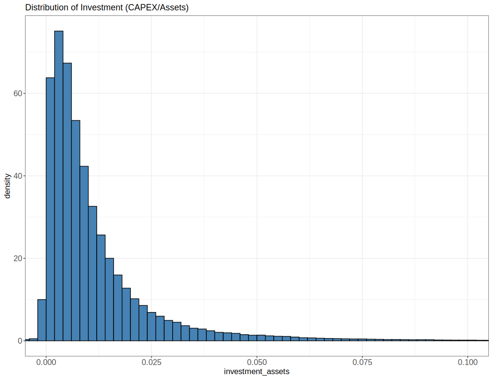

## Histogram

<code style="white-space: pre; display: inline;">geom_histogram(mapping = NULL,
&nbsp;&nbsp; data = NULL,
&nbsp;&nbsp; stat = "bin",
&nbsp;&nbsp; position = "stack",
&nbsp;&nbsp; ...,
&nbsp;&nbsp; binwidth = NULL,
&nbsp;&nbsp; origin = NULL,
&nbsp;&nbsp; breaks = NULL,
&nbsp;&nbsp; bins = NULL,
&nbsp;&nbsp; na.rm = FALSE,
&nbsp;&nbsp; orientation = NA,
&nbsp;&nbsp; show.legend = NA,
&nbsp;&nbsp; inherit.aes = TRUE
)</code>

- <span class="env-green">`binwidth`</span> <span class="env-green">The width of the bins</span>. 
  
  Can be specified as a numeric value or as a function that calculates width from unscaled x. Here, "unscaled x" refers to the original x values in the data, before application of any scale transformation. When specifying a function along with a grouping structure, the function will be called once per group. 

  - The default is to use the number of bins in `bins`, covering the range of the data. `stat_bin()` using `bins=30`; this is NOT a good default, but the idea is to get you experimenting with different number of bins. 
    
    You can also experiment modifying the `binwidth` with `center` or `boundary` arguments. `binwidth` overrides `bins` so you should do one change at a time. 
  
  - <span class="env-green">**You should always override this value**</span>, exploring multiple widths to find the best to illustrate the stories in your data.

- <span class="env-green">`bins`</span> Number of bins. Defaults to 30. Overridden by binwidth. 
  
  My experience is that it's easier to specify `bins` at first to get a rough idea of the range of the axis. 
  Then specify `binwidth` to get more control over the binning.

  ::: {.rmdimportant}
  If you have both `bins` and `boundary` specified, `boundary` might be ignored. 

  Use `binwidth` and `boundary` together to ensure that the bins are aligned with the specified boundary.
  :::

- `center`, <span class="env-green">`boundary`</span> numeric values specify bin positions. One value for either `center` or `boundary` is adequate, other values will be automatically filled using `binwidth`.

  -  `center`     specifies the center of one of the bins. **Default** figure will use center position to identify bins. 
  
  -  `boundary`   specifies the boundary between two bins. Boundary values are more informative. 
     
     ✅ <span class="env-green">[recommended to specify one boundary value; just easier to say boundaries]</span>
  
  -  Worth noting that `center` and `boundary` can be either above or below the range of the data, in this case the value provided will be <u>shifted</u> of a multiple number of `binwidth`.

- `breaks` Actual breaks to use. Intervals are created as left open, right closed. But specifying inside `geom_histogram` might show weird breaks in y-axis labels. 

  ✅ <span class="env-green">Specifying breaks using `scale_x_continuous`</span> is a better practice. 


```R
p <- ggplot(data = data, aes(tmp) ) + 
    geom_histogram(
      fill = "#BDBCBC", color = "black", 
      binwidth = 2, boundary = 0) +
    labs(x = "Average temperature [ºC]")
p
```


`geom_histogram(aes(..density..))` surrounding the variable names with `..`  means to call `after_stat` function. It delays the mapping until later in the rendering process when summary statistics have been calculated.  The expression  `..density..` is deprecated; use `after_stat()` in stead.

Most [aesthetics](https://ggplot2.tidyverse.org/reference/aes.html) are mapped directly from variables found in the data, called direct input (stage1). Sometimes, however, you want to delay the mapping until later stages of the data that you can map aesthetics from, and three functions to control at which stage aesthetics should be evaluated.

`after_stat(x)` and `after_scale(x)` can be used inside the `aes()` function, used as the `mapping` argument in layers. 

- `after_stat(x)` uses variables calculated after the transformation by the layer stat (stage 2); 

  E.g., the height of bars in `geom_histogram()` can be density probability;

  ```r
  # this shows the count frequency
  ggplot(faithful, aes(x = waiting)) +
    geom_histogram(fill = "#BDBCBC", color = "black") 
  
  # this shows the density plot, can replace after_stat(density) with ..density..
  # surrounding the variable name with two dots
  ggplot(faithful, aes(x = waiting)) +
    geom_histogram(aes(y = after_stat(density)),
                  fill = "#BDBCBC", color = "black") +
    geom_density() # empirical density
  ```

  - `after_stat(count)` show frequency count; <span class="env-green">`after_stat(ncount)`</span> count, scaled to a maximum of 1; 

  - `after_stat(density)` show density; `after_stat(ndensity)` density, scaled to a maximum of 1;

- `after_scale` uses variables calculated after the scale transformation (stage 3); see documents [here](the height of bars in `geom_histogram()`).

  - could be used to label a bar plot;

--------------------------------------------------------------------------------

### Set axis limits for histogram

❗ Always use `coord_cartesian()` to set axis limits for histogram as `scale_x_continuous(limits = c(0, 1))` will remove data outside the limits, which can lead to incorrect calculations and visualizations.

`coord_cartesian(xlim = c(0, 1))` will zoom in on the part of the graph when x is between 0 and 1, without removing data outside the limits. The axis will expand automatically to fit the data, by default, it will add a padding of 5% on each side of the data range. That means if the data range is from 0 to 1, the x-axis will be expanded to range from -0.05 to 1.05. 

You can adjust this padding using the `expand` argument in `scale_x_continuous(expand = c(0, 0))`, which will remove the padding and set the axis limits exactly to the specified range of 0 to 1.

Use `?scale_x_continuous` to learn more about the `expand` argument. More nuanced control over the expansion can be achieved by using `expansion` functions, e.g., `scale_x_continuous(expand = expansion(mult = c(0.1, 0.2)))` will add a 10% expansion on the lower end and a 20% expansion on the upper end of the x-axis.


```r
fundamental_complete %>%
    ggplot(aes(x = investment_assets)) +
    geom_histogram(binwidth = .002, aes(y = ..density..), fill = "steelblue", color = "black", boundary = 0) +
    coord_cartesian(xlim = c(0, 0.1)) +
    scale_x_continuous(expand = c(0.05, 0)) +
    labs(title = "Distribution of Investment (CAPEX/Assets)")
```

This will set the main x-axis range to 0 to 0.1, and add padding of $5\% \times 0.1$ to both sides of the x-axis, resulting in an expanded range of -0.005 to 0.105. 



--------------------------------------------------------------------------------

### Add fitted density from a distribution

```r
# fit a lognormal distribution
library(MASS)
fit_params <- fitdistr(prices_monthly$AdjustedPrice,"lognormal")
fit_params$estimate

ggplot(prices_monthly, aes(x = AdjustedPrice)) +
    geom_histogram(bins = 40,
                   aes(y = ..density..),
                   fill="#BDBCBC", color="black") +
    stat_function(fun = dlnorm, 
                  args = list(meanlog = fit_params$estimate['meanlog'], 
                            sdlog = fit_params$estimate['sdlog']),
                  colour = "red"
                  ) +
    scale_x_continuous(limits = c(0, 170))
```

--------------------------------------------------------------------------------


### Histogram of a vector

```r
dice_results <- c(1,3,2,4,5,6,5,3,2,1,6,2,6,5,6,4)
ggplot(aes(x = dice_results)) + geom_bar()
```

This returns an error: `data` must be a `data.frame`.  If you don't provide argument name explicitly, sequential rule is used – `data` arg is used for `aes(x=dice_results)`.

To correct it – use arg name explicitly:

```r
ggplot(mapping = aes(x=dice_results)) + geom_bar()
```

Alternatively, you may use it inside `geom_` functions family without explicit naming `mapping` argument since `mapping` is the first argument unlike in `ggplot` function case where `data` is the first function argument.

```r
ggplot() + geom_bar(aes(dice_results))

# or use the `aes` function
ggplot() + 
		aes(dice_results) +
		geom_bar()
```


**Vertical histogram**

https://stackoverflow.com/a/13334294/10108921


`geom_bar` and `geom_col` plots bar charts.

-  `geom_bar` makes the height of the bar proportional to the number of cases in each group. 
-  `geom_col` the heights of the bars to represent values in the data

--------------------------------------------------------------------------------

### Add a band

<code style="white-space: pre; display: inline;">geom_ribbon(
&nbsp;&nbsp; data = sim_obs_quantile, 
&nbsp;&nbsp; aes(ymin=`17%`, ymax=`83%`), 
&nbsp;&nbsp; alpha=0.2, fill="#F8766D"
)</code> plot confidence interval (CI) in shaded areas.

--------------------------------------------------------------------------------

### Add a line or arrow

<code style="white-space: pre; display: inline;">geom_segment(
&nbsp;&nbsp; aes(x = x1, y = y1, xend = x2, yend = y2), 
&nbsp;&nbsp; col = "red",
&nbsp;&nbsp; arrow = arrow(length = unit(0.3, "cm") )
)</code> draws a straight arrowhead line from the start point `(x, y)` to the end point`(xend, yend)` in the plot.

- `arrow` specification for arrow heads, as created by `grid::arrow()`. `length` set the length of the arrow head to 0.3 cm.

--------------------------------------------------------------------------------

### Add shapes

<code style="white-space: pre; display: inline;">annotate(
&nbsp;&nbsp; geom = "segment", x = 12, y = -0.05, xend = 12, yend = 0,
&nbsp;&nbsp; col = "red", arrow = arrow(length = unit(0.3, "cm") )
)</code> draws arrows outside the plot.

- `geom` specifies the type of annotation to draw. It can be any `geom_` functions, e.g., 
  - `"text"`, `"label"`: for adding text annotations to the plot.
  - `"segment"`, `"curve"` for adding line segments or curves to the plot.
  - `"rect"` for adding rectangles to the plot.

ref: [How to annotate a plot in ggplot2](https://r-graph-gallery.com/233-add-annotations-on-ggplot2-chart.html)
